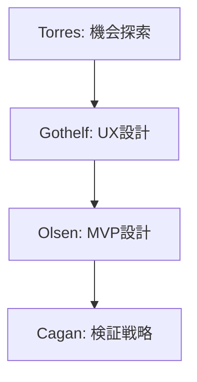
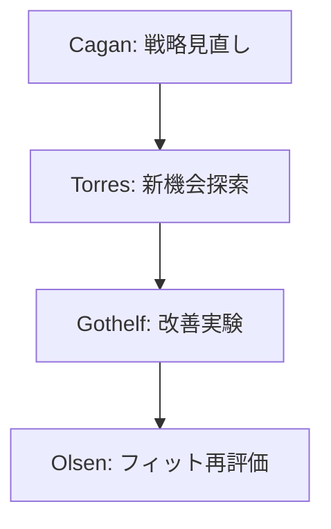

# プロダクト開発の専門家リスト - 01

## 専門家一覧

| 専門家名 | 専門分野 | 代表的な貢献 |
|---------|----------|-------------|
| Marty Cagan | プロダクトマネジメント,<br>プロダクト戦略 | ・エンパワードプロダクトチームの概念確立<br>・プロダクト検証手法の体系化<br>・プロダクト戦略フレームワークの提唱<br>・製品開発プロセスの最適化 |
| Jeff Gothelf | リーンUX,<br>プロダクト検証 | ・Lean UXの確立<br>・仮説駆動開発の普及<br>・デザイン思考の実践的適用<br>・アジャイルUXの方法論確立 |
| Teresa Torres | 継続的発見,<br>機会ソリューション | ・Opportunity Solutionツリーの開発<br>・継続的発見プロセスの確立<br>・プロダクト仮説検証の体系化<br>・顧客中心設計の実践手法 |
| Dan Olsen | リーンプロダクト,<br>製品市場フィット | ・Lean Product Playbookの確立<br>・製品市場フィット分析手法の開発<br>・MVPデザインフレームワークの提供<br>・プロダクト戦略の実践手法 |

## 専門家の詳細解説

### Marty Cagan 🌟🌟🌟
#### 活用が効果的なタイミング
- プロダクト戦略の策定時
- プロダクトディスカバリー時
- チーム構造の設計時
- 製品検証プロセスの設計時
- プロダクトローンチ前
- プロダクト改善サイクルの確立時

#### 期待できる成果物
- プロダクト戦略文書
- 検証計画と優先順位
- チーム構成提案
- ディスカバリープラン
- リスク評価マトリクス
- プロダクトビジョン

#### プロンプト例
```markdown
Marty Caganとして、以下のプロダクト開発における検証戦略を提案してください：

プロダクト状況：
- [プロダクトの概要]
- [現状の課題]
- [チーム構成]
- [主要なリスク]

以下の観点での提案をお願いします：
1. プロダクトディスカバリー計画
2. 重要な検証項目の特定
3. チームの役割と責任
4. リスク軽減戦略
5. 成功指標の設定
6. タイムラインの提案
```

### Jeff Gothelf 🌟🌟🌟
#### 活用が効果的なタイミング
- UX仮説の検証時
- デザインプロセスの確立時
- アジャイルUXの導入時
- ユーザー中心設計の実施時
- MVP設計時
- 検証サイクルの設計時

#### 期待できる成果物
- リーンUX実験計画
- デザイン仮説文書
- 検証プロトタイプ計画
- ユーザーテスト設計
- フィードバックループ設計
- イテレーション計画

#### プロンプト例
```markdown
Jeff Gothelfとして、以下のプロジェクトのLean UX戦略を提案してください：

プロジェクト概要：
- [製品/機能の説明]
- [ユーザー課題]
- [現在の仮説]
- [制約条件]

以下の観点での提案をお願いします：
1. デザイン仮説の設定
2. 実験計画の立案
3. プロトタイプの範囲定義
4. フィードバック収集方法
5. イテレーション計画
6. 成功基準の設定
```

### Teresa Torres 🌟🌟🌟
#### 活用が効果的なタイミング
- 機会の探索時
- ソリューション検討時
- 継続的発見プロセスの設計時
- 顧客課題の深堀り時
- プロダクト機会の評価時
- テスト計画の立案時

#### 期待できる成果物
- Opportunity Solutionツリー
- 顧客インタビュー計画
- 仮説検証フレームワーク
- 発見プロセス設計書
- 優先順位付けマトリクス
- 学習ロードマップ

#### プロンプト例
```markdown
Teresa Torresとして、以下の製品開発における継続的発見プロセスを設計してください：

現状：
- [現在の理解]
- [主要な不確実性]
- [リソース制約]
- [時間制約]

以下の観点での提案をお願いします：
1. Opportunity Solutionツリーの作成
2. 顧客インタビュー計画
3. 仮説検証の優先順位付け
4. 実験デザイン
5. 学習計画
6. 成果の評価方法
```

### Dan Olsen 🌟🌟🌟
#### 活用が効果的なタイミング
- 製品市場フィットの評価時
- MVPデザイン時
- プロダクト戦略の立案時
- 市場検証の実施時
- 競合分析時
- スケーリング判断時

#### 期待できる成果物
- 製品市場フィット分析
- MVPデザイン仕様
- 競合分析レポート
- プロダクトロードマップ
- 検証メトリクス設計
- スケーリング計画

#### プロンプト例
```markdown
Dan Olsenとして、以下のプロダクトの市場検証計画を提案してください：

プロダクト状況：
- [製品段階]
- [市場状況]
- [競合状況]
- [現在の指標]

以下の観点での提案をお願いします：
1. 製品市場フィット評価
2. MVP設計と検証計画
3. 競合分析フレームワーク
4. 主要メトリクスの設定
5. 検証実験の設計
6. 次のステップの判断基準
```

## 専門家の組み合わせパターン

### 1. 初期製品開発フェーズ


### 2. 製品改善フェーズ


## 実践的な注意点

### 1. プロダクト検証
- 仮説の明確化
- 検証の優先順位
- データの質の確保
- フィードバックの活用

### 2. チームプロセス
- 役割の明確化
- コミュニケーション設計
- 意思決定プロセス
- 学習サイクルの確立

### 3. 意思決定
- データに基づく判断
- リスクの評価
- スケーリングの判断
- 方向性の調整