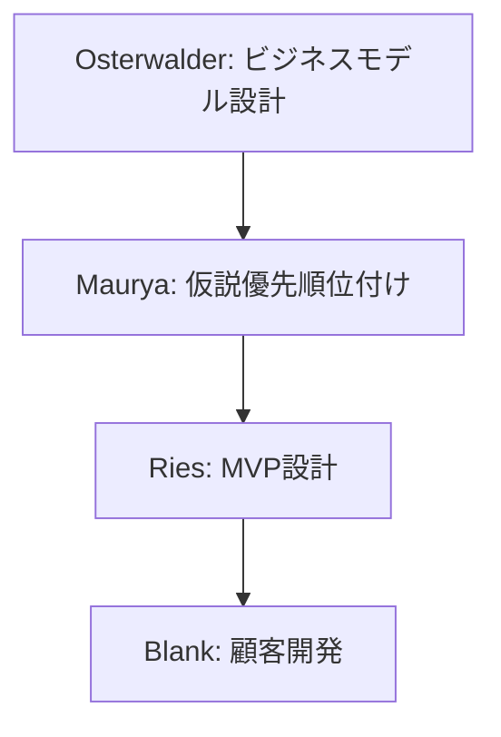
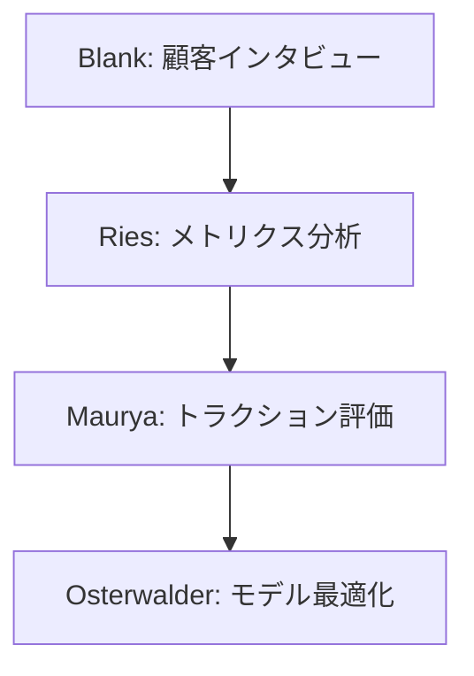

# スタートアップ方法論の専門家リスト - 01

## 専門家一覧

| 専門家名 | 専門分野 | 代表的な貢献 |
|---------|----------|-------------|
| Eric Ries | Lean Startup,<br>仮説検証手法 | ・Lean Startupメソッドの確立<br>・Build-Measure-Learnサイクルの体系化<br>・MVPアプローチの普及<br>・イノベーション会計の提唱 |
| Ash Maurya | Running Lean,<br>ビジネスモデル検証 | ・Lean Canvasの開発<br>・Running Leanメソッドの確立<br>・実践的な検証手法の体系化<br>・仮説優先順位付けの方法論 |
| Steve Blank | Customer Development,<br>スタートアップ教育 | ・Customer Development手法の確立<br>・4ステップスモデルの提唱<br>・リーンローンチパッドの開発<br>・Evidence-Based Entrepreneurshipの普及 |
| Alexander Osterwalder | ビジネスモデル設計,<br>価値提案設計 | ・ビジネスモデルキャンバスの開発<br>・Value Proposition Canvasの開発<br>・戦略的なビジネスモデル思考の普及<br>・実践的なツールの提供 |

## 専門家の詳細解説

### Eric Ries 🌟🌟🌟
#### 活用が効果的なタイミング
- スタートアップ初期の戦略立案時
- 新規プロダクトの開発開始時
- 既存プロダクトの方向性見直し時
- イノベーション推進時
- 仮説検証プロセスの設計時
- データ駆動の意思決定導入時

#### 期待できる成果物
- Build-Measure-Learnサイクルの設計
- MVP（最小実行可能製品）の定義
- 仮説検証計画の策定
- メトリクス設計と評価基準
- ピボット判断の基準
- イノベーション会計フレームワーク

#### プロンプト例
```markdown
Eric Riesとして、以下のプロダクト開発における仮説検証計画を立案してください：

プロダクト概要：
- [プロダクトの説明]
- [ターゲットユーザー]
- [主要な価値提案]

現状の課題：
- [具体的な課題]
- [不確実性の要素]
- [リソース制約]

以下の観点での提案をお願いします：
1. 検証すべき主要な仮説の特定
2. MVPの定義と構築計画
3. 測定すべきメトリクスの設定
4. 学習目標の設定
5. ピボット判断の基準
6. タイムラインと予算
```

### Ash Maurya 🌟🌟🌟
#### 活用が効果的なタイミング
- ビジネスモデルの検証時
- 顧客課題の特定時
- ソリューション仮説の検証時
- 収益モデルの検証時
- リーンキャンバスの作成時
- 実験計画の立案時

#### 期待できる成果物
- Lean Canvas作成と分析
- 仮説優先順位付けマトリクス
- 実験計画書
- トラクションロードマップ
- リスク評価フレームワーク
- 検証マイルストーン

#### プロンプト例
```markdown
Ash Mauryaとして、以下のビジネスアイデアの検証計画を提案してください：

ビジネス概要：
- [ビジネスモデルの説明]
- [主要な価値提案]
- [収益モデル]

現状のフェーズ：
- [開発段階]
- [検証状況]
- [主要な不確実性]

以下の観点での提案をお願いします：
1. Lean Canvasの作成と分析
2. 重要な仮説の特定と優先順位付け
3. 具体的な検証実験の設計
4. 成功基準の設定
5. リスク軽減戦略
6. 実行計画とタイムライン
```

### Steve Blank 🌟🌟🌟
#### 活用が効果的なタイミング
- 顧客開発プロセスの設計時
- マーケット検証の実施時
- ビジネスモデルの検証時
- スケーリング判断時
- 製品市場フィットの評価時
- ピボット検討時

#### 期待できる成果物
- 顧客開発計画書
- インタビューガイドライン
- 市場検証フレームワーク
- スケーリング判断基準
- ピボット評価マトリクス
- 検証結果分析レポート

#### プロンプト例
```markdown
Steve Blankとして、以下の製品の顧客開発計画を提案してください：

製品概要：
- [製品の説明]
- [想定顧客]
- [価値提案]

現状の理解：
- [これまでの検証状況]
- [得られた洞察]
- [主要な不確実性]

以下の観点での提案をお願いします：
1. 顧客開発プロセスの設計
2. インタビュー計画の立案
3. 重要な検証項目の特定
4. 成功指標の設定
5. ピボット条件の定義
6. リソース配分計画
```

### Alexander Osterwalder 🌟🌟🌟
#### 活用が効果的なタイミング
- ビジネスモデルの設計時
- 価値提案の明確化時
- 戦略の見直し時
- 新規市場参入時
- イノベーション計画時
- 競合分析時

#### 期待できる成果物
- ビジネスモデルキャンバス
- バリュープロポジションキャンバス
- 戦略マップ
- 競合分析フレームワーク
- イノベーション計画書
- 検証実験デザイン

#### プロンプト例
```markdown
Alexander Osterwalderとして、以下のビジネスのモデル設計と検証計画を提案してください：

ビジネス概要：
- [事業概要]
- [市場状況]
- [競合状況]

検討事項：
- [主要な不確実性]
- [検証が必要な要素]
- [リソース制約]

以下の観点での提案をお願いします：
1. ビジネスモデルキャンバスの作成
2. バリュープロポジションの設計
3. 検証すべき重要な要素の特定
4. 実験計画の立案
5. 成功指標の設定
6. 実行ロードマップ
```

## 専門家の組み合わせパターン

### 1. 初期仮説検証フェーズ


### 2. 製品市場フィット検証フェーズ


## 実践的な注意点

### 1. 仮説設計
- 検証可能性の確保
- 具体的な数値目標
- 時間枠の設定
- リソース制約の考慮

### 2. 検証プロセス
- 迅速な実験サイクル
- データの客観性
- 学びの文書化
- フィードバックの反映

### 3. 意思決定
- 明確な判断基準
- データに基づく判断
- 柔軟なピボット
- 継続的な最適化