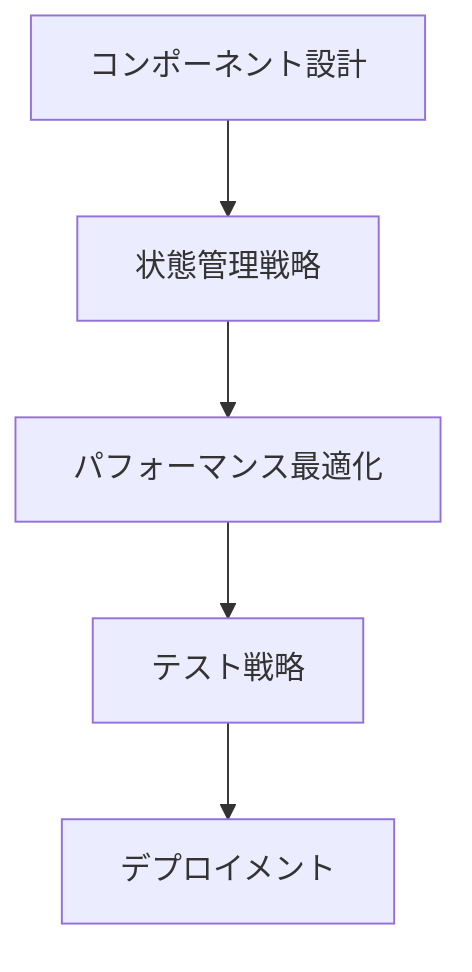

# 実装フェーズの専門家ロール活用ガイド

## 著名人一覧

| 活用が効果的なタイミング | 専門家名 | 専門分野 | 代表的な貢献 |
|------------------------|----------|----------|--------------|
| ・Reactアプリケーションの設計時<br>・状態管理の実装時<br>・パフォーマンス最適化時<br>・コンポーネント設計の改善時 | Dan Abramov | React | ・Redux<br>・React Hot Loader<br>・Create React App<br>・React Performance |
| ・アーキテクチャ設計時<br>・コード品質改善時<br>・依存関係の整理時<br>・レガシーコードのリファクタリング時 | Robert C. Martin | Clean Architecture | ・SOLID原則<br>・クリーンコード<br>・アーキテクチャパターン<br>・アジャイルプラクティス |
| ・Next.jsプロジェクト設計時<br>・SSR/SSG実装時<br>・パフォーマンス最適化時<br>・デプロイ戦略検討時 | Guillermo Rauch | Next.js | ・Next.jsフレームワーク<br>・Vercel<br>・サーバーレスアーキテクチャ<br>・エッジコンピューティング |
| ・アジャイル開発プラクティス導入時<br>・テスト駆動開発の実践時<br>・ペアプログラミング実施時<br>・継続的統合の導入時 | Kent Beck | XP | ・テスト駆動開発<br>・ペアプログラミング<br>・継続的統合<br>・リファクタリング |
| ・関数型アプローチ導入時<br>・型安全な設計時<br>・副作用管理の実装時<br>・モナド変換子の活用時 | Giulio Canti | fp-ts | ・関数型プログラミング<br>・型レベルプログラミング<br>・モナド変換子<br>・代数的データ型 |
| ・副作用の型安全な管理時<br>・リソース制御の実装時<br>・非同期処理の設計時<br>・並行処理の実装時 | Michael Arnaldi | Effect-TS | ・効果型システム<br>・リソース管理<br>・並行処理<br>・レイヤー化アーキテクチャ |

## 詳細解説

### 1. Reactアプローチ（Dan Abramov）



#### 実装例

```typescript
// コンポーネントの最適化パターン
import { useState, useCallback, useMemo } from 'react';
import { useEffect } from 'react';

interface ListProps<T> {
  items: T[];
  renderItem: (item: T) => React.ReactNode;
  onItemSelect: (item: T) => void;
}

function OptimizedList<T extends { id: string }>({
  items,
  renderItem,
  onItemSelect
}: ListProps<T>) {
  // メモ化された値
  const sortedItems = useMemo(
    () => [...items].sort((a, b) => a.id.localeCompare(b.id)),
    [items]
  );

  // メモ化されたコールバック
  const handleSelect = useCallback(
    (item: T) => {
      onItemSelect(item);
    },
    [onItemSelect]
  );

  return (
    <ul>
      {sortedItems.map(item => (
        <li key={item.id} onClick={() => handleSelect(item)}>
          {renderItem(item)}
        </li>
      ))}
    </ul>
  );
}

// Hooks パターン
function useDataFetching<T>(url: string) {
  const [data, setData] = useState<T | null>(null);
  const [loading, setLoading] = useState(true);
  const [error, setError] = useState<Error | null>(null);

  useEffect(() => {
    let mounted = true;

    async function fetchData() {
      try {
        const response = await fetch(url);
        const result = await response.json();
        if (mounted) {
          setData(result);
          setLoading(false);
        }
      } catch (e) {
        if (mounted && e instanceof Error) {
          setError(e);
          setLoading(false);
        }
      }
    }

    fetchData();
    return () => { mounted = false; };
  }, [url]);

  return { data, loading, error };
}
```

### 2. クリーンアーキテクチャ（Robert C. Martin）

```typescript
// レイヤー化アーキテクチャの実装
// エンティティ層
interface User {
  id: string;
  name: string;
  email: string;
}

// ユースケース層
interface UserRepository {
  findById(id: string): Promise<User>;
  save(user: User): Promise<void>;
}

class CreateUserUseCase {
  constructor(private userRepo: UserRepository) {}

  async execute(userData: Omit<User, 'id'>): Promise<User> {
    const user = {
      id: generateId(),
      ...userData
    };

    await this.userRepo.save(user);
    return user;
  }
}

// インターフェースアダプター層
class UserController {
  constructor(private createUser: CreateUserUseCase) {}

  async handleCreateUser(req: Request, res: Response) {
    try {
      const user = await this.createUser.execute(req.body);
      res.status(201).json(user);
    } catch (error) {
      res.status(400).json({ error: error.message });
    }
  }
}
```

### 3. Next.jsアプローチ（Guillermo Rauch）

```typescript
// 最適化されたページコンポーネント
export default function BlogPost({ post }) {
  return (
    <article>
      <h1>{post.title}</h1>
      <div dangerouslySetInnerHTML={{ __html: post.content }} />
    </article>
  );
}

// 静的生成の最適化
export async function getStaticProps({ params }) {
  const post = await getPost(params.id);
  return {
    props: { post },
    revalidate: 60 // ISR設定
  };
}

export async function getStaticPaths() {
  const posts = await getAllPosts();
  return {
    paths: posts.map(post => ({
      params: { id: post.id }
    })),
    fallback: 'blocking'
  };
}
```

## 活用のポイント

1. **実装フェーズでの準備**
   - 適切な技術スタックの選択
   - アーキテクチャパターンの決定
   - 開発環境の整備
   - チーム内での合意形成

2. **実装プロセスの最適化**
   - 継続的なコードレビュー
   - 自動化テストの活用
   - パフォーマンス監視
   - 技術的負債の管理

3. **知識共有とチーム成長**
   - ペアプログラミングの実施
   - 技術勉強会の開催
   - ドキュメント整備
   - メンタリング活動

## メトリクスと評価

### 1. コード品質メトリクス
- 循環的複雑度
- テストカバレッジ
- 重複コード率
- コードスメル検出

### 2. パフォーマンスメトリクス
- レスポンスタイム
- メモリ使用量
- CPU使用率
- ロードタイム

### 3. 開発生産性メトリクス
- デプロイ頻度
- リリースサイクル時間
- バグ修正時間
- コードレビュー効率

## チェックリスト

- [ ] アーキテクチャの設計原則に従っているか
- [ ] パフォーマンス要件を満たしているか
- [ ] セキュリティ対策は十分か
- [ ] テストの自動化は適切か
- [ ] ドキュメントは最新か
- [ ] 技術的負債は管理されているか
- [ ] チーム全体のスキル向上は進んでいるか
- [ ] CI/CDパイプラインは効率的か