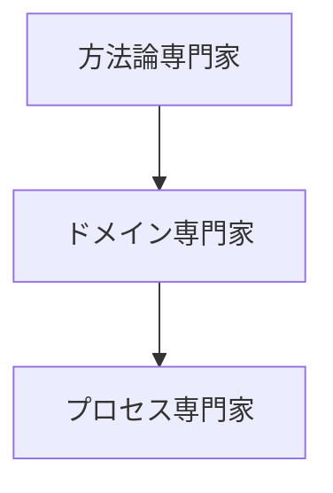
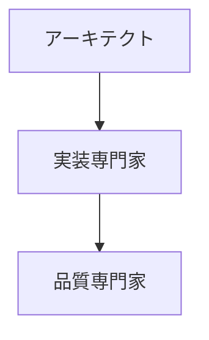
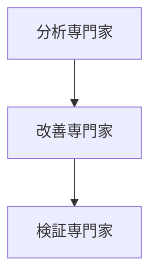

# 専門家リストの作成ガイド

## 1. 専門家の選定と分類

### 1.1 選定基準
```markdown
### 必須基準
□ 分野での重要な貢献実績
□ 実践的な手法やフレームワークの確立
□ 広く認知された著作や論文
□ 継続的な影響力

### 推奨基準
□ 複数の成功事例
□ 実装可能な手法の提供
□ コミュニティでの評価
□ 最新の知見の提供
```

### 1.2 カテゴリ分類の基準
```markdown
### 基盤技術（Foundation）
- アーキテクチャ設計
- 設計原則
- 実装パターン
- 品質管理

### 特定領域（Domain-Specific）
- パフォーマンス
- セキュリティ
- ユーザビリティ
- データ管理

### プロセス改善（Process）
- 開発手法
- プロジェクト管理
- チーム開発
- 品質保証
```

## 2. 専門家情報の構造化

### 2.1 基本情報セクション
```markdown
# [専門分野]の専門家リスト - [セット番号]

## 専門家一覧
| 専門家名 | 専門分野 | 代表的な貢献 |
|---------|----------|-------------|
| [名前] | [主分野]<br>[副分野] | ・[主要な貢献1]<br>・[主要な貢献2]<br>・[主要な貢献3] |

## 重要度の定義
🌟🌟🌟 最重要レベル
- 分野の基礎理論を確立
- 複数の実践的手法を提供
- 広く採用されている手法の提唱者

🌟🌟 重要レベル
- 特定分野での深い知見
- 実践的な手法の体系化
- 具体的な実装パターンの提示

🌟 基本レベル
- 特定技術での実績
- 実践的な適用例の提供
- 具体的な改善手法の提案
```

### 2.2 詳細情報セクション
```markdown
## 専門家の詳細解説

### [専門家名] 🌟🌟🌟

#### プロフィール
- 専門分野: [詳細]
- 主な著書: [書籍リスト]
- 重要な貢献: [具体的な貢献]
- 影響力: [影響を与えた領域]

#### 活用が効果的なタイミング
- [具体的なタイミング1]
- [具体的なタイミング2]
- [具体的なタイミング3]

#### 期待できる成果物
- [成果物1の詳細]
- [成果物2の詳細]
- [成果物3の詳細]
```

## 3. プロンプトの設計

### 3.1 基本構造
```markdown
### プロンプトの基本形式
[専門家名]として、以下の[課題/状況]について分析と提案をお願いします：

[状況の説明]
- [具体的な背景]
- [現状の課題]
- [制約条件]

以下の観点での提案をお願いします：
1. [観点1]
2. [観点2]
3. [観点3]

期待する成果物：
- [成果物1]
- [成果物2]
- [成果物3]
```

### 3.2 状況別のバリエーション
```markdown
### 1. 分析・評価
[専門家名]として、以下の[対象]を分析・評価してください：

現状：
- [具体的な状況]
- [メトリクス]
- [課題]

以下の観点での分析をお願いします：
1. 現状の評価
2. 主要な課題
3. 改善提案
4. 優先順位

### 2. 設計・提案
[専門家名]として、以下の[要件]に基づく設計を提案してください：

要件：
- [機能要件]
- [非機能要件]
- [制約条件]

以下の観点での提案をお願いします：
1. アーキテクチャ設計
2. 実装方針
3. 品質保証方法
4. リスク対策

### 3. レビュー・改善
[専門家名]として、以下の[成果物]をレビューし、改善提案をお願いします：

対象：
- [成果物の説明]
- [現状の課題]
- [改善目標]

以下の観点でのレビューをお願いします：
1. 設計の妥当性
2. 実装の品質
3. 改善提案
4. 優先順位
```

## 4. 組み合わせパターン

### 4.1 フェーズ別の組み合わせ
```markdown
### 1. 初期フェーズ


### 2. 実装フェーズ


### 3. 改善フェーズ

```

### 4.2 目的別の組み合わせ
```markdown
### 1. 品質改善
- 品質専門家 → プロセス専門家
- 具体的な課題特定 → 改善手法の適用

### 2. パフォーマンス最適化
- パフォーマンス専門家 → アーキテクト
- ボトルネック特定 → アーキテクチャ改善

### 3. ユーザビリティ向上
- UX専門家 → 実装専門家
- 課題分析 → 改善実装
```

## 5. メンテナンスと更新

### 5.1 定期的なレビュー
```markdown
### レビュー項目
□ 専門家情報の最新性
□ プロンプトの有効性
□ 組み合わせパターンの適切性
□ 新しい専門家の追加必要性

### 更新のタイミング
- 四半期ごとの軽微な更新
- 半年ごとの大規模レビュー
```

### 5.2 品質管理
```markdown
### チェックポイント
□ 情報の正確性
□ プロンプトの実用性
□ 組み合わせの効果
□ フィードバックの反映

### 改善プロセス
1. フィードバック収集
2. 効果分析
3. 改善検討
4. 更新実施