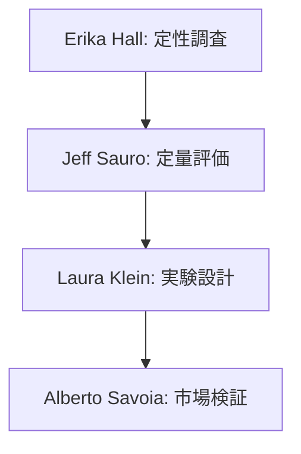
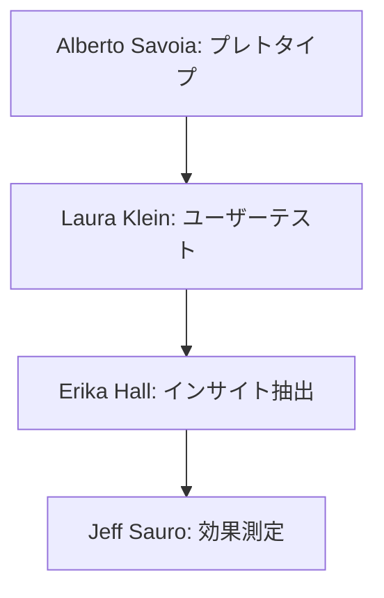

# 検証手法の専門家リスト - 01

## 専門家一覧

| 専門家名 | 専門分野 | 代表的な貢献 |
|---------|----------|-------------|
| Laura Klein | UXリサーチ,<br>実験設計 | ・リーンUXリサーチ手法の確立<br>・ユーザビリティテスト手法の体系化<br>・定性・定量調査の統合アプローチ<br>・実験設計フレームワークの開発 |
| Jeff Sauro | 定量的UX評価,<br>統計的検証 | ・UX統計手法の確立<br>・ベンチマーク手法の開発<br>・メトリクス設計フレームワーク<br>・検証の信頼性評価手法 |
| Erika Hall | 定性調査,<br>ユーザーリサーチ | ・リサーチ方法論の体系化<br>・インタビュー手法の確立<br>・コンテキスト調査手法<br>・リサーチ計画フレームワーク |
| Alberto Savoia | 仮説検証手法,<br>プレトタイピング | ・プレトタイピング手法の確立<br>・市場検証フレームワーク<br>・早期検証アプローチ<br>・リスク最小化戦略 |

## 専門家の詳細解説

### Laura Klein 🌟🌟🌟
#### 活用が効果的なタイミング
- UXリサーチの設計時
- ユーザビリティテストの計画時
- 検証実験の設計時
- インサイト抽出時
- データ解釈時
- 改善施策の立案時

#### 期待できる成果物
- リサーチ計画書
- テスト設計書
- 実験プロトコル
- 分析フレームワーク
- インサイトレポート
- 改善提案書

#### プロンプト例
```markdown
Laura Kleinとして、以下のユーザー仮説の検証計画を立案してください：

検証対象の仮説：
[具体的な仮説内容]

現状の理解：
- [ユーザー状況]
- [行動パターン]
- [課題認識]

以下の観点での提案をお願いします：
1. リサーチ手法の選定
2. テスト設計の詳細
3. データ収集計画
4. 分析フレームワーク
5. 成功指標の設定
6. タイムラインの提案
```

### Jeff Sauro 🌟🌟🌟
#### 活用が効果的なタイミング
- メトリクス設計時
- 定量評価の計画時
- 統計的検証の設計時
- ベンチマーク設定時
- 信頼性評価時
- 効果測定時

#### 期待できる成果物
- メトリクス定義書
- 評価フレームワーク
- 統計分析計画
- 信頼性評価レポート
- ベンチマーク設定
- 測定プロトコル

#### プロンプト例
```markdown
Jeff Sauroとして、以下の改善施策の効果測定計画を立案してください：

測定対象：
[改善施策の詳細]

現状の指標：
- [指標1]: [現在値]
- [指標2]: [現在値]
- [指標3]: [現在値]

以下の観点での提案をお願いします：
1. 主要メトリクスの定義
2. 測定方法の詳細
3. 統計的有意性の確保
4. サンプルサイズの設計
5. 信頼性評価方法
6. 分析手法の選定
```

### Erika Hall 🌟🌟🌟
#### 活用が効果的なタイミング
- 定性調査の設計時
- インタビュー計画時
- コンテキスト調査時
- ユーザー理解の深化時
- 洞察抽出時
- 行動分析時

#### 期待できる成果物
- インタビューガイド
- 調査計画書
- コンテキスト分析
- 行動パターン分析
- インサイトマップ
- 改善提案書

#### プロンプト例
```markdown
Erika Hallとして、以下のユーザー理解のための調査計画を立案してください：

調査目的：
[具体的な目的]

対象ユーザー：
- [属性]
- [行動特性]
- [環境要因]

以下の観点での提案をお願いします：
1. 調査手法の選定
2. インタビュー設計
3. 観察ポイント
4. データ収集方法
5. 分析フレームワーク
6. アウトプット形式
```

### Alberto Savoia 🌟🌟🌟
#### 活用が効果的なタイミング
- 早期市場検証時
- プレトタイプ設計時
- リスク評価時
- 投資判断時
- ピボット検討時
- スケーリング判断時

#### 期待できる成果物
- プレトタイプ設計書
- 検証実験計画
- リスク評価マトリクス
- 市場検証レポート
- 意思決定フレームワーク
- スケーリング計画

#### プロンプト例
```markdown
Alberto Savoiaとして、以下の新規プロダクトのプレトタイプ計画を立案してください：

プロダクト概要：
[プロダクトの説明]

検証したい要素：
- [要素1]
- [要素2]
- [要素3]

以下の観点での提案をお願いします：
1. プレトタイプの設計
2. 検証実験の計画
3. リスク評価方法
4. 成功基準の設定
5. 投資判断の基準
6. スケーリング条件
```

## 専門家の組み合わせパターン

### 1. 包括的な検証アプローチ


### 2. 早期検証アプローチ


## 実践的な注意点

### 1. 検証設計
- 目的の明確化
- 手法の適切な選択
- リソースの最適配分
- タイムラインの現実性

### 2. データ収集
- バイアスの排除
- 信頼性の確保
- 継続的な収集
- 質の管理

### 3. 分析と活用
- 客観的な解釈
- 文脈の考慮
- アクションへの変換
- 学びの共有