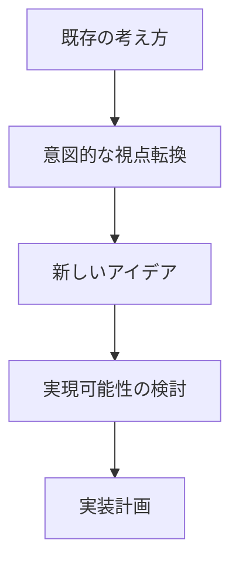

# その他フェーズの専門家ロール活用ガイド

## 著名人一覧

| 活用が効果的なタイミング | 専門家名 | 専門分野 | 代表的な貢献 |
|------------------------|----------|----------|--------------|
| ・企画段階での議論の活性化が必要な時<br>・異なる視点からの分析が欲しい時<br>・慣習的な思考を打破したい時<br>・新規アイデアの創出時 | 日本人のアクセンチュア勤務のコンサルタント | 見当違いな分析 | ・独特な視点からの分析<br>・予想外のアプローチ提案<br>・固定観念の打破 |

## 活用方法の詳細

### 1. ブレインストーミングでの活用



### 2. 実践的なアプローチ

```typescript
// アイデア生成と評価のフレームワーク
interface IdeaGeneration {
  conventional: {
    assumptions: string[];
    constraints: string[];
    solutions: string[];
  };
  unconventional: {
    newPerspectives: string[];
    crossIndustryIdeas: string[];
    disruptiveApproaches: string[];
  };
  evaluation: {
    feasibility: number;
    impact: number;
    uniqueness: number;
  };
}

class IdeaEvaluator {
  evaluateIdea(idea: IdeaGeneration): number {
    return (
      this.calculateFeasibility(idea.evaluation.feasibility) +
      this.calculateImpact(idea.evaluation.impact) +
      this.calculateUniqueness(idea.evaluation.uniqueness)
    ) / 3;
  }

  private calculateFeasibility(score: number): number {
    // 実現可能性の評価ロジック
    return score * 0.4;
  }

  private calculateImpact(score: number): number {
    // インパクトの評価ロジック
    return score * 0.35;
  }

  private calculateUniqueness(score: number): number {
    // ユニークさの評価ロジック
    return score * 0.25;
  }
}
```

## 活用のポイント

### 1. 意図的な視点転換
- 既存の前提への挑戦
- 異業種からのインスピレーション
- 制約の再定義

### 2. アイデア展開の促進
- ブレインストーミングの活性化
- クリエイティブな発想の促進
- 新しい可能性の探索

### 3. 実現可能性の評価
- 技術的な実現性
- ビジネス価値の検証
- リスク評価

## チェックリスト

- [ ] 従来の考え方から十分に離れているか
- [ ] 新しい視点が含まれているか
- [ ] 実現可能性が検討されているか
- [ ] チームの受容性は考慮されているか
- [ ] ビジネス価値は明確か
- [ ] リスクは適切に評価されているか

## メトリクス

### 1. アイデア評価指標
- 革新性
- 実現可能性
- ビジネスインパクト
- 技術的複雑さ

### 2. プロセス評価指標
- アイデア生成数
- 実装採用率
- チーム受容度
- 成功率

### 3. 成果指標
- ビジネス価値
- 技術的優位性
- ユーザー満足度
- 市場競争力

## 実践のためのガイドライン

1. **準備フェーズ**
   - 既存の制約の明確化
   - チームの心理的安全性の確保
   - 目標の設定

2. **実行フェーズ**
   - 自由な発想の促進
   - 批判的思考の一時的な保留
   - アイデアの可視化

3. **評価フェーズ**
   - 実現可能性の検討
   - リスク分析
   - 実装計画の策定

4. **フォローアップ**
   - 実装状況のモニタリング
   - フィードバックの収集
   - 改善点の特定

## 注意点とリスク管理

1. **バランスの維持**
   - 革新性と実現可能性
   - 短期的価値と長期的価値
   - 技術的挑戦と実装の容易さ

2. **コミュニケーション管理**
   - チーム内の合意形成
   - ステークホルダーとの調整
   - 期待値の管理

3. **リスク軽減**
   - 段階的な実装
   - プロトタイプの活用
   - フィードバックループの確立