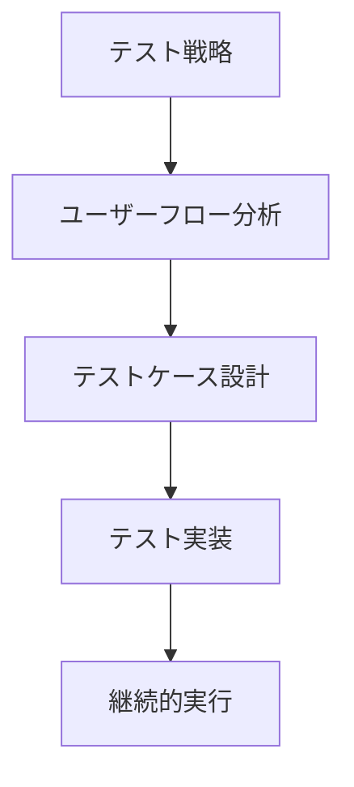

# テストフェーズの専門家ロール活用ガイド

## 著名人一覧

| 活用が効果的なタイミング | 専門家名 | 専門分野 | 代表的な貢献 |
|------------------------|----------|----------|--------------|
| ・ユーザー視点のテスト設計時<br>・アクセシビリティテストの実装時<br>・インテグレーションテストの設計時<br>・テストベストプラクティスの確立時 | Kent C. Dodds | Testing Library | ・React Testing Library<br>・Testing JavaScript<br>・テストベストプラクティス<br>・テストパターン集 |
| ・副作用を含むコードのテスト時<br>・モック/スタブの型安全な実装時<br>・テストの自動化設計時<br>・並行処理のテスト時 | Giulio Canti | Effect-TS | ・テスト用DSL<br>・型安全なテストユーティリティ<br>・テストフレームワーク<br>・テストデータジェネレーター |

## 詳細解説

### 1. ユーザー中心のテスト（Kent C. Dodds）



#### 実装例

```typescript
// Testing Libraryを使用したテスト実装
import { render, screen, fireEvent } from '@testing-library/react';
import userEvent from '@testing-library/user-event';

describe('LoginForm', () => {
  it('should display validation error for invalid email', async () => {
    render(<LoginForm />);
    
    const emailInput = screen.getByLabelText(/email/i);
    await userEvent.type(emailInput, 'invalid-email');
    
    const submitButton = screen.getByRole('button', { name: /submit/i });
    await userEvent.click(submitButton);
    
    expect(screen.getByText(/please enter a valid email/i)).toBeInTheDocument();
  });

  it('should call onSubmit with form data when valid', async () => {
    const onSubmit = jest.fn();
    render(<LoginForm onSubmit={onSubmit} />);
    
    await userEvent.type(
      screen.getByLabelText(/email/i),
      'test@example.com'
    );
    await userEvent.type(
      screen.getByLabelText(/password/i),
      'password123'
    );
    
    await userEvent.click(
      screen.getByRole('button', { name: /submit/i })
    );
    
    expect(onSubmit).toHaveBeenCalledWith({
      email: 'test@example.com',
      password: 'password123'
    });
  });
});
```

### 2. 効果的なテスト設計（Giulio Canti）

```typescript
// Effect-TSを使用したテスト実装
import * as Effect from '@effect/io/Effect';
import * as Layer from '@effect/io/Layer';
import { pipe } from '@effect/data/Function';

// テスト対象のサービス
interface UserService {
  getUser: (id: string) => Effect.Effect<never, Error, User>;
  updateUser: (user: User) => Effect.Effect<never, Error, User>;
}

// テストレイヤーの実装
const TestUserService = Layer.succeed<UserService>({
  getUser: (id) => 
    Effect.succeed({ id, name: 'Test User', email: 'test@example.com' }),
  updateUser: (user) => 
    Effect.succeed({ ...user, updatedAt: new Date() })
});

// プロパティベーステストの実装
import * as Gen from '@effect/test/Gen';
import * as Test from '@effect/test/Test';

const userGen = Gen.struct({
  id: Gen.string,
  name: Gen.string,
  email: Gen.email
});

const updateUserTest = Test.test('updateUser should preserve user id')(
  Gen.run(userGen)(user =>
    pipe(
      Effect.service<UserService>(),
      Effect.flatMap(service => service.updateUser(user)),
      Effect.map(updatedUser => updatedUser.id === user.id),
      Effect.provideLayer(TestUserService)
    )
  )
);
```

## テスト戦略の最適化

### 1. テストピラミッドの構築

```typescript
// テストタイプの定義
type TestType = 'unit' | 'integration' | 'e2e';

interface TestStrategy {
  type: TestType;
  coverage: number;
  automation: boolean;
  frequency: 'continuous' | 'daily' | 'weekly';
}

// テスト戦略の実装
const testPyramid: Record<TestType, TestStrategy> = {
  unit: {
    type: 'unit',
    coverage: 80,
    automation: true,
    frequency: 'continuous'
  },
  integration: {
    type: 'integration',
    coverage: 50,
    automation: true,
    frequency: 'daily'
  },
  e2e: {
    type: 'e2e',
    coverage: 20,
    automation: true,
    frequency: 'weekly'
  }
};
```

### 2. テスト自動化の確立

```typescript
// テスト自動化フレームワーク
interface AutomationFramework {
  setup(): Promise<void>;
  runTests(type: TestType): Promise<TestResults>;
  generateReport(results: TestResults): Promise<Report>;
  cleanup(): Promise<void>;
}

// CI/CD パイプラインの統合
class TestPipeline {
  constructor(private framework: AutomationFramework) {}

  async execute() {
    await this.framework.setup();
    
    const unitResults = await this.framework.runTests('unit');
    const integrationResults = await this.framework.runTests('integration');
    const e2eResults = await this.framework.runTests('e2e');
    
    const report = await this.framework.generateReport({
      unit: unitResults,
      integration: integrationResults,
      e2e: e2eResults
    });
    
    await this.framework.cleanup();
    return report;
  }
}
```

## チェックリストとベストプラクティス

### 1. テスト設計

- [ ] ユーザーストーリーに基づくテストケース
- [ ] エッジケースの考慮
- [ ] パフォーマンス要件の検証
- [ ] セキュリティ要件の検証

### 2. テスト実装

- [ ] テストの可読性
- [ ] テストの独立性
- [ ] テストデータの管理
- [ ] モック/スタブの適切な使用

### 3. テスト実行

- [ ] CI/CDパイプラインへの統合
- [ ] テスト環境の整備
- [ ] テスト実行の効率化
- [ ] レポーティングの自動化

### 4. テスト保守

- [ ] テストコードのリファクタリング
- [ ] テストの更新管理
- [ ] フレームワークのアップデート
- [ ] テクニカルデット管理

## メトリクス

### 1. カバレッジメトリクス
- コードカバレッジ
- ブランチカバレッジ
- パスカバレッジ
- 機能カバレッジ

### 2. 品質メトリクス
- テストの信頼性
- テストの実行時間
- テストの失敗率
- バグの検出率

### 3. 効率メトリクス
- テスト作成時間
- テスト実行時間
- テスト保守コスト
- 自動化率

## 継続的な改善

1. **テスト戦略の見直し**
   - 定期的なレビュー
   - フィードバックの収集
   - 新技術の評価
   - プロセスの最適化

2. **チーム能力の向上**
   - トレーニングの実施
   - ベストプラクティスの共有
   - ペアテスティング
   - 知識の文書化