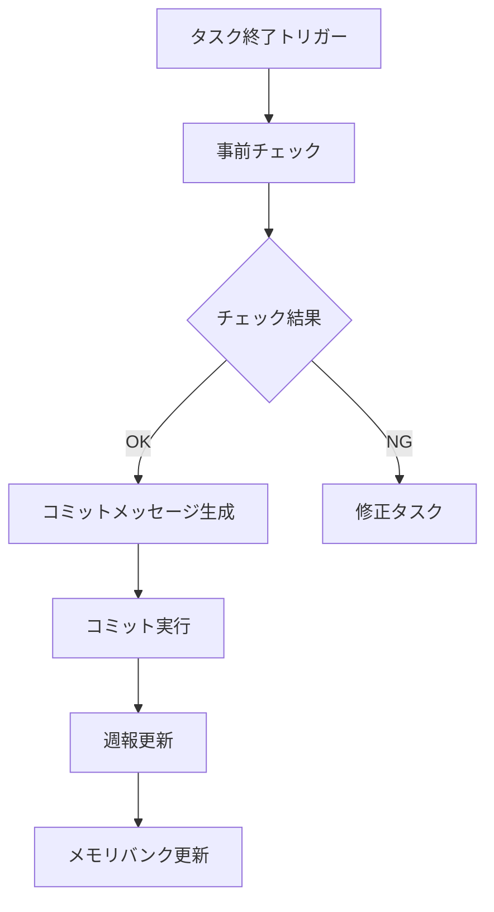

# パーソナル実行ルール

## 1. タスク終了時の自動コミット

### 1.1 トリガーキーワード

以下のいずれかのキーワードでタスク終了を認識：
- 「タスク完了」
- 「作業終了」
- 「おつかれ」
- 「これで終わり」

### 1.2 実行シーケンス



### 1.3 事前チェック項目

1. ビルド確認
   - yarn run build の実行
   - エラーがないことを確認

2. テスト実行
   - yarn run test:unit の実行
   - 関連するテストの成功を確認

3. リンター確認
   - yarn run lint の実行
   - 警告・エラーの解消

### 1.4 コミットメッセージ自動生成

```
<type>(<scope>): <タスクの概要>

<タスクの詳細な説明>
- 実装した機能や修正内容
- 重要な技術的決定
- 影響範囲

# プロンプト履歴
<プロンプトの履歴を記載>
```

### 1.5 コミット後の処理

1. 週報の更新
   - 実施内容の記録
   - 成果物へのリンク追加
   - 次のタスクの記録

2. メモリバンクの更新
   - 技術的な決定の記録
   - 新しい知見の追加
   - 次のステップの更新

## 2. コミットメッセージのテンプレート

### 2.1 機能追加時

```
feature(<機能名>): <機能の概要>

- 実装した機能の詳細
- 使用した技術やアプローチ
- テスト結果

# プロンプト履歴
1. Q: 機能実装の依頼
2. A: 実装完了の報告
```

### 2.2 バグ修正時

```
fix(<修正箇所>): <修正内容の概要>

- 修正した問題の詳細
- 修正のアプローチ
- テスト結果

# プロンプト履歴
1. Q: バグ修正の依頼
2. A: 修正完了の報告
```

### 2.3 リファクタリング時

```
refactor(<対象>): <改善内容の概要>

- リファクタリングの目的
- 変更点の詳細
- パフォーマンスへの影響

# プロンプト履歴
1. Q: リファクタリングの依頼
2. A: 改善完了の報告
```

## 3. 注意事項

### 3.1 コミット対象の確認
- バイナリファイルの除外
- 機密情報の漏洩防止
- 不要なファイルの除外

### 3.2 エラー発生時の対応
- エラーログの確認
- 修正方針の提案
- 必要に応じてロールバック

### 3.3 大規模な変更の場合
- 複数のコミットに分割
- 各コミットの論理的な独立性を確保
- レビューしやすい単位でコミット
