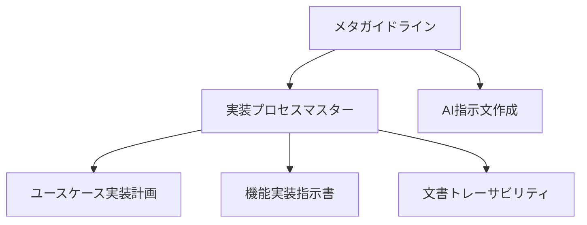

# AIガイドライン体系の構築

## ステータス

提案済み・承認済み - 2025-03-04

## 文脈

AIを活用した開発プロセスを標準化し、一貫性のある実装を実現する必要がある。特に：

1. ユーザーからAIへの指示の品質向上
2. AIの実装プロセスの標準化
3. 文書間のトレーサビリティ確保
4. 品質管理の体系化

が求められている。

## 決定

以下の構造でガイドライン体系を構築する：

### 1. ガイドラインの階層構造

1. メタレベル
   - meta-guidelines.md
   - ai-instruction-writing.md

2. プロセスレベル
   - implementation-process-master.md
   - document-traceability.md

3. 実装レベル
   - implementation-planning-with-usecases.md
   - feature-implementation-instruction-template.md

### 2. 文書管理方式

- 場所: `docs/draft/guidelines/`
- 命名規則: `[カテゴリ]-[詳細].md`
- バージョン管理: Git

### 3. 相互参照システム

- Markdownリンクによる明示的な参照
- 文書IDによるトレーサビリティ
- 変更履歴の記録

## 根拠

### 1. 階層構造の採用
- 関心の分離が可能
- 段階的な詳細化が容易
- メンテナンス性が向上

### 2. プロセス分割の方針
- ユースケースからコードまでの一貫性
- 各フェーズの責務が明確
- 品質チェックポイントの設定が容易

### 3. ドキュメント形式
- Markdownの採用により:
  - バージョン管理が容易
  - 可読性が高い
  - ツールチェーンとの親和性が良い

## 影響

### 1. 肯定的な影響
- 実装プロセスの標準化
- 品質の向上
- トレーサビリティの確保
- メンテナンス性の向上

### 2. 課題
- 初期の学習コスト
- ドキュメント管理のオーバーヘッド
- 更新の必要性

## 採用しなかった選択肢

### 1. フラットな文書構造
- 理由：複雑性の管理が困難
- 課題：文書間の関係性が不明確

### 2. 単一の包括的ガイドライン
- 理由：メンテナンスが困難
- 課題：特定の情報の検索が困難

### 3. ツールベースの管理システム
- 理由：導入・運用コストが高い
- 課題：柔軟性の低下

## 実装手順

1. ガイドライン体系の構築
   - メタガイドラインの作成
   - プロセスガイドラインの作成
   - 実装ガイドラインの作成

2. ドキュメントの整備
   - テンプレートの作成
   - 相互参照の実装
   - レビュープロセスの確立

3. 品質管理の導入
   - チェックリストの作成
   - レビュー基準の設定
   - フィードバックプロセスの確立

## 関連する問題

- 実装プロセスの標準化
- 品質管理の体系化
- ドキュメント管理の効率化

## 参照

- docs/guidelines/ai-development.md
- docs/guidelines/implementation-planning.md
- docs/ai/guidelines/documentation.md

## 更新履歴

- 2025-03-04: ADR作成・承認
  - ガイドライン体系の定義
  - 実装手順の策定
  - 品質管理プロセスの確立