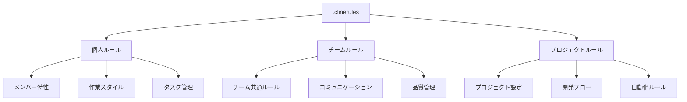
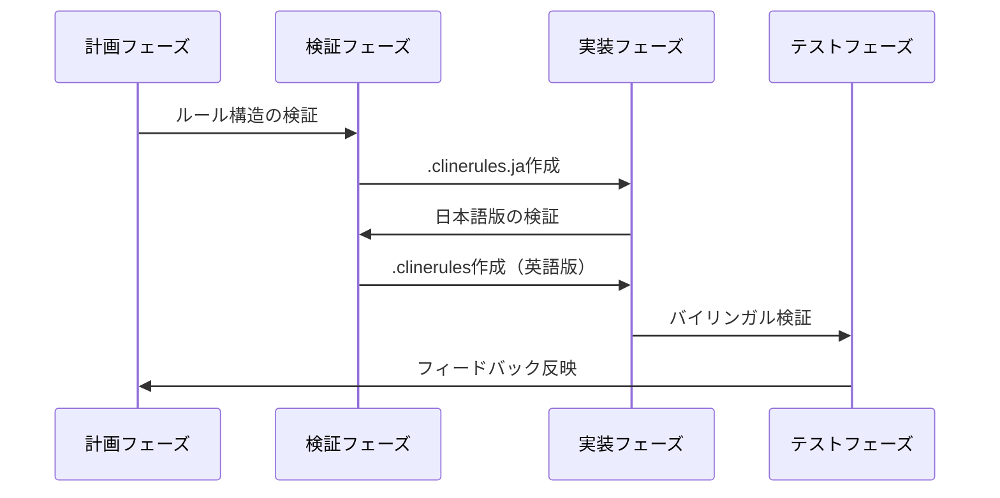
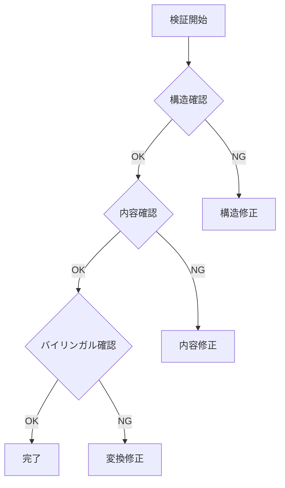

# .clinerules作成計画書

## 1. プロジェクト情報

### 1.1 基本情報
- チーム名: core
- メンバー名: amano
- プロジェクト: we-edit

### 1.2 既存ルール構造

## 2. メンバー特性の理解

### 2.1 重要な特性
- プログラミングスキルが高い
- GitHubからの学習で広範な知識を保有
- アルゴリズムやライブラリの実装が得意
- コンテキスト依存の処理は要確認

### 2.2 作業スタイル
- テストコード重視
- 動作確認しながらの段階的な実装
- 説明を交えながらのコード作成
- 試行錯誤の回避（仮説ベースの開発）

## 3. 作業計画

### 3.1 作業フロー

### 3.2 実装ステップ

1. 日本語版作成（.clinerules.ja）
   - メンバー特性の反映
   - チームルールの統合
   - プロジェクトルールの組込み

2. 英語版変換（.clinerules）
   - トークン数の最適化
   - 文脈の維持
   - 技術用語の適切な使用

## 4. エラー防止メカニズム

### 4.1 検証ポイント

### 4.2 チェックリスト
- [ ] ファイル構造の整合性
- [ ] セクション構造の一貫性
- [ ] インデントルールの遵守
- [ ] 参照パスの正確性
- [ ] 言語間の内容一致

## 5. 検証計画

### 5.1 検証項目
1. 構造検証
   - ファイル階層の確認
   - セクション構造の確認
   - フォーマットの一貫性

2. 内容検証
   - メンバー特性の反映
   - チームルールとの整合性
   - プロジェクトルールの遵守

3. バイリンガル検証
   - 日英対応の正確性
   - トークン数の最適化
   - 文脈の維持確認

### 5.2 エラー対応フロー
1. エラー検出時
   - 即時の作業中断
   - 原因の切り分け
   - 対応策の立案
   - ユーザーへの報告

2. 修正プロセス
   - バックアップの作成
   - 段階的な修正
   - 再検証の実施
   - 承認の取得