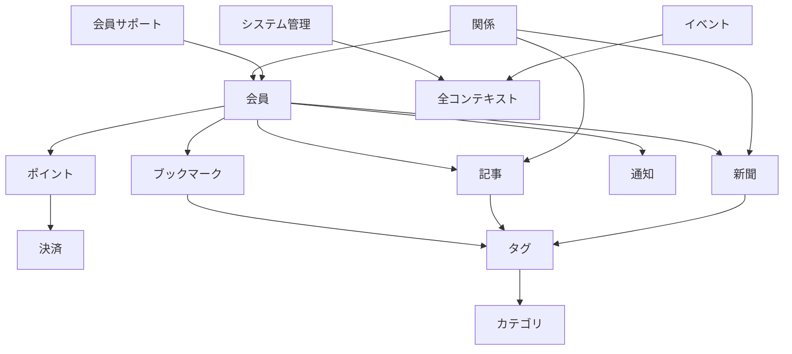

# 境界づけられたコンテキスト - We-Editシステムにおける実践的アプローチ
by Eric Evans

## なぜこの解説が必要か

We-Editプロジェクトを分析すると、13の境界づけられたコンテキストが存在し、それぞれが独自の概念モデルと責務を持っています。これらのコンテキスト間には複雑な相互作用があり、特に以下の課題に直面しています：

1. 同じ用語（例：「タグ」）が異なるコンテキストで異なる意味を持つ
2. コンテキスト間の関係が複雑（例：ブックマーク、記事、新聞の関係）
3. 階層構造を持つドメイン（グループシステム）の存在
4. 複数のコンテキストにまたがる操作（ポイントシステムと決済システム）

これらの課題に対して、境界づけられたコンテキストの適切な設計と実装が不可欠です。

## 1. コンテキストマップの分析

### 1.1 主要なコンテキストの関係



### 1.2 コンテキスト境界の定義

各コンテキストの責務と境界を明確に定義します：

```typescript
// 会員コンテキスト
module MemberContext {
  // 会員の核となる概念
  type Member = {
    id: MemberId;
    profile: MemberProfile;
    groups: ReadonlyArray<GroupMembership>;
  };

  // このコンテキスト固有の会員プロファイル定義
  type MemberProfile = {
    displayName: string;
    email: string;
    preferences: MemberPreferences;
  };
}

// ブックマークコンテキスト
module BookmarkContext {
  // ブックマークの核となる概念
  type Bookmark = {
    id: BookmarkId;
    url: URL;
    // 会員コンテキストへの参照（境界を越える）
    ownerId: MemberContext.MemberId;
    // タグコンテキストへの参照
    tags: ReadonlyArray<TagContext.TagId>;
  };
}
```

## 2. コンテキスト間の統合パターン

### 2.1 共有カーネル

```typescript
// 複数のコンテキストで共有される基本型
module SharedKernel {
  type UUID = string & { readonly _brand: 'UUID' };
  type Timestamp = number & { readonly _brand: 'Timestamp' };
  type URL = string & { readonly _brand: 'URL' };
  
  // バリデーションルール
  const validateUrl = (url: string): Either<ValidationError, URL> => {
    // 共通のURL検証ロジック
  };
}
```

### 2.2 カスタマー/サプライヤー関係

```typescript
// ポイントコンテキスト（カスタマー）
module PointContext {
  type PointTransaction = {
    id: TransactionId;
    // 決済コンテキストからの情報（ダウンストリーム）
    paymentId?: PaymentContext.PaymentId;
    amount: number;
    type: PointTransactionType;
  };

  // 決済コンテキストとの統合レイヤー
  const handlePaymentCompletion = (
    payment: PaymentContext.Payment
  ): TaskEither<PointError, PointTransaction> => {
    // 決済情報からポイントへの変換ロジック
  };
}

// 決済コンテキスト（サプライヤー）
module PaymentContext {
  // ポイントコンテキストのニーズに合わせたインターフェース
  interface PointPaymentService {
    processPointPurchase(
      amount: number,
      memberId: MemberId
    ): Promise<Payment>;
  }
}
```

### 2.3 コンフォーミスト

```typescript
// タグコンテキスト（既存システム）
module TagContext {
  type Tag = {
    id: TagId;
    name: string;
    type: 'USER' | 'SYSTEM';
  };
}

// カテゴリコンテキスト（コンフォーミスト）
module CategoryContext {
  // タグコンテキストの構造に従う
  type Category = {
    id: TagId;  // タグと同じID体系を使用
    name: string;
    type: 'SYSTEM';  // 常にシステムタグとして扱う
  };
}
```

## 3. 境界の保護パターン

### 3.1 腐敗防止レイヤー

```typescript
// 新聞コンテキストと記事コンテキストの間の腐敗防止レイヤー
module NewspaperArticleACL {
  // 新聞コンテキストのモデル
  type NewspaperArticle = {
    id: ArticleId;
    content: string;
    metadata: ArticleMetadata;
  };

  // 記事コンテキストのモデル
  type Article = {
    id: string;
    content: string;
    tags: string[];
  };

  // 変換レイヤー
  const translateToNewspaper = (
    article: Article
  ): TaskEither<TranslationError, NewspaperArticle> => {
    // 記事から新聞記事への変換ロジック
  };

  const translateToArticle = (
    newspaperArticle: NewspaperArticle
  ): TaskEither<TranslationError, Article> => {
    // 新聞記事から記事への変換ロジック
  };
}
```

### 3.2 オープンホストサービス

```typescript
// システム管理コンテキストが提供する汎用インターフェース
module SystemManagementContext {
  // 他のコンテキストが使用する共通インターフェース
  interface ContextManagement {
    auditLog(event: AuditEvent): Promise<void>;
    checkPermission(
      actorId: string,
      action: string,
      resource: string
    ): Promise<boolean>;
    getConfiguration(key: string): Promise<unknown>;
  }

  // イベント定義
  type AuditEvent = {
    timestamp: Date;
    actorId: string;
    action: string;
    context: string;
    details: unknown;
  };
}
```

## 4. 実装戦略

### 4.1 モジュール構造

```typescript
// プロジェクト構造
src/
  contexts/
    member/
      domain/
        Member.ts
        Group.ts
      application/
        MemberService.ts
      infrastructure/
        MemberRepository.ts
      integration/
        EventPublisher.ts
    bookmark/
      // 同様の構造
    article/
      // 同様の構造
```

### 4.2 コンテキスト間の通信

```typescript
// イベントベースの通信
module EventContext {
  // ドメインイベントの定義
  type DomainEvent =
    | { type: 'BOOKMARK_CREATED'; bookmark: BookmarkContext.Bookmark }
    | { type: 'ARTICLE_PUBLISHED'; article: ArticleContext.Article }
    | { type: 'POINTS_AWARDED'; points: PointContext.PointTransaction };

  // イベントバス
  interface EventBus {
    publish(event: DomainEvent): Promise<void>;
    subscribe(
      eventType: DomainEvent['type'],
      handler: (event: DomainEvent) => Promise<void>
    ): void;
  }
}
```

## まとめ

We-Editプロジェクトにおける境界づけられたコンテキストの設計と実装において、以下の点が特に重要です：

1. **明確な境界定義**
   - 各コンテキストの責務を明確に
   - 共有カーネルの最小化
   - コンテキスト間の関係の明示

2. **適切な統合パターンの選択**
   - 共有カーネル：基本型と共通バリデーション
   - カスタマー/サプライヤー：ポイントと決済の関係
   - コンフォーミスト：カテゴリとタグの関係
   - 腐敗防止レイヤー：新聞と記事の統合

3. **実装の一貫性**
   - モジュール構造の標準化
   - コンテキスト間通信の規約
   - 境界の保護メカニズム

これらの原則に従うことで、拡張性が高く、保守性の良いシステムを実現できます。