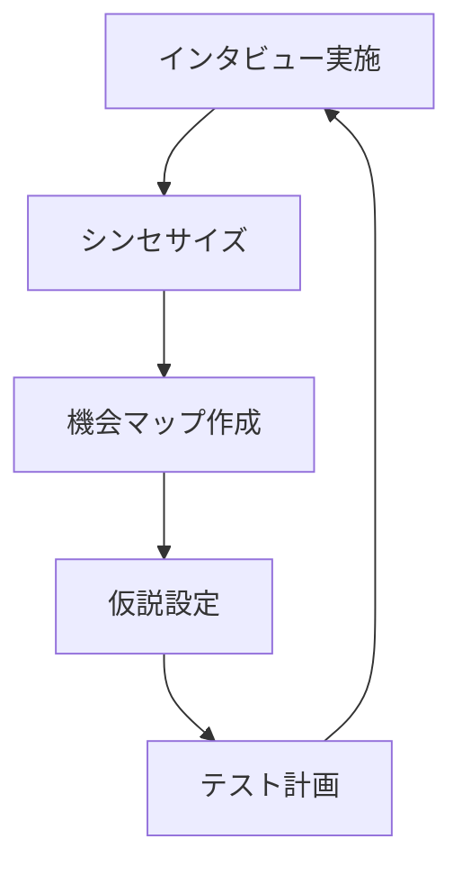
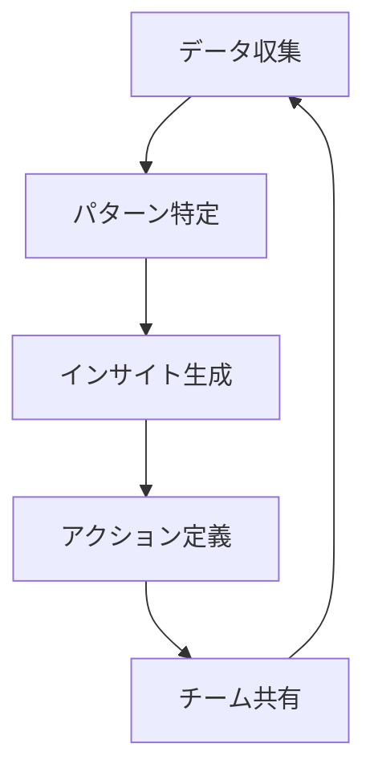

# Continuous Discovery Habitsによる仮説検証 - We-Editシステムにおける実践的アプローチ
by Teresa Torres

## なぜこの解説が必要か

We-Editプロジェクトでは、以下の継続的発見に関する課題に直面しています：

1. 定期的なユーザーリサーチの習慣化
2. 発見から実装までの時間短縮
3. チーム全体での顧客理解の共有
4. 優先順位付けの継続的な最適化

Continuous Discovery Habitsのアプローチは、これらの課題に対する実践的な解決策を提供します。

## 1. 継続的発見の習慣化

### 1.1 週次のリサーチサイクル



### 1.2 We-Editでの実装

```typescript
// 継続的発見フレームワーク
interface ContinuousDiscovery {
  cadence: {
    weekly_interviews: Interview[];
    synthesis_sessions: SynthesisSession[];
    team_reviews: TeamReview[];
  };
  artifacts: {
    opportunity_maps: OpportunityMap[];
    assumption_lists: Assumption[];
    experiment_plans: ExperimentPlan[];
  };
  metrics: {
    interview_velocity: number;
    insight_generation_rate: number;
    experiment_completion_rate: number;
  };
}

// 継続的発見マネージャー
class ContinuousDiscoveryManager {
  async manageCycle(
    discovery: ContinuousDiscovery
  ): Promise<CycleOutcome> {
    const interviews = await this.conductInterviews(discovery.cadence);
    const insights = this.synthesizeFindings(interviews);
    const opportunities = this.mapOpportunities(insights);

    return {
      learnings: this.consolidateLearnings(insights),
      decisions: this.makeDecisions(opportunities),
      nextActions: this.planNextCycle(opportunities)
    };
  }
}
```

## 2. 機会ソリューションツリー

### 2.1 機会の構造化

```typescript
// 機会ソリューションツリー
interface OpportunitySolutionTree {
  opportunities: {
    customer_needs: CustomerNeed[];
    pain_points: PainPoint[];
    desired_outcomes: DesiredOutcome[];
  };
  solutions: {
    existing: Solution[];
    proposed: Solution[];
    experiments: Experiment[];
  };
  relationships: {
    opportunity_to_solution: Relationship[];
    solution_dependencies: Dependency[];
  };
}

// 機会分析マネージャー
class OpportunityAnalyzer {
  async analyzeOpportunities(
    tree: OpportunitySolutionTree
  ): Promise<OpportunityAnalysis> {
    const prioritizedNeeds = this.prioritizeNeeds(tree.opportunities);
    const mappedSolutions = this.mapSolutionsToNeeds(
      tree.solutions,
      prioritizedNeeds
    );
    const experimentPlan = this.createExperimentPlan(mappedSolutions);

    return {
      highValueOpportunities: this.identifyHighValue(prioritizedNeeds),
      recommendedSolutions: this.recommendSolutions(mappedSolutions),
      validationPlan: this.createValidationPlan(experimentPlan)
    };
  }
}
```

## 3. 継続的なインタビュープロセス

### 3.1 インタビューの習慣化

```typescript
// 継続的インタビュープロセス
interface ContinuousInterviewing {
  scheduling: {
    cadence: 'weekly' | 'bi-weekly';
    duration: number;
    participants: Participant[];
  };
  preparation: {
    objectives: InterviewObjective[];
    questions: Question[];
    artifacts: Artifact[];
  };
  execution: {
    methods: InterviewMethod[];
    recording: RecordingMethod;
    note_taking: NoteMethod;
  };
  synthesis: {
    patterns: Pattern[];
    insights: Insight[];
    actions: Action[];
  };
}

// インタビュー管理システム
class InterviewManager {
  async manageInterviews(
    process: ContinuousInterviewing
  ): Promise<InterviewResults> {
    const sessions = await this.scheduleInterviews(process.scheduling);
    const execution = await this.executeInterviews(sessions, process.preparation);
    const synthesis = this.synthesizeResults(execution);

    return {
      patterns: this.identifyPatterns(synthesis),
      insights: this.generateInsights(synthesis),
      recommendations: this.createRecommendations(synthesis)
    };
  }
}
```

### 3.2 インサイトの統合



## 4. 実装戦略

### 4.1 発見から実装へのブリッジ

```typescript
// 発見-実装ブリッジ
interface DiscoveryDeliveryBridge {
  discoveries: {
    insights: CustomerInsight[];
    opportunities: Opportunity[];
    solutions: Solution[];
  };
  prioritization: {
    criteria: PrioritizationCriteria[];
    scores: Score[];
    decisions: Decision[];
  };
  implementation: {
    stories: UserStory[];
    experiments: Experiment[];
    metrics: SuccessMetric[];
  };
}

class DiscoveryDeliveryManager {
  async bridgeDiscoveryDelivery(
    bridge: DiscoveryDeliveryBridge
  ): Promise<BridgeOutcome> {
    const prioritized = this.prioritizeOpportunities(bridge.discoveries);
    const planned = this.createImplementationPlan(prioritized);
    const execution = await this.executeImplementation(planned);

    return {
      deliveredValue: this.assessDeliveredValue(execution),
      learnings: this.captureLearnings(execution),
      adjustments: this.recommendAdjustments(execution)
    };
  }
}
```

### 4.2 仮説検証の習慣化

```typescript
// 仮説検証習慣
interface HypothesisTestingHabit {
  cadence: {
    daily_monitoring: MonitoringActivity[];
    weekly_experiments: Experiment[];
    monthly_reviews: Review[];
  };
  methods: {
    qualitative: QualitativeMethod[];
    quantitative: QuantitativeMethod[];
    mixed: MixedMethod[];
  };
  documentation: {
    templates: Template[];
    learnings: Learning[];
    decisions: Decision[];
  };
}

class HypothesisTestingManager {
  async manageTestingHabits(
    habits: HypothesisTestingHabit
  ): Promise<HabitOutcome> {
    const monitoring = await this.executeMonitoring(habits.cadence);
    const experiments = await this.runExperiments(habits.methods);
    const documentation = this.maintainDocumentation(habits.documentation);

    return {
      effectiveness: this.evaluateEffectiveness(monitoring),
      improvements: this.identifyImprovements(experiments),
      sustainability: this.assessSustainability(documentation)
    };
  }
}
```

## まとめ

We-EditプロジェクトにおけるContinuous Discovery Habitsの実践では、以下の点が特に重要です：

1. **継続的な発見の習慣化**
   - 週次のユーザーインタビュー
   - 定期的な機会マッピング
   - チーム全体での学習共有

2. **体系的なアプローチ**
   - 機会ソリューションツリーの活用
   - 優先順位付けの最適化
   - 発見から実装への効率的な移行

3. **持続可能なプロセス**
   - 習慣としての定着
   - チーム全体の参加
   - 継続的な改善サイクル

これらの原則に従うことで、ユーザーニーズに基づいた継続的な製品改善を実現できます。