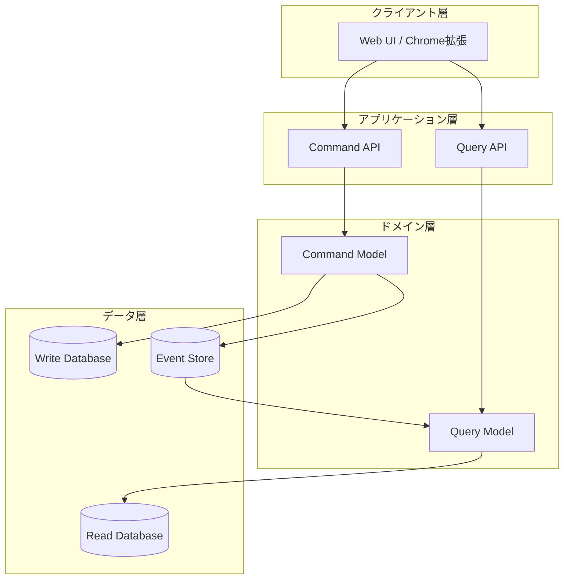
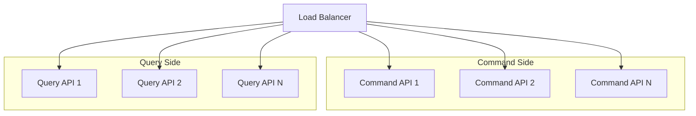

# CQRS (Command Query Responsibility Segregation) 解説 by Greg Young & Ajay Kumar

## なぜCQRS解説が必要か

このプロジェクトでは、以下の特徴から、CQRSパターンの採用が強く示唆されます：

1. すでにEvent Sourcingを採用予定であり、CQRSはその自然な補完となる
2. ブックマーク、記事、ニュースペーパーの各機能で読み取りと書き込みの要件が大きく異なる
3. 複数のUIインターフェース（Webアプリ、Chrome拡張）からのアクセスパターンの最適化が必要
4. 検索や一覧表示などの読み取り操作が頻繁に発生する
5. スケーラビリティとパフォーマンスの要件が高い

## CQRSの本質

CQRSは、システムの読み取り（Query）と書き込み（Command）の責務を分離するアーキテクチャパターンです。このパターンは、複雑なドメインモデルを持つシステムで特に効果を発揮します。

### アーキテクチャ概要



## 主要コンポーネント

### 1. コマンドサイド（Write Side）

```typescript
// コマンド定義
interface Command {
  id: string;
  type: string;
  payload: unknown;
  metadata: {
    userId: string;
    timestamp: Date;
  };
}

// コマンドハンドラー
interface CommandHandler<T extends Command> {
  handle(command: T): Promise<void>;
}

// 具体的な実装例
class CreateBookmarkCommandHandler implements CommandHandler<CreateBookmarkCommand> {
  constructor(
    private readonly repository: BookmarkRepository,
    private readonly eventBus: EventBus
  ) {}

  async handle(command: CreateBookmarkCommand): Promise<void> {
    const bookmark = new BookmarkAggregate({
      id: command.payload.id,
      url: command.payload.url,
      title: command.payload.title,
      userId: command.metadata.userId,
    });

    await this.repository.save(bookmark);
    await this.eventBus.publish(new BookmarkCreatedEvent(bookmark));
  }
}
```

### 2. クエリサイド（Read Side）

```typescript
// クエリ定義
interface Query<T> {
  execute(): Promise<T>;
}

// クエリハンドラー
class BookmarksByTagQueryHandler {
  constructor(private readonly readDb: ReadDatabase) {}

  async handle(query: BookmarksByTagQuery): Promise<BookmarkDto[]> {
    return await this.readDb.bookmarks
      .find({
        tags: { $contains: query.tag },
        userId: query.userId,
      })
      .sort({ createdAt: -1 })
      .limit(query.limit);
  }
}

// 読み取りモデル（DTO）
interface BookmarkDto {
  id: string;
  url: string;
  title: string;
  tags: string[];
  createdAt: Date;
  lastAccessed: Date;
}
```

## このプロジェクトでの実装戦略

### 1. コマンドモデルの設計

```typescript
// ドメインモデル（書き込み側）
class Article {
  private readonly events: DomainEvent[] = [];
  
  constructor(private readonly state: ArticleState) {}

  publish(): void {
    if (!this.canBePublished()) {
      throw new DomainError('Article cannot be published');
    }
    
    this.events.push(new ArticlePublishedEvent({
      articleId: this.state.id,
      publishedAt: new Date(),
    }));
  }

  private canBePublished(): boolean {
    return this.state.status === 'draft' && 
           this.state.content.length >= 100;
  }
}
```

### 2. クエリモデルの最適化

```typescript
// 記事一覧用の読み取りモデル
interface ArticleListView {
  id: string;
  title: string;
  excerpt: string;
  author: {
    id: string;
    name: string;
  };
  publishedAt: Date;
  readTime: number;
  tags: string[];
}

// 記事詳細用の読み取りモデル
interface ArticleDetailView extends ArticleListView {
  content: string;
  comments: CommentView[];
  relatedArticles: ArticleListView[];
}
```

### 3. イベントハンドリング

```typescript
class ArticleProjection {
  constructor(
    private readonly readDb: ReadDatabase,
    private readonly searchIndex: SearchIndex
  ) {}

  async handle(event: DomainEvent): Promise<void> {
    switch (event.type) {
      case 'ArticlePublished':
        await Promise.all([
          this.updateReadModel(event),
          this.updateSearchIndex(event),
        ]);
        break;
    }
  }

  private async updateReadModel(event: ArticlePublishedEvent): Promise<void> {
    await this.readDb.articles.insert({
      id: event.articleId,
      status: 'published',
      publishedAt: event.publishedAt,
    });
  }

  private async updateSearchIndex(event: ArticlePublishedEvent): Promise<void> {
    await this.searchIndex.index({
      id: event.articleId,
      type: 'article',
      content: event.content,
    });
  }
}
```

## パフォーマンス最適化

### 1. 読み取り側の最適化

```typescript
// キャッシュ戦略
class CachedBookmarkQueryHandler {
  constructor(
    private readonly redis: Redis,
    private readonly readDb: ReadDatabase
  ) {}

  async getBookmarks(userId: string): Promise<BookmarkDto[]> {
    const cached = await this.redis.get(`bookmarks:${userId}`);
    if (cached) {
      return JSON.parse(cached);
    }

    const bookmarks = await this.readDb.bookmarks
      .find({ userId })
      .sort({ lastAccessed: -1 })
      .limit(100);

    await this.redis.setex(
      `bookmarks:${userId}`,
      3600,
      JSON.stringify(bookmarks)
    );

    return bookmarks;
  }
}
```

### 2. 書き込み側の最適化

```typescript
// コマンドバッチ処理
class CommandBatchProcessor {
  private batch: Command[] = [];
  private readonly maxBatchSize = 100;
  private readonly maxWaitTime = 1000; // ms

  async add(command: Command): Promise<void> {
    this.batch.push(command);

    if (this.shouldProcessBatch()) {
      await this.processBatch();
    }
  }

  private async processBatch(): Promise<void> {
    const commands = [...this.batch];
    this.batch = [];

    await this.commandBus.publishBatch(commands);
  }

  private shouldProcessBatch(): boolean {
    return this.batch.length >= this.maxBatchSize;
  }
}
```

## スケーラビリティ考慮事項

### 1. 水平スケーリング



### 2. 非同期処理

```typescript
// イベント配信の信頼性確保
class ReliableEventPublisher {
  constructor(
    private readonly eventStore: EventStore,
    private readonly messageQueue: MessageQueue
  ) {}

  async publishWithRetry(event: DomainEvent): Promise<void> {
    const maxRetries = 3;
    let attempts = 0;

    while (attempts < maxRetries) {
      try {
        await this.messageQueue.publish(event);
        return;
      } catch (error) {
        attempts++;
        await this.delay(Math.pow(2, attempts) * 1000);
      }
    }

    // 最終的な失敗をログに記録
    await this.logFailedEvent(event);
  }
}
```

## 結論

CQRSパターンの採用により、このプロジェクトは以下の利点を得ることができます：

1. **パフォーマンスの最適化**
   - 読み取り/書き込みの個別スケーリング
   - クエリ側の効率的なキャッシュ戦略
   - 書き込み側の整合性確保

2. **保守性の向上**
   - 責務の明確な分離
   - テストの容易性
   - 変更の影響範囲の限定

3. **拡張性の確保**
   - 新しいクエリモデルの追加が容易
   - UIの要件変更への柔軟な対応
   - マイクロサービスアーキテクチャへの移行容易性

### 注意点

1. **複雑性の増加**
   - 二重のモデル管理
   - 整合性の考慮
   - チームの学習曲線

2. **運用上の考慮事項**
   - 監視の重要性
   - デバッグの複雑さ
   - 障害復旧手順の確立

## 参考文献

1. Greg Young "CQRS, Task Based UIs, Event Sourcing agh!"
2. Ajay Kumar "Building Scalable Applications with CQRS"
3. Vaughn Vernon "Implementing Domain-Driven Design"
4. Martin Fowler "CQRS"