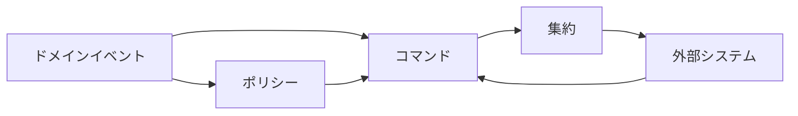
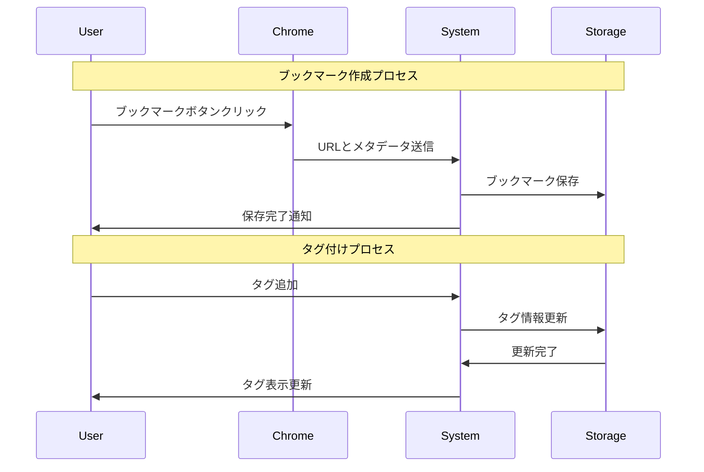
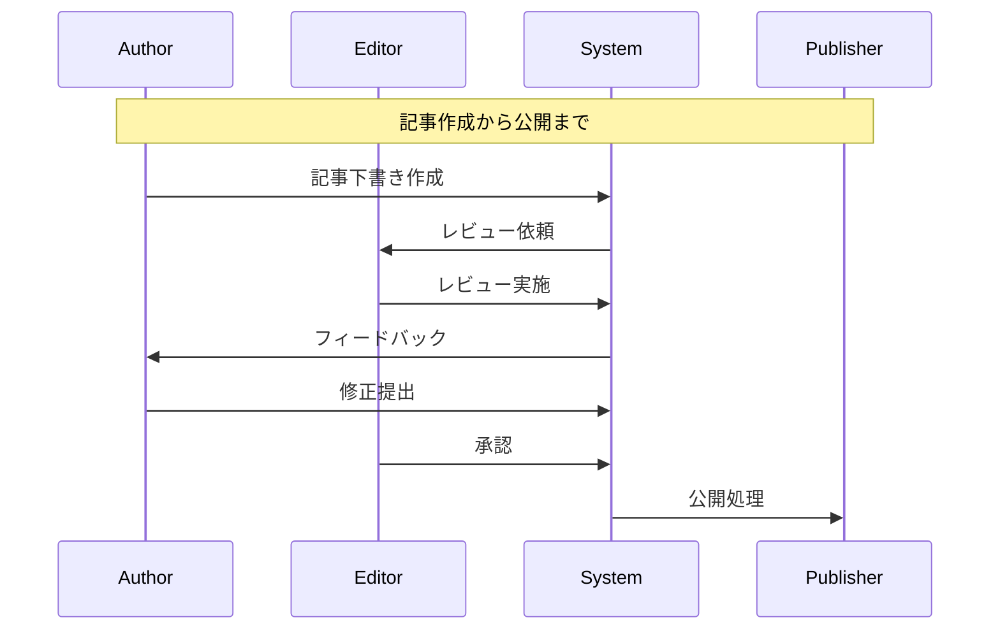

# EventStorming解説 by Alberto Brandolini

## なぜEventStorming解説が必要か

このプロジェクトでは、以下の理由からEventStormingの採用が強く示唆されます：

1. Event SourcingとCQRSアーキテクチャを採用しており、ドメインイベントの特定と整理が重要
2. ブックマーク、記事、ニュースペーパーという複数の複雑なドメインが存在し、それらの関係性の理解が必要
3. WebアプリケーションとChrome拡張の連携における業務フローの可視化が必要
4. 開発チームとステークホルダー間での知識共有と合意形成が重要
5. 将来の機能拡張を見据えた、ドメインモデルの柔軟な進化が必要

## EventStormingの本質

EventStormingは、ソフトウェアの複雑性に対処するための協働モデリング手法です。Alberto Brandoliniによって考案されたこの手法は、以下の特徴を持ちます：

1. 視覚的で直感的
2. 参加者全員の積極的な関与を促進
3. ドメイン知識の発見と共有を加速
4. 技術的・ビジネス的な課題を早期に特定

### 基本的な要素



## EventStormingのプロセス

### 1. ビッグピクチャ・イベントストーミング

```yaml
目的:
  - システム全体の理解
  - 主要なイベントの特定
  - ホットスポットの発見

手順:
  1. イベントの書き出し（オレンジ付箋）
  2. タイムライン上での整理
  3. ホットスポットのマーキング（ピンク付箋）
  4. ドメイン領域の区分け
```

### 2. プロセスレベル・イベントストーミング

```yaml
目的:
  - 特定の業務プロセスの詳細化
  - コマンドとポリシーの特定
  - アクターの役割の明確化

要素:
  オレンジ付箋: ドメインイベント
  青付箋: コマンド
  紫付箋: ポリシー
  黄色付箋: アクター
  緑付箋: 外部システム
  赤付箋: ホットスポット/課題
```

## このプロジェクトでの適用例

### 1. ブックマーク管理プロセス



### 2. 記事管理プロセス



## イベントの体系化

### 1. ドメインイベントの分類

```typescript
// ブックマークドメイン
type BookmarkEvent =
  | BookmarkCreated
  | BookmarkTagsUpdated
  | BookmarkMoved
  | BookmarkShared
  | BookmarkDeleted;

// 記事ドメイン
type ArticleEvent =
  | ArticleDrafted
  | ArticleSubmitted
  | ArticleReviewed
  | ArticlePublished
  | ArticleArchived;

// ニュースペーパードメイン
type NewspaperEvent =
  | NewspaperGenerated
  | NewspaperDistributed
  | NewspaperArchived;
```

### 2. コマンドとの関連付け

```typescript
interface Command {
  id: string;
  type: string;
  payload: unknown;
  metadata: {
    userId: string;
    timestamp: Date;
  };
}

// ブックマーク関連コマンド
interface CreateBookmarkCommand extends Command {
  type: 'CreateBookmark';
  payload: {
    url: string;
    title: string;
    tags?: string[];
  };
}

// 記事関連コマンド
interface SubmitArticleCommand extends Command {
  type: 'SubmitArticle';
  payload: {
    articleId: string;
    content: string;
    metadata: {
      title: string;
      description: string;
      tags: string[];
    };
  };
}
```

## ワークショップの実施ガイド

### 1. 準備

```yaml
必要なもの:
  物理的な場合:
    - 大きな壁またはホワイトボード
    - 付箋（複数色）
    - マーカー
    - マスキングテープ

  オンラインの場合:
    - Miro/Mural等のオンラインホワイトボード
    - ビデオ会議ツール
    - 参加者用のテンプレート
```

### 2. ファシリテーション

```yaml
ステップ:
  1. イントロダクション:
    - 目的の説明
    - ルールの確認
    - タイムボックスの設定

  2. イベントの抽出:
    - 重要な出来事の特定
    - 時系列での整理
    - 関連性の可視化

  3. プロセスの詳細化:
    - コマンドの特定
    - アクターの追加
    - ポリシーの定義

  4. 振り返りと整理:
    - ホットスポットの確認
    - 境界の設定
    - 次のステップの計画
```

## 成果物の活用

### 1. 設計ドキュメントへの反映

```markdown
# ドメインモデル定義

## ブックマークドメイン
- 集約: Bookmark
- エンティティ: BookmarkItem, Tag
- 値オブジェクト: URL, Title

## 記事ドメイン
- 集約: Article
- エンティティ: Content, Review
- 値オブジェクト: Title, Status

## ニュースペーパードメイン
- 集約: Newspaper
- エンティティ: Edition, Section
- 値オブジェクト: PublishDate, Format
```

### 2. 実装への展開

```typescript
// 集約の実装例
class BookmarkAggregate {
  private events: DomainEvent[] = [];
  private state: BookmarkState;

  constructor(private readonly id: string) {}

  createBookmark(command: CreateBookmarkCommand): void {
    if (this.state !== undefined) {
      throw new Error('Bookmark already exists');
    }

    this.applyEvent(new BookmarkCreatedEvent({
      bookmarkId: this.id,
      url: command.payload.url,
      title: command.payload.title,
      tags: command.payload.tags,
      createdBy: command.metadata.userId,
    }));
  }

  private applyEvent(event: DomainEvent): void {
    this.events.push(event);
    this.state = this.evolve(this.state, event);
  }

  private evolve(state: BookmarkState, event: DomainEvent): BookmarkState {
    switch (event.type) {
      case 'BookmarkCreated':
        return {
          id: event.payload.bookmarkId,
          url: event.payload.url,
          title: event.payload.title,
          tags: event.payload.tags,
        };
      // その他のイベントハンドリング
    }
  }
}
```

## EventStormingの利点

### 1. 知識の共有と発見

- チーム全体でのドメイン理解の促進
- 暗黙知の形式知化
- コミュニケーションギャップの早期発見

### 2. 設計の質の向上

- ドメインモデルの適切な境界の特定
- イベントドリブンな設計の促進
- ビジネスプロセスの最適化

### 3. プロジェクトリスクの低減

- 早期の問題発見
- 要件の漏れ防止
- ステークホルダーの合意形成

## 結論

EventStormingは、このプロジェクトにおいて以下の価値を提供します：

1. **ドメインの理解深化**
   - 複雑なドメイン間の関係性の可視化
   - イベントドリブンな設計の促進
   - ビジネスプロセスの最適化

2. **チームコラボレーションの向上**
   - 知識共有の促進
   - コミュニケーションの改善
   - 合意形成の効率化

3. **実装品質の向上**
   - 適切な境界の設定
   - イベントの明確な定義
   - テスト戦略の立案

## 参考文献

1. Brandolini, Alberto. "Introducing EventStorming"
2. Brandolini, Alberto. "EventStorming Recipes"
3. Vernon, Vaughn. "Domain-Driven Design Distilled"
4. Evans, Eric. "Domain-Driven Design"