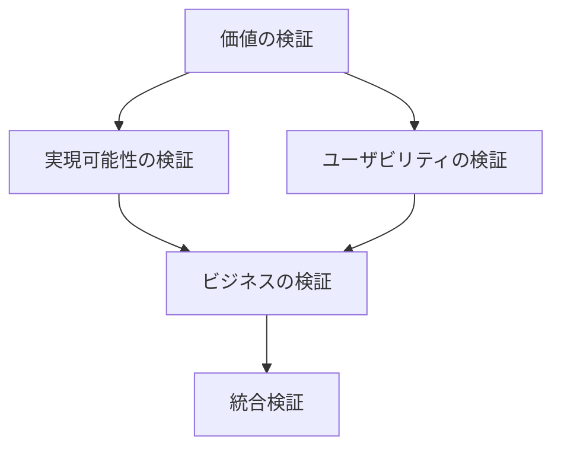
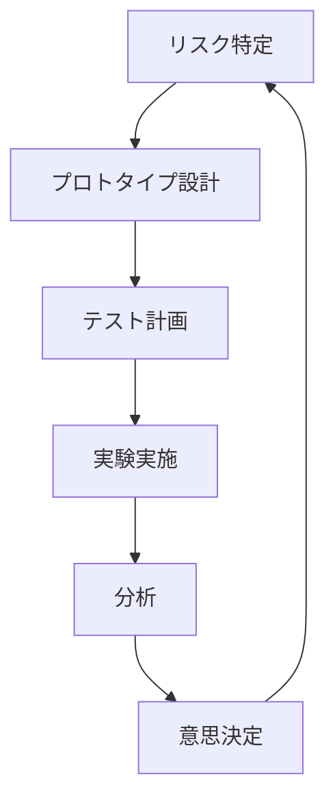

# Inspiredによる仮説検証 - We-Editシステムにおける実践的アプローチ
by Marty Cagan

## なぜこの解説が必要か

We-Editプロジェクトでは、以下のプロダクト開発の課題に直面しています：

1. 本当に価値のある機能の見極め
2. 技術的実現可能性の検証
3. ユーザビリティの確保
4. ビジネス要件との整合性

Inspiredのアプローチは、これらの課題に対する包括的な解決策を提供します。

## 1. プロダクト仮説の検証フレームワーク

### 1.1 4象限アプローチ



### 1.2 We-Editでの実装

```typescript
// プロダクト仮説の検証フレームワーク
interface ProductHypothesis {
  value: {
    problem: string;
    solution: string;
    customerSegment: string;
    valueProposition: string;
  };
  feasibility: {
    technicalRequirements: string[];
    constraints: string[];
    risks: Risk[];
  };
  usability: {
    userJourney: UserJourneyStep[];
    criticalTasks: string[];
    successCriteria: string[];
  };
  business: {
    revenue: RevenueModel;
    costs: CostStructure;
    metrics: BusinessMetric[];
  };
}

// リスク評価
interface Risk {
  type: 'technical' | 'market' | 'business';
  description: string;
  probability: 'high' | 'medium' | 'low';
  impact: 'high' | 'medium' | 'low';
  mitigationStrategy: string;
}

// 検証マネージャー
class ProductHypothesisValidator {
  async validateHypothesis(
    hypothesis: ProductHypothesis
  ): Promise<ValidationResult> {
    const valueValid = await this.validateValue(hypothesis.value);
    const feasibilityValid = await this.validateFeasibility(hypothesis.feasibility);
    const usabilityValid = await this.validateUsability(hypothesis.usability);
    const businessValid = await this.validateBusiness(hypothesis.business);

    return {
      isValid: valueValid && feasibilityValid && usabilityValid && businessValid,
      details: {
        value: valueValid,
        feasibility: feasibilityValid,
        usability: usabilityValid,
        business: businessValid
      },
      recommendations: this.generateRecommendations({
        value: valueValid,
        feasibility: feasibilityValid,
        usability: usabilityValid,
        business: businessValid
      })
    };
  }
}
```

## 2. プロダクト発見プロセス

### 2.1 機会の評価

```typescript
// 機会評価フレームワーク
interface OpportunityAssessment {
  market: {
    size: number;
    growth: number;
    segments: MarketSegment[];
  };
  customers: {
    problems: CustomerProblem[];
    alternatives: Alternative[];
    willingness_to_pay: WillingnessToPay;
  };
  business: {
    strategic_fit: StrategicFitAnalysis;
    financial_model: FinancialModel;
    risks: Risk[];
  };
  timing: {
    market_readiness: string;
    competitive_landscape: string;
    technology_readiness: string;
  };
}

class OpportunityEvaluator {
  async evaluateOpportunity(
    assessment: OpportunityAssessment
  ): Promise<OpportunityScore> {
    const marketScore = this.evaluateMarket(assessment.market);
    const customerScore = this.evaluateCustomers(assessment.customers);
    const businessScore = this.evaluateBusiness(assessment.business);
    const timingScore = this.evaluateTiming(assessment.timing);

    return {
      overall: this.calculateOverallScore({
        market: marketScore,
        customer: customerScore,
        business: businessScore,
        timing: timingScore
      }),
      details: {
        market: marketScore,
        customer: customerScore,
        business: businessScore,
        timing: timingScore
      },
      recommendations: this.generateRecommendations({
        market: marketScore,
        customer: customerScore,
        business: businessScore,
        timing: timingScore
      })
    };
  }
}
```

### 2.2 プロダクト戦略の策定

```typescript
// プロダクト戦略フレームワーク
interface ProductStrategy {
  vision: {
    statement: string;
    timeframe: string;
    success_metrics: SuccessMetric[];
  };
  objectives: {
    customer: Objective[];
    business: Objective[];
    technology: Objective[];
  };
  roadmap: {
    phases: RoadmapPhase[];
    milestones: Milestone[];
    dependencies: Dependency[];
  };
  experiments: {
    planned: Experiment[];
    completed: Experiment[];
    learnings: Learning[];
  };
}

// 戦略実行マネージャー
class ProductStrategyExecutor {
  async executeStrategy(strategy: ProductStrategy): Promise<StrategyExecution> {
    const validatedObjectives = await this.validateObjectives(strategy.objectives);
    const experimentPlan = this.createExperimentPlan(strategy.experiments);
    const roadmapExecution = this.executeRoadmap(strategy.roadmap);

    return {
      progress: this.trackProgress(validatedObjectives),
      learnings: this.collectLearnings(experimentPlan),
      adjustments: this.recommendAdjustments({
        objectives: validatedObjectives,
        experiments: experimentPlan,
        roadmap: roadmapExecution
      })
    };
  }
}
```

## 3. リスク管理とプロトタイピング

### 3.1 リスクベースのプロトタイピング

```typescript
// リスクベースのプロトタイピングフレームワーク
interface RiskBasedPrototype {
  risk: {
    type: 'value' | 'usability' | 'feasibility' | 'business';
    description: string;
    level: 'high' | 'medium' | 'low';
  };
  prototype: {
    type: 'paper' | 'clickable' | 'live';
    scope: string[];
    fidelity: 'low' | 'medium' | 'high';
  };
  testing: {
    method: TestingMethod[];
    participants: number;
    success_criteria: string[];
  };
}

class RiskBasedPrototyper {
  async createAndTestPrototype(
    config: RiskBasedPrototype
  ): Promise<PrototypeResults> {
    const prototype = await this.buildPrototype(config.prototype);
    const testPlan = this.createTestPlan(config.testing);
    const results = await this.runTests(prototype, testPlan);

    return {
      riskMitigated: this.evaluateRiskMitigation(results, config.risk),
      learnings: this.extractLearnings(results),
      nextSteps: this.planNextSteps(results)
    };
  }
}
```

### 3.2 検証サイクル



## 4. 実装戦略

### 4.1 プロダクトディスカバリー管理

```typescript
// プロダクトディスカバリーマネジメント
interface DiscoveryManagement {
  activities: {
    customer_interviews: Interview[];
    prototypes: Prototype[];
    experiments: Experiment[];
    stakeholder_reviews: Review[];
  };
  learnings: {
    customer: Learning[];
    technical: Learning[];
    business: Learning[];
  };
  decisions: {
    made: Decision[];
    pending: Decision[];
  };
}

class DiscoveryManager {
  async manageDiscovery(
    discovery: DiscoveryManagement
  ): Promise<DiscoveryOutcome> {
    const activities = await this.runActivities(discovery.activities);
    const learnings = this.consolidateLearnings(discovery.learnings);
    const decisions = await this.makeDecisions(activities, learnings);

    return {
      insights: this.generateInsights(activities, learnings),
      recommendations: this.createRecommendations(decisions),
      nextSteps: this.planNextPhase(decisions)
    };
  }
}
```

## まとめ

We-EditプロジェクトにおけるInspiredの実践では、以下の点が特に重要です：

1. **包括的な検証アプローチ**
   - 価値、実現可能性、ユーザビリティ、ビジネスの4側面
   - リスクベースのプロトタイピング
   - 体系的な検証プロセス

2. **プロダクト発見の重視**
   - 機会の綿密な評価
   - データ駆動の意思決定
   - 継続的な学習サイクル

3. **実行可能な戦略**
   - 明確なプロダクトビジョン
   - 実験ベースのアプローチ
   - 柔軟な計画調整

これらの原則に従うことで、顧客にとって真に価値のある製品を効率的に開発することができます。