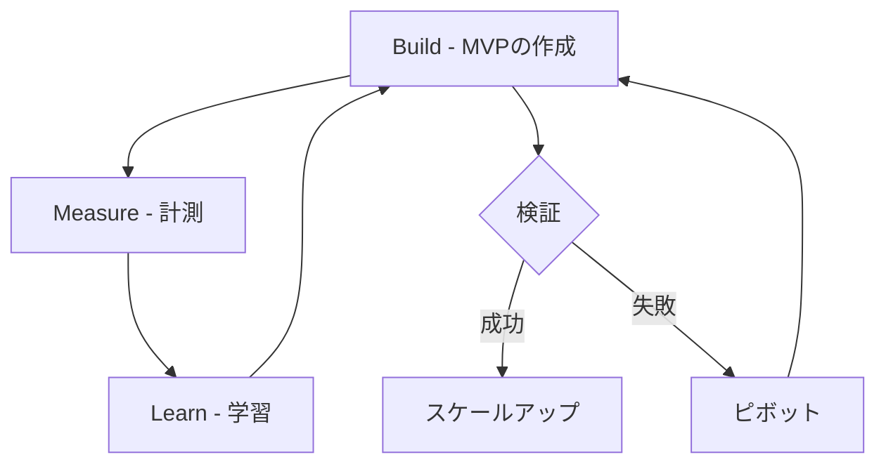
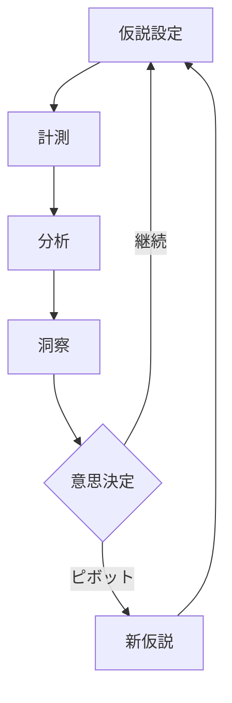

# リーンスタートアップによる仮説検証 - We-Editシステムにおける実践的アプローチ
by Eric Ries

## なぜこの解説が必要か

We-Editプロジェクトでは、新機能の開発や既存機能の改善において、以下の課題に直面しています：

1. ユーザーニーズの正確な把握が困難
2. 開発リソースの効率的な配分
3. 機能のリリース時期の判断
4. 改善サイクルの最適化

これらの課題に対して、リーンスタートアップの手法、特に仮説検証のアプローチが有効です。

## 1. Build-Measure-Learnサイクルの実装

### 1.1 サイクルの概要



### 1.2 We-Editでの適用

```typescript
// 仮説検証のための基本インターフェース
interface Hypothesis {
  id: string;
  statement: string;
  expectedOutcome: string;
  actualOutcome?: string;
  metrics: MetricDefinition[];
  status: 'pending' | 'testing' | 'validated' | 'invalidated';
}

interface MetricDefinition {
  name: string;
  target: number;
  current?: number;
  unit: string;
}

// 仮説検証のサービス
class HypothesisTestingService {
  async testHypothesis(hypothesis: Hypothesis): Promise<TestResult> {
    const mvp = await this.buildMVP(hypothesis);
    const metrics = await this.measureMetrics(mvp, hypothesis.metrics);
    const learnings = this.analyzeLearnings(metrics);
    
    return {
      validated: this.isValidated(metrics, hypothesis.metrics),
      learnings,
      nextSteps: this.determineNextSteps(learnings)
    };
  }
}
```

## 2. MVP（Minimum Viable Product）の設計

### 2.1 MVPの種類と選択基準

```typescript
// MVPタイプの定義
type MVPType = 
  | 'landing-page'    // ランディングページテスト
  | 'fake-door'       // 機能の仮実装
  | 'wizard-of-oz'    // 手動実装
  | 'concierge'       // 個別対応サービス
  | 'prototype';      // 実装プロトタイプ

// MVP設計のためのインターフェース
interface MVPDefinition {
  type: MVPType;
  hypothesis: Hypothesis;
  timeframe: {
    start: Date;
    end: Date;
  };
  resources: {
    development: number;  // 開発工数（人日）
    operations: number;   // 運用工数（人日）
  };
  success_criteria: {
    metric: string;
    target: number;
  }[];
}
```

### 2.2 段階的な検証プロセス

```typescript
// 段階的検証のためのパイプライン
class ValidationPipeline {
  private stages: ValidationStage[] = [
    new ProblemValidationStage(),
    new SolutionValidationStage(),
    new ScaleValidationStage()
  ];

  async execute(hypothesis: Hypothesis): Promise<ValidationResult> {
    let currentResult: ValidationResult = { validated: false, data: {} };
    
    for (const stage of this.stages) {
      if (!currentResult.validated) break;
      currentResult = await stage.validate(hypothesis);
    }
    
    return currentResult;
  }
}
```

## 3. 測定と学習のフレームワーク

### 3.1 主要な測定指標

```typescript
// メトリクス定義
interface Metrics {
  acquisition: {
    visitors: number;
    signups: number;
    conversion_rate: number;
  };
  activation: {
    completed_onboarding: number;
    feature_usage: Record<string, number>;
  };
  retention: {
    daily_active_users: number;
    weekly_active_users: number;
    monthly_active_users: number;
  };
  revenue: {
    mrr: number;
    arpu: number;
    ltv: number;
  };
}

// メトリクス収集サービス
class MetricsCollectionService {
  async collectMetrics(timeframe: DateRange): Promise<Metrics> {
    const [acquisition, activation, retention, revenue] = await Promise.all([
      this.getAcquisitionMetrics(timeframe),
      this.getActivationMetrics(timeframe),
      this.getRetentionMetrics(timeframe),
      this.getRevenueMetrics(timeframe)
    ]);

    return {
      acquisition,
      activation,
      retention,
      revenue
    };
  }
}
```

### 3.2 学習のループ



## 4. 実装戦略

### 4.1 フィーチャーフラグによる段階的リリース

```typescript
// フィーチャーフラグの実装
interface FeatureFlag {
  name: string;
  description: string;
  enabled: boolean;
  rolloutPercentage: number;
  targets?: {
    userIds?: string[];
    userGroups?: string[];
  };
}

class FeatureFlagService {
  async isFeatureEnabled(
    featureName: string,
    userId: string
  ): Promise<boolean> {
    const flag = await this.getFeatureFlag(featureName);
    if (!flag.enabled) return false;

    if (flag.targets?.userIds?.includes(userId)) return true;
    if (this.isUserInTargetGroups(userId, flag.targets?.userGroups)) {
      return true;
    }

    return this.isUserInRolloutPercentage(userId, flag.rolloutPercentage);
  }
}
```

### 4.2 A/Bテスト基盤

```typescript
// A/Bテストの設定
interface ABTest {
  id: string;
  name: string;
  variants: {
    id: string;
    name: string;
    weight: number;
  }[];
  metrics: {
    primary: string[];
    secondary: string[];
  };
  audience: {
    filters: UserFilter[];
    size: number;
  };
}

// A/Bテストサービス
class ABTestingService {
  async assignVariant(
    testId: string,
    userId: string
  ): Promise<string> {
    const test = await this.getTest(testId);
    if (!this.isUserInAudience(userId, test.audience)) {
      return 'control';
    }

    return this.deterministicVariantAssignment(userId, test.variants);
  }
}
```

## まとめ

We-Editプロジェクトにおけるリーンスタートアップの実践において、以下の点が特に重要です：

1. **仮説検証の体系化**
   - 明確な仮説定義
   - 測定可能な成功指標
   - 体系的な検証プロセス

2. **MVPの効果的な活用**
   - 目的に応じたMVPタイプの選択
   - 最小限のリソースでの検証
   - 段階的な機能展開

3. **データドリブンな意思決定**
   - 適切なメトリクスの設定
   - 継続的なデータ収集と分析
   - 客観的な評価基準

これらの原則に従うことで、効率的な開発サイクルと、ユーザーニーズに適合した製品開発を実現できます。