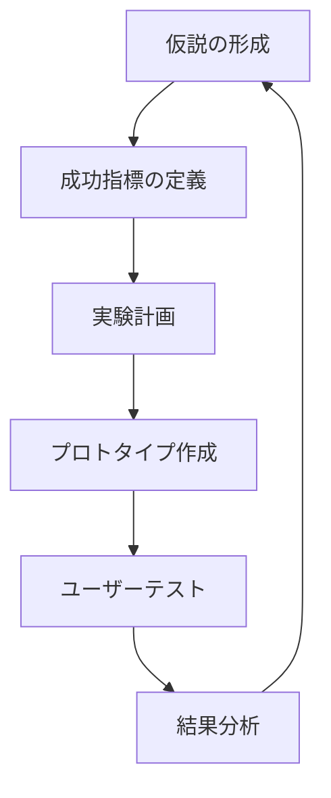
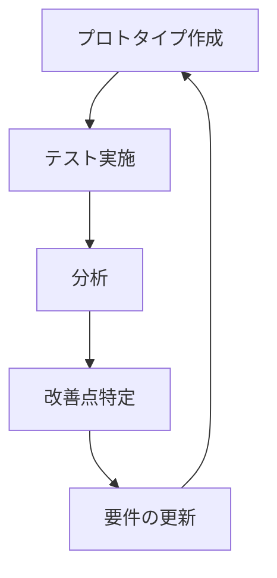

# Lean UXによる仮説検証 - We-Editシステムにおける実践的アプローチ
by Jeff Gothelf and Josh Seiden

## なぜこの解説が必要か

We-Editプロジェクトでは、以下のUX関連の課題に直面しています：

1. ユーザー体験の仮説検証方法
2. デザイン決定の根拠となるデータ収集
3. アジャイル開発の中でのUX改善プロセス
4. クロスファンクショナルチームでの協働

Lean UXのアプローチは、これらの課題に対する実践的な解決策を提供します。

## 1. デザイン仮説の構築

### 1.1 仮説の構造化



### 1.2 We-Editでの実装

```typescript
// デザイン仮説のフレームワーク
interface DesignHypothesis {
  problem: {
    statement: string;
    userPain: string;
    businessImpact: string;
  };
  solution: {
    description: string;
    mockups: string[];
    prototypes: string[];
  };
  expectedOutcome: {
    userBehavior: string;
    metrics: DesignMetric[];
    businessResult: string;
  };
  validation: {
    methods: ValidationMethod[];
    timeline: number;  // 日数
    participants: number;
  };
}

interface DesignMetric {
  name: string;
  current: number;
  target: number;
  method: 'quantitative' | 'qualitative';
  source: 'analytics' | 'user-testing' | 'survey';
}

type ValidationMethod = 
  | 'usability-testing'
  | 'a-b-testing'
  | 'user-interview'
  | 'analytics-review'
  | 'heatmap-analysis';
```

## 2. デザインスタジオの実施

### 2.1 コラボレーティブデザイン

```typescript
// デザインスタジオセッションの構造
interface DesignStudio {
  session: {
    problem: string;
    constraints: string[];
    participants: {
      role: string;
      expertise: string[];
    }[];
    duration: number;  // 分
  };
  activities: {
    type: 'diverge' | 'converge' | 'critique';
    duration: number;
    outputs: string[];
  }[];
  outcomes: {
    concepts: DesignConcept[];
    decisions: DesignDecision[];
    nextSteps: string[];
  };
}

interface DesignConcept {
  name: string;
  sketch: string;
  assumptions: string[];
  testableHypotheses: string[];
}

// デザインスタジオファシリテーター
class DesignStudioFacilitator {
  async runSession(studio: DesignStudio): Promise<DesignStudioOutcome> {
    const concepts = await this.facilitateDivergence(studio);
    const critiques = await this.facilitateCritique(concepts);
    const decisions = this.facilitateConvergence(critiques);
    
    return {
      selectedConcepts: decisions.concepts,
      rationale: decisions.rationale,
      actionItems: this.createActionItems(decisions)
    };
  }
}
```

## 3. ラピッドプロトタイピングと検証

### 3.1 プロトタイプの段階

```typescript
// プロトタイプの定義
interface Prototype {
  stage: 'paper' | 'digital' | 'interactive' | 'live';
  fidelity: 'low' | 'medium' | 'high';
  scope: {
    features: string[];
    userFlows: string[];
    interactions: string[];
  };
  objectives: {
    hypotheses: string[];
    metrics: PrototypeMetric[];
  };
}

interface PrototypeMetric {
  name: string;
  success_criteria: string;
  measurement_method: string;
}

// プロトタイプテストの実行者
class PrototypeTestRunner {
  async conductTest(
    prototype: Prototype,
    participants: TestParticipant[]
  ): Promise<TestResults> {
    const sessions = await this.runTestSessions(prototype, participants);
    const metrics = this.collectMetrics(sessions);
    const insights = this.analyzeResults(sessions, metrics);
    
    return {
      quantitativeData: metrics,
      qualitativeInsights: insights,
      recommendations: this.generateRecommendations(insights)
    };
  }
}
```

### 3.2 反復的な改善プロセス



## 4. 実装戦略

### 4.1 UXデータの継続的収集

```typescript
// UXモニタリングシステム
interface UXMonitor {
  metrics: {
    usability: UsabilityMetric[];
    engagement: EngagementMetric[];
    satisfaction: SatisfactionMetric[];
  };
  collection_methods: {
    automated: AutomatedCollection[];
    manual: ManualCollection[];
  };
  analysis: {
    frequency: 'real-time' | 'daily' | 'weekly';
    alerts: UXAlert[];
  };
}

class UXDataCollector {
  async collectData(): Promise<UXData> {
    const [usability, engagement, satisfaction] = await Promise.all([
      this.collectUsabilityData(),
      this.collectEngagementData(),
      this.collectSatisfactionData()
    ]);

    return {
      metrics: { usability, engagement, satisfaction },
      timestamp: new Date(),
      insights: this.analyzeData({ usability, engagement, satisfaction })
    };
  }
}
```

### 4.2 イテレーティブなデザインプロセス

```typescript
// デザインイテレーションの管理
interface DesignIteration {
  phase: 'research' | 'ideation' | 'testing' | 'implementation';
  activities: {
    name: string;
    duration: number;
    participants: string[];
    outputs: string[];
  }[];
  decisions: {
    made: Decision[];
    pending: Decision[];
  };
  metrics: {
    name: string;
    baseline: number;
    current: number;
    target: number;
  }[];
}

class DesignIterationManager {
  async runIteration(iteration: DesignIteration): Promise<IterationResult> {
    const activities = await this.executeActivities(iteration.activities);
    const metrics = await this.measureResults(iteration.metrics);
    const decisions = await this.makeDecisions(activities, metrics);
    
    return {
      completedActivities: activities,
      metricsResults: metrics,
      decisions,
      nextSteps: this.planNextIteration(decisions)
    };
  }
}
```

## まとめ

We-EditプロジェクトにおけるLean UXの実践では、以下の点が特に重要です：

1. **デザイン仮説の体系化**
   - 明確な問題・解決策の定義
   - 測定可能な成功指標
   - 体系的な検証方法

2. **コラボレーティブなプロセス**
   - クロスファンクショナルなデザインスタジオ
   - 迅速なプロトタイピングと検証
   - チーム全体での学習サイクル

3. **データ駆動の意思決定**
   - 継続的なUXメトリクスの収集
   - 定量・定性データの統合分析
   - 実践的な改善サイクル

これらの原則に従うことで、ユーザー中心の製品開発プロセスを確立し、継続的な改善を実現できます。