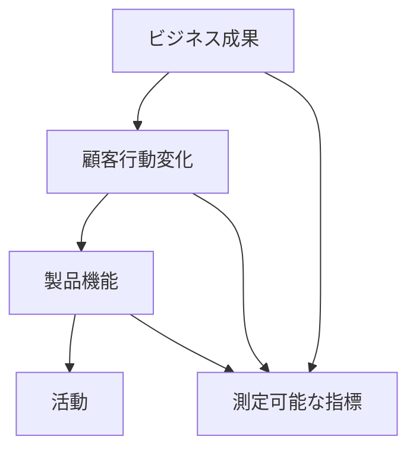
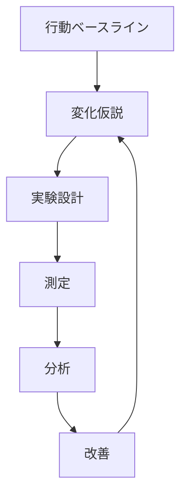

# Outcomes Over Outputによる仮説検証 - We-Editシステムにおける実践的アプローチ
by Josh Seiden

## なぜこの解説が必要か

We-Editプロジェクトでは、以下の成果測定に関する課題に直面しています：

1. アウトプットとアウトカムの適切な区別
2. 顧客行動の変化の測定
3. 意味のある成果指標の設定
4. 仮説検証の効果的な評価

Outcomes Over Outputのアプローチは、これらの課題に対する実践的な解決策を提供します。

## 1. アウトカム駆動開発

### 1.1 アウトカムの階層構造



### 1.2 We-Editでの実装

```typescript
// アウトカム駆動フレームワーク
interface OutcomeDrivenDevelopment {
  outcomes: {
    business: BusinessOutcome[];
    customer: CustomerOutcome[];
    product: ProductOutcome[];
  };
  measurements: {
    metrics: OutcomeMetric[];
    behaviors: BehaviorMetric[];
    impacts: ImpactMetric[];
  };
  validation: {
    hypotheses: OutcomeHypothesis[];
    experiments: OutcomeExperiment[];
    learnings: OutcomeLearning[];
  };
}

// アウトカム管理システム
class OutcomeManager {
  async manageOutcomes(
    development: OutcomeDrivenDevelopment
  ): Promise<OutcomeResults> {
    const measured = await this.measureOutcomes(development.measurements);
    const validated = await this.validateOutcomes(development.validation);
    const adjusted = this.adjustBasedOnLearnings(validated);

    return {
      achievements: this.assessAchievements(measured),
      insights: this.generateInsights(validated),
      recommendations: this.createRecommendations(adjusted)
    };
  }
}
```

## 2. 行動変化の測定

### 2.1 行動指標のフレームワーク

```typescript
// 行動指標システム
interface BehaviorMetrics {
  baseline: {
    currentBehaviors: Behavior[];
    frequencies: Frequency[];
    contexts: Context[];
  };
  desired: {
    targetBehaviors: Behavior[];
    changes: BehaviorChange[];
    impacts: Impact[];
  };
  measurement: {
    methods: MeasurementMethod[];
    tools: MeasurementTool[];
    frequency: MeasurementFrequency[];
  };
}

// 行動分析マネージャー
class BehaviorAnalyzer {
  async analyzeBehaviors(
    metrics: BehaviorMetrics
  ): Promise<BehaviorAnalysis> {
    const baseline = await this.measureBaseline(metrics.baseline);
    const changes = await this.trackChanges(metrics.desired);
    const impact = this.assessImpact(baseline, changes);

    return {
      behaviorChanges: this.quantifyChanges(changes),
      businessImpact: this.calculateImpact(impact),
      nextSteps: this.recommendNextSteps(impact)
    };
  }
}
```

### 2.2 行動変化の検証サイクル



## 3. 成果ベースの実験設計

### 3.1 実験フレームワーク

```typescript
// 成果ベース実験
interface OutcomeBasedExperiment {
  target: {
    currentState: CurrentState;
    desiredState: DesiredState;
    behaviorChange: BehaviorChange;
  };
  design: {
    hypothesis: OutcomeHypothesis;
    intervention: Intervention;
    measurement: Measurement;
  };
  execution: {
    timeline: Timeline;
    dataCollection: DataCollection;
    analysis: Analysis;
  };
}

// 実験実行マネージャー
class OutcomeExperimentRunner {
  async runExperiment(
    experiment: OutcomeBasedExperiment
  ): Promise<ExperimentResults> {
    const execution = await this.executeIntervention(experiment.design);
    const data = await this.collectData(experiment.execution);
    const analysis = this.analyzeOutcomes(data);

    return {
      behaviorChanges: this.measureChanges(analysis),
      outcomes: this.evaluateOutcomes(analysis),
      learnings: this.documentLearnings(analysis)
    };
  }
}
```

### 3.2 成果の測定システム

```typescript
// 成果測定システム
interface OutcomeMeasurement {
  metrics: {
    behavioral: BehavioralMetric[];
    business: BusinessMetric[];
    product: ProductMetric[];
  };
  collection: {
    methods: CollectionMethod[];
    frequency: CollectionFrequency[];
    tools: CollectionTool[];
  };
  analysis: {
    techniques: AnalysisTechnique[];
    visualization: Visualization[];
    reporting: Report[];
  };
}

class OutcomeMeasurer {
  async measureOutcomes(
    measurement: OutcomeMeasurement
  ): Promise<MeasurementResults> {
    const data = await this.collectData(measurement.collection);
    const analysis = this.analyzeData(measurement.analysis);
    const insights = this.generateInsights(analysis);

    return {
      results: this.compileResults(data),
      impact: this.assessImpact(analysis),
      recommendations: this.createRecommendations(insights)
    };
  }
}
```

## 4. 実装戦略

### 4.1 成果駆動の開発プロセス

```typescript
// 成果駆動開発プロセス
interface OutcomeDrivenProcess {
  planning: {
    outcomes: DesiredOutcome[];
    metrics: OutcomeMetric[];
    timeline: Timeline;
  };
  execution: {
    experiments: Experiment[];
    measurements: Measurement[];
    adaptations: Adaptation[];
  };
  learning: {
    insights: Insight[];
    adjustments: Adjustment[];
    improvements: Improvement[];
  };
}

class OutcomeProcessManager {
  async manageProcess(
    process: OutcomeDrivenProcess
  ): Promise<ProcessResults> {
    const execution = await this.executeProcess(process.execution);
    const measurements = await this.measureOutcomes(execution);
    const learnings = this.processLearnings(measurements);

    return {
      outcomes: this.evaluateOutcomes(measurements),
      insights: this.synthesizeInsights(learnings),
      adaptations: this.planAdaptations(learnings)
    };
  }
}
```

### 4.2 継続的な成果最適化

```typescript
// 成果最適化システム
interface OutcomeOptimization {
  monitoring: {
    behaviors: BehaviorMonitor[];
    impacts: ImpactMonitor[];
    trends: TrendMonitor[];
  };
  analysis: {
    patterns: Pattern[];
    correlations: Correlation[];
    predictions: Prediction[];
  };
  optimization: {
    opportunities: Opportunity[];
    experiments: Experiment[];
    improvements: Improvement[];
  };
}

class OutcomeOptimizer {
  async optimizeOutcomes(
    optimization: OutcomeOptimization
  ): Promise<OptimizationResults> {
    const monitoring = await this.monitorOutcomes(optimization.monitoring);
    const analysis = await this.analyzePatterns(optimization.analysis);
    const improvements = this.identifyImprovements(optimization.optimization);

    return {
      performance: this.assessPerformance(monitoring),
      opportunities: this.prioritizeOpportunities(analysis),
      recommendations: this.createRecommendations(improvements)
    };
  }
}
```

## まとめ

We-EditプロジェクトにおけるOutcomes Over Outputの実践では、以下の点が特に重要です：

1. **成果駆動の思考方法**
   - アウトプットからアウトカムへの転換
   - 顧客行動変化への注目
   - 意味のある成果指標の設定

2. **効果的な測定システム**
   - 行動変化の定量化
   - 多面的な成果測定
   - データに基づく意思決定

3. **継続的な最適化**
   - 実験サイクルの確立
   - 学習の体系化
   - 改善の反復

これらの原則に従うことで、真に価値のある成果を生み出すことができます。