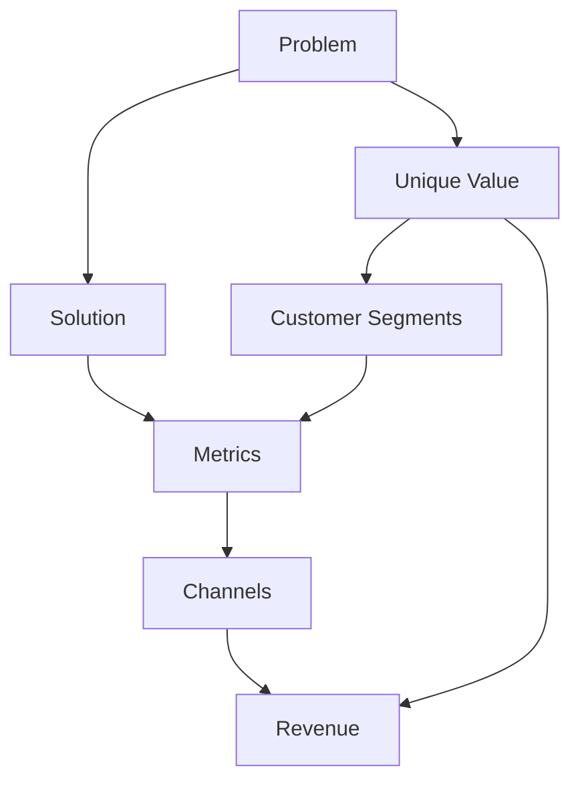
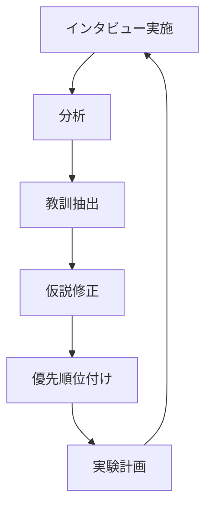

# Running Leanによる仮説検証 - We-Editシステムにおける実践的アプローチ
by Ash Maurya

## なぜこの解説が必要か

We-Editプロジェクトでは、以下の実践的な課題に直面しています：

1. アイデアを具体的な実験計画に落とし込む方法
2. 限られたリソースでの効果的な検証方法
3. フィードバックの収集と分析の体系化
4. 検証サイクルの最適化

Running Leanのアプローチは、これらの課題に対する具体的な解決策を提供します。

## 1. リーンキャンバスの活用

### 1.1 問題と解決策の定義



### 1.2 We-Editでの実装

```typescript
// リーンキャンバスのインターフェース
interface LeanCanvas {
  problem: {
    statement: string;
    existingSolutions: string[];
    constraints: string[];
  };
  customerSegments: {
    target: string;
    earlyAdopters: string[];
    characteristics: string[];
  };
  uniqueValueProposition: {
    headline: string;
    features: string[];
    differentiators: string[];
  };
  solution: {
    features: Feature[];
    mvpComponents: MVPComponent[];
  };
}

// 機能定義
interface Feature {
  name: string;
  description: string;
  priority: 'must-have' | 'nice-to-have' | 'future';
  hypotheses: Hypothesis[];
}

// MVP構成要素
interface MVPComponent {
  feature: string;
  implementationType: 'full' | 'partial' | 'mock';
  estimatedEffort: number;
  validationCriteria: string[];
}
```

## 2. 実験計画の策定

### 2.1 仮説の優先順位付け

```typescript
// 仮説の優先順位付けシステム
interface HypothesisPrioritization {
  hypothesis: Hypothesis;
  risk: {
    type: 'customer' | 'problem' | 'solution';
    level: 1 | 2 | 3;  // 1: 高リスク, 3: 低リスク
  };
  effort: {
    timeToValidate: number;  // 日数
    resourceRequired: number;  // 人日
  };
  impact: {
    businessValue: 1 | 2 | 3;  // 1: 低impact, 3: 高impact
    learningValue: 1 | 2 | 3;
  };
}

class HypothesisPrioritizer {
  calculatePriority(hypothesis: HypothesisPrioritization): number {
    const riskFactor = this.calculateRiskFactor(hypothesis.risk);
    const effortFactor = this.calculateEffortFactor(hypothesis.effort);
    const impactFactor = this.calculateImpactFactor(hypothesis.impact);

    return (riskFactor * impactFactor) / effortFactor;
  }
}
```

### 2.2 実験デザイン

```typescript
// 実験設計のフレームワーク
interface Experiment {
  hypothesis: Hypothesis;
  method: ExperimentMethod;
  metrics: {
    name: string;
    baseline: number;
    target: number;
    actual?: number;
  }[];
  timeline: {
    setup: number;  // 日数
    run: number;    // 日数
    analysis: number; // 日数
  };
  resources: {
    development: number;
    marketing: number;
    customer_service: number;
  };
}

type ExperimentMethod = 
  | 'customer-interview'
  | 'landing-page'
  | 'smoke-test'
  | 'wizard-of-oz'
  | 'concierge'
  | 'prototype';

class ExperimentRunner {
  async runExperiment(experiment: Experiment): Promise<ExperimentResult> {
    await this.setup(experiment);
    const data = await this.collect(experiment);
    const analysis = this.analyze(data, experiment.metrics);
    
    return {
      validated: this.isValidated(analysis, experiment.metrics),
      learnings: this.extractLearnings(analysis),
      nextSteps: this.recommendNextSteps(analysis)
    };
  }
}
```

## 3. カスタマー開発プロセス

### 3.1 インタビューの体系化

```typescript
// カスタマーインタビューのフレームワーク
interface CustomerInterview {
  customer: {
    segment: string;
    profile: CustomerProfile;
    stage: 'problem' | 'solution' | 'product';
  };
  script: {
    welcome: string;
    questions: InterviewQuestion[];
    wrap_up: string;
  };
  responses: {
    question_id: string;
    response: string;
    insights: string[];
    follow_ups: string[];
  }[];
}

interface InterviewQuestion {
  id: string;
  question: string;
  type: 'open' | 'closed' | 'scaling';
  purpose: 'problem' | 'solution' | 'pricing' | 'channel';
}

class InterviewAnalyzer {
  analyzeInterviews(interviews: CustomerInterview[]): InterviewInsights {
    const patterns = this.identifyPatterns(interviews);
    const problems = this.extractProblems(interviews);
    const solutions = this.evaluateSolutions(interviews);
    
    return {
      patterns,
      problems,
      solutions,
      recommendations: this.generateRecommendations({
        patterns,
        problems,
        solutions
      })
    };
  }
}
```

### 3.2 フィードバックループの確立



## 4. 実装戦略

### 4.1 継続的なフィードバック収集

```typescript
// フィードバック収集システム
interface FeedbackSystem {
  channels: {
    type: 'interview' | 'survey' | 'usage-data' | 'support';
    weight: number;
    frequency: 'continuous' | 'weekly' | 'monthly';
  }[];
  collectors: FeedbackCollector[];
  analyzers: FeedbackAnalyzer[];
}

class FeedbackOrchestrator {
  async collectAndAnalyzeFeedback(): Promise<FeedbackInsights> {
    const rawFeedback = await this.collectFromAllChannels();
    const analyzedFeedback = this.analyzeAllFeedback(rawFeedback);
    
    return {
      insights: this.generateInsights(analyzedFeedback),
      recommendations: this.generateRecommendations(analyzedFeedback),
      priorities: this.prioritizeActions(analyzedFeedback)
    };
  }
}
```

### 4.2 イテレーション計画

```typescript
// イテレーション計画のフレームワーク
interface IterationPlan {
  cycle: {
    duration: number;  // 週数
    goals: string[];
    experiments: Experiment[];
  };
  metrics: {
    name: string;
    current: number;
    target: number;
    method: string;
  }[];
  adjustments: {
    type: 'pivot' | 'persevere' | 'optimize';
    reason: string;
    actions: string[];
  }[];
}

class IterationPlanner {
  createNextIteration(
    currentResults: ExperimentResult[],
    feedback: FeedbackInsights
  ): IterationPlan {
    const learnings = this.consolidateLearnings(currentResults);
    const adjustments = this.determineAdjustments(learnings, feedback);
    
    return {
      cycle: this.planNextCycle(adjustments),
      metrics: this.updateMetrics(learnings),
      adjustments
    };
  }
}
```

## まとめ

We-EditプロジェクトにおけるRunning Leanの実践では、以下の点が特に重要です：

1. **体系的な検証プロセス**
   - リーンキャンバスによる問題・解決策の明確化
   - 優先順位付けられた実験計画
   - 構造化されたカスタマーインタビュー

2. **効率的なフィードバックループ**
   - 複数チャネルからのフィードバック収集
   - データ駆動の意思決定
   - 迅速な仮説の検証と修正

3. **継続的な改善サイクル**
   - 明確な成功指標
   - 構造化された実験プロセス
   - 体系的な学習の蓄積

これらの原則に従うことで、最小限のリソースで最大の学習を得ることができ、製品開発の効率を大幅に向上させることができます。