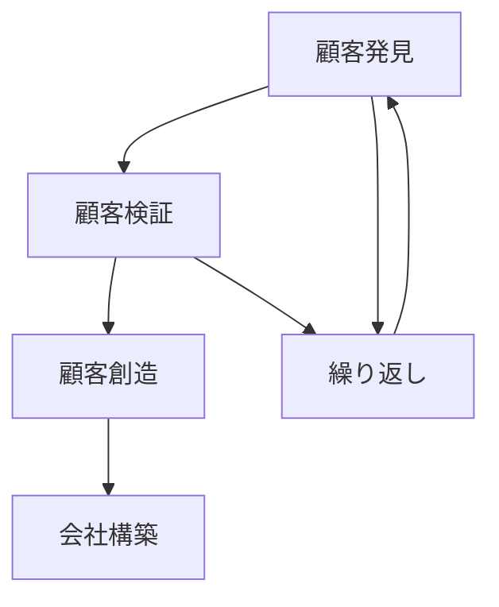
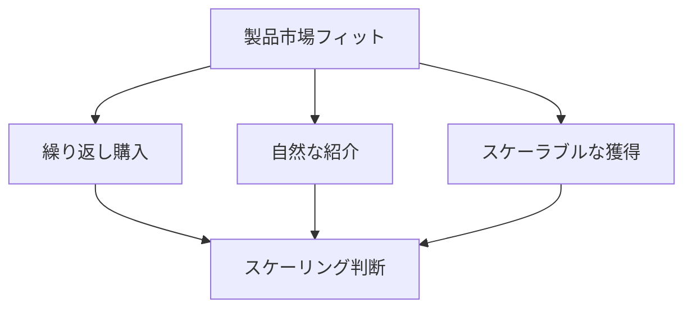

# Startup Owner's Manualによる仮説検証 - We-Editシステムにおける実践的アプローチ
by Steve Blank and Bob Dorf

## なぜこの解説が必要か

We-Editプロジェクトでは、以下の顧客開発に関する課題に直面しています：

1. 顧客ニーズの正確な把握と検証
2. ビジネスモデルの各要素の検証
3. スケーラブルな顧客獲得の方法
4. 製品市場フィットの達成

Startup Owner's Manualのアプローチは、これらの課題に対する体系的な解決策を提供します。

## 1. 顧客開発プロセス

### 1.1 4つのステップ



### 1.2 We-Editでの実装

```typescript
// 顧客開発フレームワーク
interface CustomerDevelopment {
  discovery: {
    hypotheses: CustomerHypothesis[];
    experiments: CustomerExperiment[];
    learnings: CustomerLearning[];
  };
  validation: {
    value_proposition: ValueProposition;
    business_model: BusinessModel;
    metrics: ValidationMetric[];
  };
  creation: {
    acquisition: AcquisitionChannel[];
    activation: ActivationStrategy[];
    scaling: ScalingPlan;
  };
  building: {
    organization: OrganizationStructure;
    processes: BusinessProcess[];
    culture: CultureDefinition;
  };
}

// 顧客仮説管理
class CustomerHypothesisManager {
  async validateHypotheses(
    hypotheses: CustomerHypothesis[]
  ): Promise<ValidationResults> {
    const experiments = this.designExperiments(hypotheses);
    const results = await this.runExperiments(experiments);
    const learnings = this.analyzeLearnings(results);

    return {
      validated: this.identifyValidated(results),
      invalidated: this.identifyInvalidated(results),
      insights: this.generateInsights(learnings),
      nextSteps: this.planNextSteps(learnings)
    };
  }
}
```

## 2. 仮説検証の手法

### 2.1 ビジネスモデルキャンバスの検証

```typescript
// ビジネスモデル検証フレームワーク
interface BusinessModelValidation {
  segments: {
    hypothesis: string;
    archetype: CustomerArchetype;
    validation_method: ValidationMethod[];
  }[];
  value_props: {
    hypothesis: string;
    features: Feature[];
    validation_method: ValidationMethod[];
  }[];
  channels: {
    hypothesis: string;
    type: ChannelType;
    economics: ChannelEconomics;
    validation_method: ValidationMethod[];
  }[];
  relationships: {
    hypothesis: string;
    type: RelationshipType;
    cost: RelationshipCost;
    validation_method: ValidationMethod[];
  }[];
  revenue: {
    hypothesis: string;
    model: RevenueModel;
    pricing: PricingStrategy;
    validation_method: ValidationMethod[];
  }[];
}

// 検証実行マネージャー
class BusinessModelValidator {
  async validateModel(
    model: BusinessModelValidation
  ): Promise<ValidationResults> {
    const segmentResults = await this.validateSegments(model.segments);
    const valueResults = await this.validateValueProps(model.value_props);
    const channelResults = await this.validateChannels(model.channels);
    const relationshipResults = await this.validateRelationships(model.relationships);
    const revenueResults = await this.validateRevenue(model.revenue);

    return {
      overallValidity: this.assessOverallValidity([
        segmentResults,
        valueResults,
        channelResults,
        relationshipResults,
        revenueResults
      ]),
      componentResults: {
        segments: segmentResults,
        valueProps: valueResults,
        channels: channelResults,
        relationships: relationshipResults,
        revenue: revenueResults
      },
      recommendations: this.generateRecommendations({
        segmentResults,
        valueResults,
        channelResults,
        relationshipResults,
        revenueResults
      })
    };
  }
}
```

### 2.2 顧客インタビューと検証

```typescript
// 顧客インタビュー管理
interface CustomerInterview {
  preparation: {
    hypotheses: string[];
    questions: InterviewQuestion[];
    script: InterviewScript;
  };
  execution: {
    method: 'in-person' | 'remote' | 'observation';
    duration: number;
    recording: boolean;
  };
  analysis: {
    responses: InterviewResponse[];
    patterns: Pattern[];
    insights: Insight[];
  };
}

class CustomerInterviewManager {
  async conductInterviews(
    interviews: CustomerInterview[]
  ): Promise<InterviewResults> {
    const responses = await this.collectResponses(interviews);
    const patterns = this.identifyPatterns(responses);
    const insights = this.generateInsights(patterns);

    return {
      findings: this.compileFindigs(insights),
      validation: this.validateHypotheses(insights),
      recommendations: this.createRecommendations(insights)
    };
  }
}
```

## 3. 市場適合性の検証

### 3.1 製品市場フィットの評価

```typescript
// 製品市場フィット評価システム
interface ProductMarketFit {
  metrics: {
    acquisition: {
      channels: ChannelMetrics[];
      costs: AcquisitionCosts;
      conversion: ConversionRates;
    };
    activation: {
      onboarding: OnboardingMetrics;
      initial_usage: UsageMetrics;
      engagement: EngagementMetrics;
    };
    retention: {
      user_retention: RetentionRates;
      revenue_retention: RevenueRetention;
      churn: ChurnAnalysis;
    };
  };
  signals: {
    quantitative: QuantitativeSignal[];
    qualitative: QualitativeSignal[];
  };
}

class ProductMarketFitAnalyzer {
  async analyzePMF(data: ProductMarketFit): Promise<PMFAnalysis> {
    const metricAnalysis = this.analyzeMetrics(data.metrics);
    const signalAnalysis = this.analyzeSignals(data.signals);
    const fitAssessment = this.assessFit(metricAnalysis, signalAnalysis);

    return {
      status: this.determinePMFStatus(fitAssessment),
      gaps: this.identifyGaps(fitAssessment),
      recommendations: this.createRecommendations(fitAssessment)
    };
  }
}
```

### 3.2 スケーリングの判断



## 4. 実装戦略

### 4.1 反復的な検証プロセス

```typescript
// 反復的検証システム
interface IterativeValidation {
  cycle: {
    hypotheses: Hypothesis[];
    experiments: Experiment[];
    metrics: Metric[];
  };
  execution: {
    timeline: Timeline;
    resources: Resource[];
    dependencies: Dependency[];
  };
  learning: {
    results: Result[];
    insights: Insight[];
    adaptations: Adaptation[];
  };
}

class IterativeValidator {
  async executeValidationCycle(
    validation: IterativeValidation
  ): Promise<CycleResults> {
    const execution = await this.executeCycle(validation);
    const learning = await this.processLearning(execution);
    const adaptations = this.planAdaptations(learning);

    return {
      results: this.compileResults(execution),
      insights: this.synthesizeInsights(learning),
      nextCycle: this.planNextCycle(adaptations)
    };
  }
}
```

### 4.2 データ駆動の意思決定

```typescript
// データ駆動意思決定システム
interface DataDrivenDecision {
  inputs: {
    quantitative: QuantitativeData[];
    qualitative: QualitativeData[];
    market: MarketData[];
  };
  analysis: {
    methods: AnalysisMethod[];
    tools: AnalysisTool[];
    validation: ValidationCriteria[];
  };
  decisions: {
    options: Option[];
    criteria: DecisionCriteria[];
    impacts: ImpactAssessment[];
  };
}

class DecisionManager {
  async makeDecision(
    context: DataDrivenDecision
  ): Promise<DecisionOutput> {
    const analysis = await this.analyzeInputs(context.inputs);
    const evaluation = this.evaluateOptions(context.decisions.options, analysis);
    const decision = this.selectBestOption(evaluation, context.decisions.criteria);

    return {
      selectedOption: decision,
      rationale: this.documentRationale(decision, analysis),
      implementation: this.createImplementationPlan(decision)
    };
  }
}
```

## まとめ

We-EditプロジェクトにおけるStartup Owner's Manualの実践では、以下の点が特に重要です：

1. **体系的な顧客開発**
   - 段階的な検証プロセス
   - 徹底的な仮説検証
   - データに基づく意思決定

2. **ビジネスモデルの検証**
   - 各要素の個別検証
   - 市場適合性の評価
   - スケーラビリティの確認

3. **反復的な改善**
   - 継続的な学習サイクル
   - 迅速な仮説の修正
   - 効果的な意思決定プロセス

これらの原則に従うことで、顧客ニーズに適合した製品開発と、持続可能なビジネスモデルの構築を実現できます。