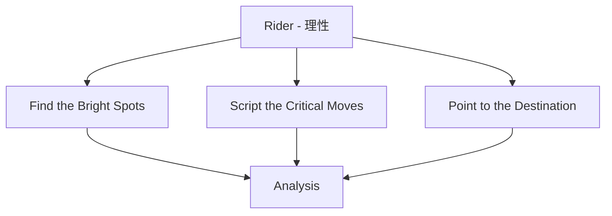
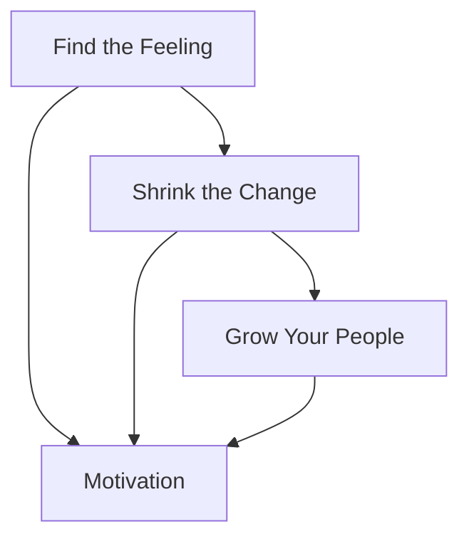

# Switchによる仮説検証 - We-Editシステムにおける実践的アプローチ
by Chip Heath and Dan Heath

## なぜこの解説が必要か

We-Editプロジェクトでは、以下の行動変容に関する課題に直面しています：

1. ユーザーの習慣的行動の変更
2. 新機能採用への抵抗感の克服
3. チーム内での変更管理
4. 持続可能な行動変容の実現

Switchのアプローチは、これらの課題に対する心理学的な解決策を提供します。

## 1. 変化の3要素フレームワーク

### 1.1 Direct the Rider（理性に訴える）



### 1.2 We-Editでの実装

```typescript
// 理性的アプローチのフレームワーク
interface RationalApproach {
  brightSpots: {
    successes: Success[];
    patterns: Pattern[];
    learnings: Learning[];
  };
  criticalMoves: {
    steps: Step[];
    guidance: Guidance[];
    checkpoints: Checkpoint[];
  };
  destination: {
    vision: Vision;
    metrics: Metric[];
    milestones: Milestone[];
  };
}

// 理性的アプローチマネージャー
class RationalApproachManager {
  async manageApproach(
    approach: RationalApproach
  ): Promise<ApproachResults> {
    const analysis = await this.analyzeBrightSpots(approach.brightSpots);
    const implementation = await this.implementCriticalMoves(approach.criticalMoves);
    const progress = this.trackProgress(approach.destination);

    return {
      insights: this.generateInsights(analysis),
      effectiveness: this.evaluateEffectiveness(implementation),
      adjustments: this.recommendAdjustments(progress)
    };
  }
}
```

## 2. Motivate the Elephant（感情に訴える）

### 2.1 感情的要素の管理

```typescript
// 感情的アプローチフレームワーク
interface EmotionalApproach {
  feelings: {
    currentState: Feeling[];
    desiredState: Feeling[];
    gaps: EmotionalGap[];
  };
  motivation: {
    triggers: Trigger[];
    reinforcement: Reinforcement[];
    feedback: Feedback[];
  };
  identity: {
    current: Identity;
    desired: Identity;
    transition: Transition[];
  };
}

// 感情マネージャー
class EmotionalManager {
  async manageEmotions(
    approach: EmotionalApproach
  ): Promise<EmotionalResults> {
    const feelings = await this.assessFeelings(approach.feelings);
    const motivation = await this.buildMotivation(approach.motivation);
    const identity = this.transformIdentity(approach.identity);

    return {
      emotionalState: this.evaluateState(feelings),
      motivationLevel: this.assessMotivation(motivation),
      identityShift: this.measureShift(identity)
    };
  }
}
```

### 2.2 感情的変化の促進



## 3. Shape the Path（環境を整える）

### 3.1 環境設計フレームワーク

```typescript
// 環境設計システム
interface EnvironmentDesign {
  tweaks: {
    situations: Situation[];
    adjustments: Adjustment[];
    impacts: Impact[];
  };
  habits: {
    current: Habit[];
    desired: Habit[];
    interventions: Intervention[];
  };
  support: {
    tools: Tool[];
    processes: Process[];
    infrastructure: Infrastructure[];
  };
}

// 環境最適化マネージャー
class EnvironmentOptimizer {
  async optimizeEnvironment(
    design: EnvironmentDesign
  ): Promise<OptimizationResults> {
    const situational = await this.optimizeSituations(design.tweaks);
    const behavioral = await this.transformHabits(design.habits);
    const structural = this.implementSupport(design.support);

    return {
      environmentalChanges: this.measureChanges(situational),
      behavioralShifts: this.trackShifts(behavioral),
      supportEffectiveness: this.evaluateSupport(structural)
    };
  }
}
```

### 3.2 行動変容の実装戦略

```typescript
// 行動変容戦略
interface BehaviorChangeStrategy {
  analysis: {
    currentBehaviors: Behavior[];
    barriers: Barrier[];
    enablers: Enabler[];
  };
  design: {
    interventions: Intervention[];
    supports: Support[];
    measurements: Measurement[];
  };
  implementation: {
    rollout: RolloutPlan;
    monitoring: MonitoringPlan;
    adjustment: AdjustmentPlan;
  };
}

class BehaviorStrategyManager {
  async implementStrategy(
    strategy: BehaviorChangeStrategy
  ): Promise<StrategyResults> {
    const design = await this.designInterventions(strategy.analysis);
    const implementation = await this.implementChanges(strategy.design);
    const monitoring = this.monitorProgress(strategy.implementation);

    return {
      effectiveness: this.evaluateEffectiveness(implementation),
      sustainability: this.assessSustainability(monitoring),
      recommendations: this.createRecommendations(monitoring)
    };
  }
}
```

## 4. 実装戦略

### 4.1 統合的なアプローチ

```typescript
// 統合アプローチフレームワーク
interface IntegratedApproach {
  rational: {
    analysis: Analysis[];
    planning: Plan[];
    execution: Execution[];
  };
  emotional: {
    motivation: Motivation[];
    engagement: Engagement[];
    commitment: Commitment[];
  };
  environmental: {
    structure: Structure[];
    support: Support[];
    reinforcement: Reinforcement[];
  };
}

class IntegratedManager {
  async manageChange(
    approach: IntegratedApproach
  ): Promise<ChangeResults> {
    const rational = await this.handleRational(approach.rational);
    const emotional = await this.handleEmotional(approach.emotional);
    const environmental = await this.handleEnvironmental(approach.environmental);

    return {
      effectiveness: this.evaluateEffectiveness({
        rational,
        emotional,
        environmental
      }),
      sustainability: this.assessSustainability({
        rational,
        emotional,
        environmental
      }),
      recommendations: this.createRecommendations({
        rational,
        emotional,
        environmental
      })
    };
  }
}
```

### 4.2 持続可能な変化の実現

```typescript
// 持続可能な変化システム
interface SustainableChange {
  foundation: {
    understanding: Understanding[];
    motivation: Motivation[];
    capability: Capability[];
  };
  reinforcement: {
    feedback: Feedback[];
    rewards: Reward[];
    adjustments: Adjustment[];
  };
  culture: {
    norms: Norm[];
    practices: Practice[];
    values: Value[];
  };
}

class SustainabilityManager {
  async manageSustainability(
    change: SustainableChange
  ): Promise<SustainabilityResults> {
    const foundation = await this.buildFoundation(change.foundation);
    const reinforcement = await this.implementReinforcement(change.reinforcement);
    const culture = this.cultivateCulture(change.culture);

    return {
      durability: this.assessDurability(foundation),
      effectiveness: this.evaluateEffectiveness(reinforcement),
      integration: this.measureIntegration(culture)
    };
  }
}
```

## まとめ

We-EditプロジェクトにおけるSwitchの実践では、以下の点が特に重要です：

1. **包括的なアプローチ**
   - 理性的側面への働きかけ
   - 感情的側面の考慮
   - 環境要因の最適化

2. **効果的な変化の促進**
   - 明確な方向性の提示
   - 動機付けの強化
   - 障壁の除去

3. **持続可能な変化の実現**
   - 習慣化の促進
   - 支援システムの構築
   - 文化的統合

これらの原則に従うことで、効果的で持続可能な行動変容を実現できます。