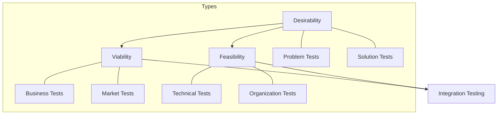
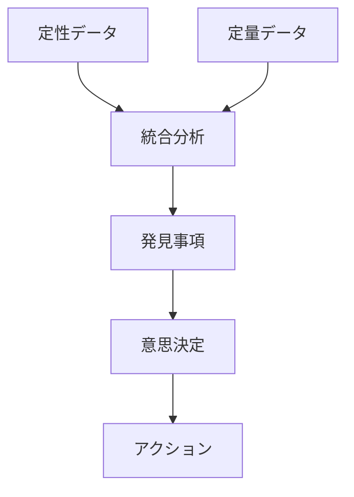

# Testing Business Ideasによる仮説検証 - We-Editシステムにおける実践的アプローチ
by David J. Bland and Alexander Osterwalder

## なぜこの解説が必要か

We-Editプロジェクトでは、以下のビジネス仮説検証の課題に直面しています：

1. 多様な実験手法の選択と実行
2. 実験の優先順位付けと計画
3. 効果的なデータ収集と分析
4. 実験結果に基づく意思決定

Testing Business Ideasのアプローチは、これらの課題に対する体系的な解決策を提供します。

## 1. 実験カテゴリーの体系化

### 1.1 実験タイプの分類



### 1.2 We-Editでの実装

```typescript
// 実験カテゴリーのフレームワーク
interface ExperimentCategory {
  type: 'desirability' | 'viability' | 'feasibility';
  subtype: 'problem' | 'solution' | 'business' | 'market' | 'technical' | 'organization';
  methods: ExperimentMethod[];
  criteria: ValidationCriteria[];
}

// 実験方法の定義
interface ExperimentMethod {
  name: string;
  description: string;
  effort: 1 | 2 | 3;  // 1: 低, 3: 高
  evidence: 1 | 2 | 3; // 1: 弱, 3: 強
  time: number;        // 実験に必要な日数
  cost: number;        // 予算（円）
  requirements: string[];
}

// 実験選択システム
class ExperimentSelector {
  selectExperiments(
    hypothesis: Hypothesis,
    constraints: ExperimentConstraints
  ): ExperimentMethod[] {
    const categoryMatch = this.matchCategory(hypothesis);
    const feasibleMethods = this.filterByConstraints(
      categoryMatch.methods,
      constraints
    );
    
    return this.prioritizeMethods(feasibleMethods, {
      effort: constraints.maxEffort,
      evidence: constraints.minEvidence,
      time: constraints.maxTime,
      cost: constraints.maxCost
    });
  }
}
```

## 2. 実験デザインパターン

### 2.1 実験カード

```typescript
// 実験カードの定義
interface ExperimentCard {
  hypothesis: {
    statement: string;
    type: ExperimentCategory['type'];
    riskLevel: 'high' | 'medium' | 'low';
  };
  method: {
    name: string;
    description: string;
    steps: string[];
  };
  metrics: {
    name: string;
    target: number;
    actual?: number;
    confidence: number;
  }[];
  results: {
    data: any;
    insights: string[];
    decisions: string[];
  };
}

// 実験実行マネージャー
class ExperimentExecutor {
  async runExperiment(card: ExperimentCard): Promise<ExperimentResults> {
    const setup = await this.setupExperiment(card);
    const data = await this.collectData(card.metrics);
    const analysis = this.analyzeResults(data, card.metrics);

    return {
      success: this.evaluateSuccess(analysis, card.metrics),
      confidence: this.calculateConfidence(analysis),
      learnings: this.extractLearnings(analysis),
      nextSteps: this.recommendNextSteps(analysis)
    };
  }
}
```

### 2.2 実験ポートフォリオ

```typescript
// 実験ポートフォリオの管理
interface ExperimentPortfolio {
  current: {
    desirability: ExperimentCard[];
    viability: ExperimentCard[];
    feasibility: ExperimentCard[];
  };
  completed: {
    successful: ExperimentCard[];
    failed: ExperimentCard[];
    inconclusive: ExperimentCard[];
  };
  planned: {
    high_priority: ExperimentCard[];
    medium_priority: ExperimentCard[];
    low_priority: ExperimentCard[];
  };
}

class PortfolioManager {
  async managePortfolio(
    portfolio: ExperimentPortfolio
  ): Promise<PortfolioStatus> {
    const progress = this.trackExperiments(portfolio.current);
    const learnings = this.consolidateLearnings(portfolio.completed);
    const plan = this.updatePlan(portfolio.planned, learnings);

    return {
      status: this.calculateStatus(progress),
      insights: this.generateInsights(learnings),
      recommendations: this.createRecommendations(plan)
    };
  }
}
```

## 3. データ収集と分析

### 3.1 エビデンスの強度評価

```typescript
// エビデンス評価システム
interface Evidence {
  type: 'qualitative' | 'quantitative';
  source: 'observation' | 'interview' | 'survey' | 'analytics';
  strength: 1 | 2 | 3;  // 1: 弱, 3: 強
  reliability: 1 | 2 | 3;
  sample_size: number;
  confidence_interval?: number;
}

class EvidenceEvaluator {
  evaluateEvidence(evidence: Evidence[]): EvidenceStrength {
    const weightedScore = this.calculateWeightedScore(evidence);
    const reliability = this.assessReliability(evidence);
    const sufficiency = this.checkSufficiency(evidence);

    return {
      score: weightedScore,
      reliability,
      sufficiency,
      recommendations: this.generateRecommendations({
        weightedScore,
        reliability,
        sufficiency
      })
    };
  }
}
```

### 3.2 実験データの統合



## 4. 実装戦略

### 4.1 実験の実行管理

```typescript
// 実験実行システム
interface ExperimentExecution {
  setup: {
    resources: Resource[];
    timeline: Timeline;
    dependencies: Dependency[];
  };
  monitoring: {
    metrics: MetricTracking[];
    checkpoints: Checkpoint[];
    alerts: Alert[];
  };
  analysis: {
    methods: AnalysisMethod[];
    tools: AnalysisTool[];
    validation: ValidationCriteria[];
  };
}

class ExperimentManager {
  async manageExperiment(
    execution: ExperimentExecution
  ): Promise<ExecutionResults> {
    const setup = await this.setupExperiment(execution.setup);
    const monitoring = await this.monitorProgress(execution.monitoring);
    const analysis = await this.analyzeResults(execution.analysis);

    return {
      status: this.determineStatus(monitoring),
      results: this.compileResults(analysis),
      recommendations: this.createRecommendations({
        setup,
        monitoring,
        analysis
      })
    };
  }
}
```

### 4.2 学習サイクルの最適化

```typescript
// 学習サイクル管理
interface LearningCycle {
  experiments: ExperimentCard[];
  insights: {
    validated: string[];
    invalidated: string[];
    uncertain: string[];
  };
  actions: {
    immediate: Action[];
    short_term: Action[];
    long_term: Action[];
  };
  adaptations: {
    hypothesis: HypothesisAdjustment[];
    methods: MethodAdjustment[];
    metrics: MetricAdjustment[];
  };
}

class LearningManager {
  async optimizeLearning(
    cycle: LearningCycle
  ): Promise<LearningOptimization> {
    const insights = this.consolidateInsights(cycle.insights);
    const actions = this.prioritizeActions(cycle.actions);
    const adaptations = this.planAdaptations(cycle.adaptations);

    return {
      improvements: this.identifyImprovements(insights),
      priorities: this.updatePriorities(actions),
      changes: this.implementChanges(adaptations)
    };
  }
}
```

## まとめ

We-EditプロジェクトにおけるTesting Business Ideasの実践では、以下の点が特に重要です：

1. **体系的な実験アプローチ**
   - 実験カテゴリーの明確な分類
   - 適切な実験方法の選択
   - エビデンスの強度評価

2. **効率的な実験管理**
   - 実験ポートフォリオの最適化
   - リソースの効果的な配分
   - 結果の統合分析

3. **継続的な学習と適応**
   - 実験結果からの迅速な学習
   - 仮説の継続的な改善
   - 意思決定プロセスの最適化

これらの原則に従うことで、効果的なビジネス仮説の検証と、データに基づく意思決定を実現できます。
