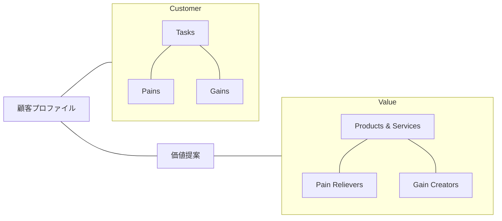
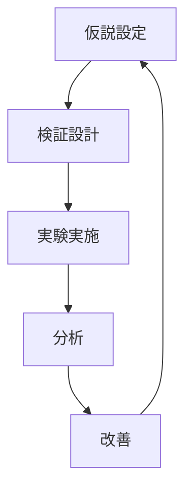

# Value Proposition Designによる仮説検証 - We-Editシステムにおける実践的アプローチ
by Alexander Osterwalder, Yves Pigneur, Greg Bernarda, and Alan Smith

## なぜこの解説が必要か

We-Editプロジェクトでは、以下の価値提案に関する課題に直面しています：

1. 顧客セグメントごとの価値提案の最適化
2. 提案価値の効果的な検証方法
3. 顧客ニーズと提供機能の整合性確保
4. 価値提案の継続的な改善

Value Proposition Designのアプローチは、これらの課題に対する体系的な解決策を提供します。

## 1. Value Proposition Canvas

### 1.1 キャンバスの構造



### 1.2 We-Editでの実装

```typescript
// 価値提案キャンバス
interface ValuePropositionCanvas {
  customerProfile: {
    jobs: CustomerJob[];
    pains: CustomerPain[];
    gains: CustomerGain[];
  };
  valueMap: {
    products: Product[];
    painRelievers: PainReliever[];
    gainCreators: GainCreator[];
  };
  fit: {
    problem_solution: FitAnalysis;
    product_market: FitAnalysis;
    business_model: FitAnalysis;
  };
}

// キャンバス分析マネージャー
class CanvasAnalyzer {
  async analyzeCanvas(
    canvas: ValuePropositionCanvas
  ): Promise<CanvasAnalysis> {
    const profileAnalysis = this.analyzeCustomerProfile(canvas.customerProfile);
    const valueAnalysis = this.analyzeValueMap(canvas.valueMap);
    const fitAnalysis = this.analyzeFit(canvas.fit);

    return {
      customerInsights: this.generateInsights(profileAnalysis),
      valueOpportunities: this.identifyOpportunities(valueAnalysis),
      recommendations: this.createRecommendations(fitAnalysis)
    };
  }
}
```

## 2. 仮説検証のフレームワーク

### 2.1 価値仮説の構築

```typescript
// 価値仮説フレームワーク
interface ValueHypothesis {
  customer: {
    segment: CustomerSegment;
    needs: CustomerNeed[];
    alternatives: Alternative[];
  };
  value: {
    proposition: string;
    differentiation: string[];
    evidence: Evidence[];
  };
  testing: {
    methods: TestMethod[];
    metrics: SuccessMetric[];
    timeline: Timeline;
  };
}

// 仮説検証マネージャー
class ValueHypothesisTester {
  async testHypothesis(
    hypothesis: ValueHypothesis
  ): Promise<TestResults> {
    const customerValidation = await this.validateCustomerNeeds(hypothesis.customer);
    const valueValidation = await this.validateValueProposition(hypothesis.value);
    const fitValidation = this.validateFit(customerValidation, valueValidation);

    return {
      isValid: this.determineValidity(fitValidation),
      insights: this.extractInsights(fitValidation),
      nextSteps: this.planNextSteps(fitValidation)
    };
  }
}
```

### 2.2 検証プロセス



## 3. 実験デザインパターン

### 3.1 価値検証実験

```typescript
// 価値検証実験
interface ValueExperiment {
  design: {
    hypothesis: ValueHypothesis;
    method: ExperimentMethod;
    sample: SampleSize;
  };
  execution: {
    touchpoints: Touchpoint[];
    measurements: Measurement[];
    feedback: Feedback[];
  };
  analysis: {
    qualitative: QualitativeAnalysis;
    quantitative: QuantitativeAnalysis;
    insights: Insight[];
  };
}

// 実験実行マネージャー
class ExperimentExecutor {
  async executeExperiment(
    experiment: ValueExperiment
  ): Promise<ExperimentResults> {
    const execution = await this.runExperiment(experiment.design);
    const measurements = await this.collectMeasurements(experiment.execution);
    const analysis = this.analyzeResults(measurements);

    return {
      validation: this.validateHypothesis(analysis),
      learnings: this.extractLearnings(analysis),
      adjustments: this.recommendAdjustments(analysis)
    };
  }
}
```

### 3.2 フィードバックループ

```typescript
// フィードバックループ管理
interface FeedbackLoop {
  collection: {
    sources: FeedbackSource[];
    methods: CollectionMethod[];
    frequency: Frequency;
  };
  processing: {
    categorization: Category[];
    prioritization: Priority[];
    analysis: Analysis[];
  };
  action: {
    improvements: Improvement[];
    experiments: Experiment[];
    validation: Validation[];
  };
}

class FeedbackManager {
  async manageFeedback(
    loop: FeedbackLoop
  ): Promise<FeedbackResults> {
    const collected = await this.collectFeedback(loop.collection);
    const processed = this.processFeedback(collected);
    const actions = this.planActions(processed);

    return {
      insights: this.generateInsights(processed),
      priorities: this.setPriorities(actions),
      plan: this.createActionPlan(actions)
    };
  }
}
```

## 4. 実装戦略

### 4.1 価値提案の反復的改善

```typescript
// 価値提案改善システム
interface ValuePropositionImprovement {
  current: {
    proposition: ValueProposition;
    performance: Performance;
    feedback: Feedback;
  };
  analysis: {
    gaps: Gap[];
    opportunities: Opportunity[];
    constraints: Constraint[];
  };
  improvement: {
    hypotheses: Hypothesis[];
    experiments: Experiment[];
    metrics: Metric[];
  };
}

class ValuePropositionOptimizer {
  async optimizeProposition(
    improvement: ValuePropositionImprovement
  ): Promise<OptimizationResults> {
    const analysis = await this.analyzeCurrentState(improvement.current);
    const opportunities = this.identifyOpportunities(improvement.analysis);
    const plan = this.createImprovementPlan(improvement.improvement);

    return {
      recommendations: this.generateRecommendations(analysis),
      priorities: this.prioritizeOpportunities(opportunities),
      roadmap: this.createRoadmap(plan)
    };
  }
}
```

### 4.2 継続的な価値創造

```typescript
// 継続的価値創造フレームワーク
interface ContinuousValueCreation {
  discovery: {
    research: Research[];
    insights: Insight[];
    opportunities: Opportunity[];
  };
  design: {
    solutions: Solution[];
    prototypes: Prototype[];
    validations: Validation[];
  };
  delivery: {
    implementation: Implementation[];
    measurement: Measurement[];
    iteration: Iteration[];
  };
}

class ValueCreationManager {
  async manageValueCreation(
    creation: ContinuousValueCreation
  ): Promise<CreationResults> {
    const discoveries = await this.executeDiscovery(creation.discovery);
    const designs = await this.executeDesign(creation.design);
    const delivery = await this.executeDelivery(creation.delivery);

    return {
      outcomes: this.assessOutcomes(delivery),
      learnings: this.consolidateLearnings(discoveries, designs),
      nextSteps: this.planNextIteration(delivery)
    };
  }
}
```

## まとめ

We-EditプロジェクトにおけるValue Proposition Designの実践では、以下の点が特に重要です：

1. **体系的な価値提案設計**
   - 顧客プロファイルの詳細な理解
   - 価値提案の明確な定義
   - フィットの継続的な検証

2. **効果的な検証プロセス**
   - 仮説駆動の実験設計
   - 多面的な検証アプローチ
   - データに基づく意思決定

3. **継続的な改善サイクル**
   - フィードバックの定期的な収集
   - 価値提案の反復的な改善
   - 顧客価値の最大化

これらの原則に従うことで、顧客にとって真に価値のある製品開発を実現できます。