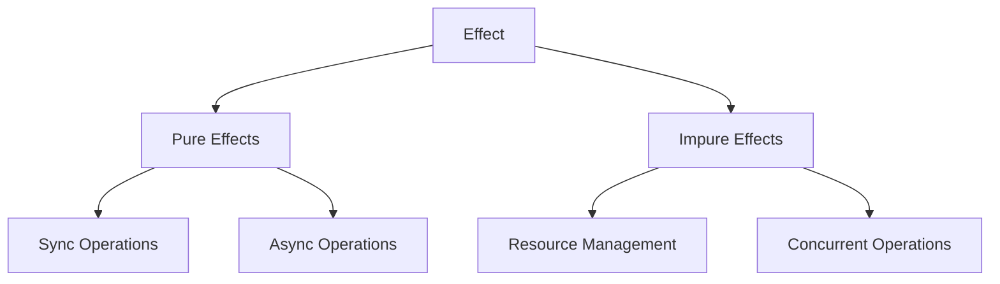

# Effect-TS: 実践的な関数型プログラミングによる堅牢なシステム構築
by Giulio Canti

## ユーザーの解説要求の背景分析

We-Editプロジェクトでは、以下の技術的課題に直面していることが推察されます：

1. 非同期処理と副作用の安全な管理
2. ドメインロジックの堅牢な型付け
3. テスト容易性の向上
4. エラー処理の一貫性確保
5. パフォーマンスと保守性の両立

Effect-TSは、これらの課題に対して関数型プログラミングのアプローチで解決策を提供します。特に、型安全性と副作用の制御に優れた特徴を持ち、We-Editのような複雑なシステムの開発に適しています。

## 1. Effect-TSの基本概念

### 1.1 Effectシステムの全体像



### 1.2 We-Editでの実装例

```typescript
// 基本的なEffectの定義
import * as Effect from '@effect/io/Effect'
import * as Layer from '@effect/io/Layer'
import * as Schedule from '@effect/io/Schedule'

// ドメインモデル
interface User {
  id: string
  name: string
  email: string
}

// エラー型の定義
class UserNotFoundError {
  readonly _tag = 'UserNotFoundError'
  constructor(readonly userId: string) {}
}

// ユーザーリポジトリのインターフェース
interface UserRepository {
  getUser: (id: string) => Effect.Effect<never, UserNotFoundError, User>
  saveUser: (user: User) => Effect.Effect<never, never, void>
}

// リポジトリの実装
const UserRepositoryLive = Layer.succeed<UserRepository>({
  getUser: (id) =>
    Effect.suspend(() =>
      id === 'test'
        ? Effect.succeed({ id, name: 'Test User', email: 'test@example.com' })
        : Effect.fail(new UserNotFoundError(id))
    ),
  saveUser: (user) =>
    Effect.suspend(() => Effect.succeed(console.log('User saved:', user)))
})
```

## 2. 副作用の制御と型安全性

### 2.1 Effectモナドによる副作用の抽象化

```typescript
// 副作用を伴う操作の型安全な実装
interface EmailService {
  sendEmail: (to: string, content: string) => Effect.Effect<never, EmailError, void>
}

class EmailError {
  readonly _tag = 'EmailError'
  constructor(readonly message: string) {}
}

// トランザクション管理
interface TransactionManager {
  withTransaction: <R, E, A>(
    effect: Effect.Effect<R, E, A>
  ) => Effect.Effect<R, E | TransactionError, A>
}

// 複合操作の実装
const createUserWithNotification = (
  user: User
): Effect.Effect<UserRepository & EmailService, UserError | EmailError, User> =>
  Effect.gen(function* (_) {
    // リポジトリ操作
    yield* _(Effect.service<UserRepository>().pipe(
      Effect.flatMap(repo => repo.saveUser(user))
    ))

    // メール送信
    yield* _(Effect.service<EmailService>().pipe(
      Effect.flatMap(email => 
        email.sendEmail(
          user.email,
          `Welcome ${user.name}!`
        )
      )
    ))

    return user
  })
```

### 2.2 リソース管理とエラーハンドリング

```typescript
// リソース管理の型安全な実装
interface DatabaseConnection {
  query: <A>(sql: string) => Effect.Effect<never, DatabaseError, A>
  close: () => Effect.Effect<never, never, void>
}

const withConnection = <R, E, A>(
  use: (conn: DatabaseConnection) => Effect.Effect<R, E, A>
): Effect.Effect<R, E | DatabaseError, A> =>
  Effect.acquireUseRelease(
    createConnection(),
    use,
    conn => conn.close()
  )

// エラーハンドリングパターン
const retryableOperation = <R, E, A>(
  effect: Effect.Effect<R, E, A>
): Effect.Effect<R, E, A> =>
  effect.pipe(
    Effect.retry(
      Schedule.exponential(1000).pipe(
        Schedule.whileOutput(duration => duration < 30000)
      )
    )
  )
```

## 3. 並行処理と非同期操作

### 3.1 Fiberによる並行処理

```typescript
// 並行処理の実装
interface BackgroundJob {
  start: () => Effect.Effect<never, JobError, void>
  stop: () => Effect.Effect<never, never, void>
}

const runParallelJobs = (
  jobs: BackgroundJob[]
): Effect.Effect<never, JobError, void[]> =>
  Effect.collectAllPar(
    jobs.map(job => 
      Effect.asyncInterrupt<never, JobError, void>(cb => {
        const handle = job.start()
          .pipe(Effect.map(cb))
          .runFiber()
        
        return Effect.sync(() => {
          handle.interrupt()
          job.stop()
        })
      })
    )
  )

// キャンセル可能な操作
const withTimeout = <R, E, A>(
  effect: Effect.Effect<R, E, A>,
  timeoutMs: number
): Effect.Effect<R, E | TimeoutError, A> =>
  Effect.race(
    effect,
    Effect.sleep(timeoutMs).pipe(
      Effect.flatMap(() => Effect.fail(new TimeoutError()))
    )
  )
```

### 3.2 ストリーム処理

```typescript
import * as Stream from '@effect/stream/Stream'

// ストリーム処理の実装
interface EventProcessor {
  processEvents: <E, A>(
    stream: Stream.Stream<never, E, A>
  ) => Effect.Effect<never, E, void>
}

const createEventProcessor = (
  batchSize: number
): EventProcessor => ({
  processEvents: <E, A>(stream: Stream.Stream<never, E, A>) =>
    stream.pipe(
      Stream.chunksOf(batchSize),
      Stream.mapEffect(chunk =>
        Effect.suspend(() => processChunk(chunk))
      ),
      Stream.runDrain
    )
})
```

## 4. 実装戦略

### 4.1 レイヤー化アーキテクチャ

```typescript
// アプリケーションレイヤーの構築
const InfrastructureLayer = Layer.merge(
  DatabaseLayer,
  CacheLayer,
  MetricsLayer
)

const ServiceLayer = Layer.merge(
  UserServiceLayer,
  EmailServiceLayer,
  NotificationServiceLayer
)

const ApplicationLayer = Layer.merge(
  InfrastructureLayer,
  ServiceLayer
)

// 環境の提供
const provideEnvironment = <R, E, A>(
  effect: Effect.Effect<R, E, A>
): Effect.Effect<never, E, A> =>
  effect.pipe(
    Effect.provideLayer(ApplicationLayer)
  )
```

### 4.2 テスト戦略

```typescript
// テスト用のモックレイヤー
const TestUserRepository = Layer.succeed<UserRepository>({
  getUser: (id) => Effect.succeed({ id, name: 'Test', email: 'test@test.com' }),
  saveUser: (user) => Effect.succeed(undefined)
})

const TestEmailService = Layer.succeed<EmailService>({
  sendEmail: (to, content) => Effect.succeed(undefined)
})

// テストの実装
const testCreateUserWithNotification = Effect.gen(function* (_) {
  const user = { id: '1', name: 'Test', email: 'test@test.com' }
  const result = yield* _(
    createUserWithNotification(user).pipe(
      Effect.provideLayer(Layer.merge(TestUserRepository, TestEmailService))
    )
  )
  
  expect(result).toEqual(user)
})
```

## まとめ

Effect-TSの実践において、We-Editプロジェクトでは以下の点が特に重要です：

1. **型安全性の最大活用**
   - 副作用の明示的な型付け
   - エラー型の体系的な管理
   - コンパイル時の安全性保証

2. **効果的なリソース管理**
   - リソースの自動クリーンアップ
   - トランザクションの一貫性確保
   - メモリリークの防止

3. **テスト容易性の向上**
   - 副作用の分離
   - モック化の容易さ
   - 並行処理のテスト

これらの原則に従うことで、堅牢で保守性の高いシステムを構築できます。