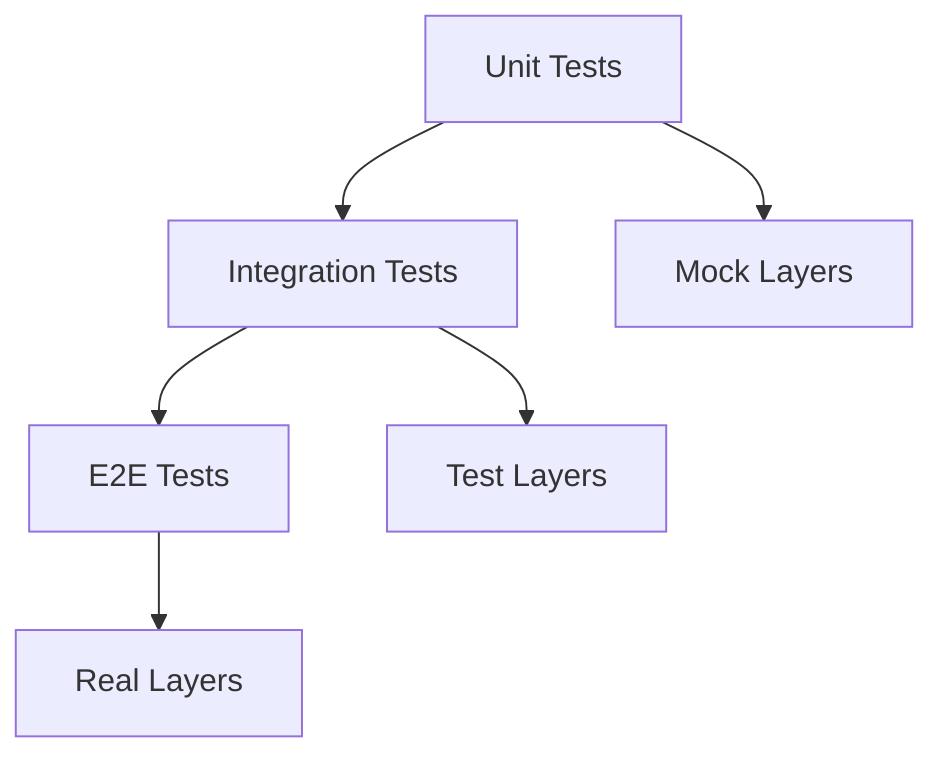

# Effect-TSによるテスト戦略 - 実践的なアプローチ
by Giulio Canti

## ユーザーの解説要求の背景分析

We-Editプロジェクトでは、以下のテストに関する課題に直面していることが推察されます：

1. 副作用を含むコードのテスト困難性
2. 非同期処理のテストの複雑さ
3. テストの信頼性と再現性の確保
4. モックとスタブの適切な使用
5. テストカバレッジの向上

Effect-TSは、これらのテスト課題に対して優れたソリューションを提供します。特に、副作用の分離と制御、非同期処理のテスト容易性、そしてモックの型安全な実装において強みを発揮します。

## 1. テストの基本アプローチ

### 1.1 テスト階層の構造



### 1.2 We-Editでの実装例

```typescript
import * as Effect from '@effect/io/Effect'
import * as Layer from '@effect/io/Layer'
import * as TestContext from '@effect/test/TestContext'

// テスト対象のインターフェース
interface UserService {
  getUser: (id: string) => Effect.Effect<never, UserError, User>
  updateUser: (user: User) => Effect.Effect<never, UserError, User>
}

// テスト用のモックレイヤー
const TestUserService = Layer.succeed<UserService>({
  getUser: (id) => 
    Effect.succeed({ id, name: 'Test User', email: 'test@example.com' }),
  updateUser: (user) => 
    Effect.succeed({ ...user, updatedAt: new Date() })
})

// テストスイートの実装
describe('UserService', () => {
  const runTest = <E, A>(
    effect: Effect.Effect<UserService, E, A>
  ) => Effect.runPromise(
    effect.pipe(Effect.provideLayer(TestUserService))
  )

  it('should get user successfully', async () => {
    const program = Effect.gen(function* (_) {
      const service = yield* _(Effect.service<UserService>())
      const user = yield* _(service.getUser('test-id'))
      return user
    })

    const result = await runTest(program)
    expect(result.id).toBe('test-id')
  })
})
```

## 2. モックとスタブの戦略

### 2.1 レイヤーベースのモック

```typescript
// 依存関係のモック化
interface DatabaseService {
  query: <T>(sql: string) => Effect.Effect<never, DBError, T>
}

interface EmailService {
  sendEmail: (to: string, content: string) => Effect.Effect<never, EmailError, void>
}

// モックレイヤーの実装
const TestDatabaseService = Layer.succeed<DatabaseService>({
  query: <T>(sql: string) =>
    Effect.succeed({} as T)
})

const TestEmailService = Layer.succeed<EmailService>({
  sendEmail: (to, content) =>
    Effect.succeed(undefined)
})

// 複合モックレイヤー
const TestEnvironment = Layer.merge(
  TestDatabaseService,
  TestEmailService
)

// テストヘルパー
const createTestRunner = <R, E, A>(
  effect: Effect.Effect<R, E, A>,
  environment: Layer.Layer<never, never, R>
) => Effect.runPromise(
  effect.pipe(Effect.provideLayer(environment))
)
```

### 2.2 スマートコンストラクタとテストビルダー

```typescript
// テストデータビルダー
class UserBuilder {
  private data: Partial<User> = {
    id: 'test-id',
    name: 'Test User',
    email: 'test@example.com'
  }

  withId(id: string): this {
    this.data.id = id
    return this
  }

  withName(name: string): this {
    this.data.name = name
    return this
  }

  build(): User {
    return this.data as User
  }
}

// テストケースビルダー
class TestCaseBuilder<R, E, A> {
  private effects: Array<Effect.Effect<R, E, any>> = []

  addEffect(effect: Effect.Effect<R, E, any>): this {
    this.effects.push(effect)
    return this
  }

  build(): Effect.Effect<R, E, A> {
    return Effect.gen(function* (_) {
      for (const effect of this.effects) {
        yield* _(effect)
      }
      return yield* _(this.effects[this.effects.length - 1])
    })
  }
}
```

## 3. テストパターン

### 3.1 統合テストパターン

```typescript
// 統合テストの実装
interface TestCase<R, E, A> {
  name: string
  effect: Effect.Effect<R, E, A>
  expected: A
  environment?: Layer.Layer<never, never, R>
}

const runIntegrationTest = <R, E, A>(
  testCase: TestCase<R, E, A>
) => {
  it(testCase.name, async () => {
    const result = await Effect.runPromise(
      testCase.effect.pipe(
        Effect.provideLayer(
          testCase.environment ?? Layer.empty
        )
      )
    )
    expect(result).toEqual(testCase.expected)
  })
}

// 統合テストの例
describe('UserService Integration', () => {
  const testCases: Array<TestCase<UserService, never, User>> = [
    {
      name: 'should create user successfully',
      effect: Effect.gen(function* (_) {
        const service = yield* _(Effect.service<UserService>())
        return yield* _(service.createUser({
          name: 'New User',
          email: 'new@example.com'
        }))
      }),
      expected: {
        id: expect.any(String),
        name: 'New User',
        email: 'new@example.com'
      },
      environment: TestUserService
    }
  ]

  testCases.forEach(runIntegrationTest)
})
```

### 3.2 非同期テストパターン

```typescript
// 非同期テストのヘルパー
const withTimeout = <R, E, A>(
  effect: Effect.Effect<R, E, A>,
  ms: number
): Effect.Effect<R, E | TimeoutError, A> =>
  Effect.race(
    effect,
    Effect.sleep(ms).pipe(
      Effect.flatMap(() => 
        Effect.fail(new TimeoutError(`Timeout after ${ms}ms`))
      )
    )
  )

// 非同期テストの実装
const testAsyncOperation = <R, E, A>(
  effect: Effect.Effect<R, E, A>,
  timeout: number = 5000
) => Effect.gen(function* (_) {
  const fiber = yield* _(effect.pipe(Effect.fork))
  const result = yield* _(
    fiber.join.pipe(
      withTimeout(timeout)
    )
  )
  return result
})
```

## 4. テスト自動化戦略

### 4.1 テストジェネレーター

```typescript
// プロパティベーステストの実装
interface PropertyTest<R, E, A> {
  name: string
  generator: () => A
  property: (value: A) => Effect.Effect<R, E, boolean>
  iterations?: number
}

const runPropertyTest = <R, E, A>(
  test: PropertyTest<R, E, A>
) => {
  it(test.name, async () => {
    const iterations = test.iterations ?? 100
    
    for (let i = 0; i < iterations; i++) {
      const value = test.generator()
      const result = await Effect.runPromise(
        test.property(value)
      )
      expect(result).toBe(true)
    }
  })
}

// プロパティテストの例
const userNamePropertyTest: PropertyTest<
  UserService,
  never,
  string
> = {
  name: 'user name should always be valid',
  generator: () => 
    Math.random().toString(36).substring(7),
  property: (name) =>
    Effect.gen(function* (_) {
      const service = yield* _(Effect.service<UserService>())
      const user = yield* _(service.createUser({
        name,
        email: 'test@example.com'
      }))
      return user.name === name
    })
}
```

### 4.2 CI/CDパイプラインの統合

```typescript
// テスト実行環境の設定
interface TestEnvironmentConfig {
  timeout: number
  retries: number
  parallel: boolean
  reporters: TestReporter[]
}

// テスト実行マネージャー
class TestRunner {
  constructor(private config: TestEnvironmentConfig) {}

  async runAll(): Promise<TestResults> {
    const suites = this.discoverTestSuites()
    const results = await this.runSuites(suites)
    return this.generateReport(results)
  }

  private async runSuites(
    suites: TestSuite[]
  ): Promise<SuiteResults[]> {
    if (this.config.parallel) {
      return Promise.all(
        suites.map(suite => this.runSuite(suite))
      )
    }

    const results: SuiteResults[] = []
    for (const suite of suites) {
      results.push(await this.runSuite(suite))
    }
    return results
  }
}
```

## まとめ

We-EditプロジェクトにおけるEffect-TSのテスト実践では、以下の点が特に重要です：

1. **効果的なテスト戦略**
   - レイヤーベースのモック化
   - 型安全なテストビルダー
   - 再利用可能なテストパターン

2. **テストの品質確保**
   - プロパティベーステスト
   - 非同期処理の信頼性テスト
   - 統合テストの自動化

3. **開発効率の向上**
   - テストヘルパーの活用
   - CI/CDパイプラインの統合
   - テスト自動化の促進

これらの原則に従うことで、信頼性の高いテストスイートを効率的に構築できます。