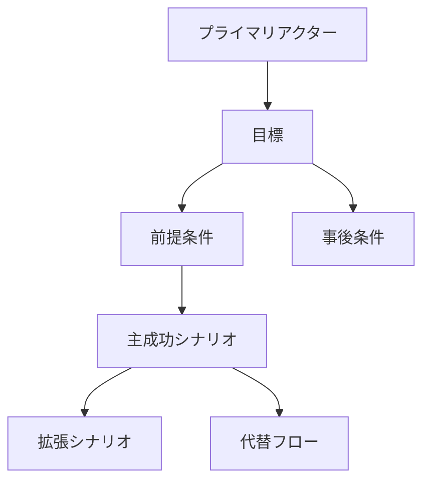
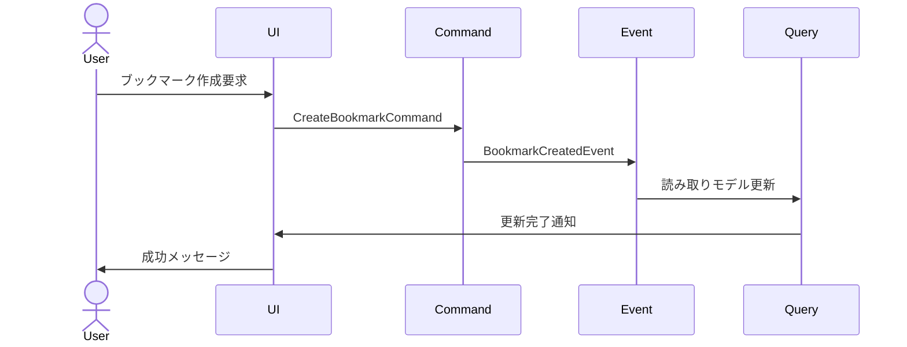

# 効果的なユースケース解説 by Alistair Cockburn

## なぜユースケース解説が必要か

このプロジェクトでは、以下の理由から効果的なユースケース作成の理解が重要です：

1. Event SourcingとCQRSという高度なアーキテクチャパターンを採用しており、これらの技術的複雑さをビジネス要件と明確に紐付ける必要がある
2. ブックマーク、記事、ニュースペーパーという異なるドメインが存在し、それぞれの振る舞いを正確に捉える必要がある
3. WebアプリケーションとChrome拡張という異なるインターフェースを持ち、一貫した動作を保証する必要がある
4. 将来の機能拡張を見据えた、拡張性の高い要件定義が必要

## ユースケースの本質

Alistair Cockburnによると、ユースケースは以下の要素を満たす必要があります：

1. 目標指向である
2. ステークホルダーの価値を明確に示す
3. システムの振る舞いを具体的に記述する
4. 技術的な実装詳細から独立している

### 基本構造



## ユースケース記述の実践

### 1. テンプレート構造

```markdown
# ユースケース：[ユースケース名]

## 概要
[1-2文での簡潔な説明]

## レベル
[ユーザー目標 / サブファンクション / 要約]

## プライマリアクター
[主要な実行者]

## ステークホルダーと関心事
- [ステークホルダー1]：[関心事]
- [ステークホルダー2]：[関心事]

## 前提条件
- [条件1]
- [条件2]

## 成功保証（事後条件）
- [条件1]
- [条件2]

## 主成功シナリオ
1. [ステップ1]
2. [ステップ2]
3. [ステップ3]

## 拡張シナリオ
1a. [代替パス]
2a. [代替パス]

## 特記事項
[その他の重要な情報]
```

### 2. 具体例：ブックマーク作成

```markdown
# ユースケース：ブックマークの作成

## 概要
ユーザーが現在閲覧中のWebページをブックマークとして保存する

## レベル
ユーザー目標

## プライマリアクター
Webブラウザユーザー

## ステークホルダーと関心事
- ユーザー：
  - 簡単な操作でブックマークを保存したい
  - 既存のブックマークとの重複を防ぎたい
- システム管理者：
  - システムの安定性を維持したい
  - ストレージ使用量を適切に管理したい

## 前提条件
- ユーザーがシステムにログインしている
- 有効なURLのWebページを閲覧中である
- Chrome拡張がインストールされている

## 成功保証（事後条件）
- ブックマークがシステムに保存される
- ユーザーのブックマークリストが更新される
- 関連するイベントが記録される

## 主成功シナリオ
1. ユーザーがChrome拡張のブックマークボタンをクリックする
2. システムが現在のページのメタデータを取得する
3. システムがURLの重複チェックを行う
4. システムがブックマークを保存する
5. システムが成功メッセージを表示する

## 拡張シナリオ
3a. 重複するURLが存在する場合
  1. システムが重複を通知する
  2. ユーザーに上書きの確認を求める
  3. ユーザーが確認した場合、既存のブックマークを更新する

4a. 保存に失敗した場合
  1. システムがエラーメッセージを表示する
  2. ユーザーに再試行オプションを提供する

## 特記事項
- オフライン時の動作考慮が必要
- Event Sourcingパターンとの整合性確保が必要
```

## Event SourcingとCQRSとの統合

### 1. イベントの特定



### 2. コマンドとイベントのマッピング

```typescript
// ユースケースから導出されるコマンド
interface CreateBookmarkCommand {
  type: 'CreateBookmark';
  payload: {
    url: string;
    title: string;
    metadata: {
      description?: string;
      thumbnail?: string;
    };
    tags: string[];
  };
}

// 発生するイベント
interface BookmarkCreatedEvent {
  type: 'BookmarkCreated';
  payload: {
    bookmarkId: string;
    url: string;
    title: string;
    metadata: {
      description?: string;
      thumbnail?: string;
    };
    tags: string[];
    createdAt: Date;
    userId: string;
  };
}
```

## ユースケース品質の評価基準

### 1. 完全性チェックリスト

```yaml
必須要素:
  構造的要素:
    - [ ] 明確な目標定義
    - [ ] プライマリアクターの特定
    - [ ] 前提条件の明示
    - [ ] 成功条件の定義
    - [ ] 主成功シナリオの記述
    - [ ] 代替フローの考慮

  品質要素:
    - [ ] ビジネス価値の明確化
    - [ ] 技術的実現可能性
    - [ ] ステークホルダーの期待値
    - [ ] 測定可能な成功基準
```

### 2. レビューポイント

```yaml
評価基準:
  明確性:
    - アクターの役割が明確か
    - 目標が具体的か
    - 手順が詳細か

  完全性:
    - 必要な前提条件を網羅しているか
    - 代替フローを考慮しているか
    - エラー処理が適切か

  一貫性:
    - 他のユースケースと整合しているか
    - システム全体のゴールに沿っているか
    - 技術アーキテクチャと適合するか
```

## このプロジェクトでの適用

### 1. ドメイン別のユースケース構造

```
usecases/
├── bookmark/
│   ├── create.md
│   ├── update.md
│   ├── delete.md
│   └── share.md
├── article/
│   ├── publish.md
│   ├── draft.md
│   └── review.md
└── newspaper/
    ├── generate.md
    ├── distribute.md
    └── archive.md
```

### 2. 実装との紐付け

```typescript
// ユースケースの実装例
class CreateBookmarkUseCase {
  constructor(
    private readonly commandBus: CommandBus,
    private readonly queryService: BookmarkQueryService
  ) {}

  async execute(request: CreateBookmarkRequest): Promise<Result> {
    // 前提条件のチェック
    if (!await this.checkPreconditions(request)) {
      return Result.failure('前提条件を満たしていません');
    }

    // 重複チェック
    if (await this.queryService.exists(request.url)) {
      return Result.failure('既に存在するURLです');
    }

    // コマンド発行
    const command = new CreateBookmarkCommand({
      url: request.url,
      title: request.title,
      tags: request.tags,
    });

    try {
      await this.commandBus.dispatch(command);
      return Result.success();
    } catch (error) {
      return Result.failure(error.message);
    }
  }
}
```

## ユースケース駆動開発の利点

### 1. コミュニケーションの改善

- ステークホルダー間の共通言語の確立
- 要件の明確化と合意形成の促進
- 実装の方向性の明確化

### 2. 品質の向上

- 早期の問題発見
- 要件の漏れ防止
- テストケースの導出容易化

### 3. メンテナンス性の向上

- 変更影響範囲の特定が容易
- ドキュメントの一貫性維持
- トレーサビリティの確保

## 結論

効果的なユースケース記述は、このプロジェクトにおいて以下の価値を提供します：

1. **アーキテクチャ決定のサポート**
   - Event SourcingとCQRSの適用範囲の明確化
   - ドメインモデルの境界の特定
   - 技術選択の妥当性確認

2. **要件管理の改善**
   - ステークホルダーとの効果的なコミュニケーション
   - 変更要求の影響分析の容易化
   - 実装の優先順位付けの基準提供

3. **品質の確保**
   - テスト戦略の立案
   - 受け入れ基準の明確化
   - 継続的な改善の基準点の提供

## 参考文献

1. Cockburn, Alistair. "Writing Effective Use Cases"
2. Cockburn, Alistair. "Agile Software Development"
3. Jacobson, Ivar. "Use Case 2.0"
4. Evans, Eric. "Domain-Driven Design"