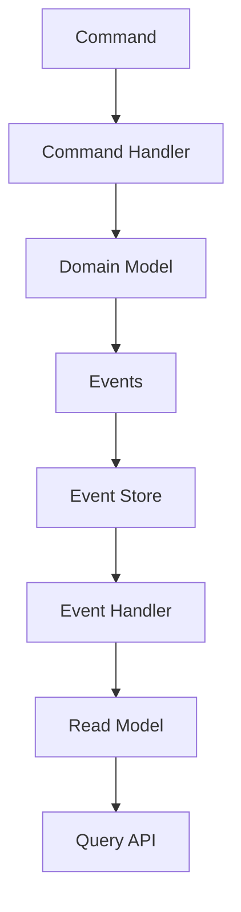

# Event Sourcing解説 by Greg Young

## なぜEvent Sourcing解説が必要か

このプロジェクトは、ブックマーク、記事、ニュースペーパーの管理を行うNext.jsウェブアプリケーションとして構築されています。以下の理由から、Event Sourcingの採用が有効と考えられます：

1. ユーザーコンテンツの完全な監査証跡が必要
2. 複数のバウンデッドコンテキスト間での整合性維持が必要
3. Chrome拡張機能とのオフライン同期が必要
4. システムの状態を任意の時点に復元できる機能が望ましい
5. 将来的なスケーラビリティ要件への対応

## Event Sourcingとは

Event Sourcingは、システムの状態変更を一連のイベントとして保存する設計パターンです。従来のCRUDベースのアプローチとは異なり、Event Sourcingではエンティティの現在の状態ではなく、そのエンティティに対するすべての変更イベントを保存します。

### 核となる概念

1. **イベント（Events）**
   - システム内で発生した事実の不変の記録
   - 過去形で名付ける（例：`BookmarkCreated`, `ArticleUpdated`）
   - イベントは決して変更・削除されない

2. **イベントストリーム（Event Stream）**
   - 特定のエンティティに関連するイベントの時系列順の集合
   - 各イベントには一意のシーケンス番号が割り当てられる

3. **イベントストア（Event Store）**
   - イベントの永続化を担当
   - アペンドオンリーの操作
   - 高速な書き込みと読み取りの最適化

4. **スナップショット（Snapshots）**
   - 特定時点でのシステム状態の保存
   - リプレイ時間の短縮に使用

## アーキテクチャパターン



### コンポーネントの説明

1. **Command Handler**
   - ユーザーアクションを受け付け
   - ドメインモデルに対する操作を実行
   - イベントの生成を管理

2. **Domain Model**
   - ビジネスロジックの中心
   - イベントの生成判断
   - 整合性ルールの適用

3. **Event Store**
   - イベントの永続化
   - イベントストリームの管理
   - 最適化されたクエリインターフェース

4. **Event Handler**
   - イベントのサブスクライブ
   - リードモデルの更新
   - 外部システムとの連携

## 実装のベストプラクティス

### 1. イベントの設計

```typescript
interface Event {
  id: string;
  type: string;
  timestamp: Date;
  aggregateId: string;
  version: number;
  data: unknown;
}

// 具体例
interface BookmarkCreatedEvent extends Event {
  type: 'BookmarkCreated';
  data: {
    url: string;
    title: string;
    tags: string[];
    createdBy: string;
  };
}
```

### 2. イベントストアの実装

```typescript
interface EventStore {
  append(streamId: string, events: Event[]): Promise<void>;
  read(streamId: string, fromVersion?: number): Promise<Event[]>;
  readAll(fromPosition?: number): Promise<Event[]>;
}

class PostgresEventStore implements EventStore {
  async append(streamId: string, events: Event[]): Promise<void> {
    // トランザクション内でイベントを保存
    await this.db.transaction(async (trx) => {
      for (const event of events) {
        await trx('events').insert({
          stream_id: streamId,
          type: event.type,
          data: event.data,
          metadata: event.metadata,
          version: event.version,
        });
      }
    });
  }
}
```

### 3. スナップショットの実装

```typescript
interface Snapshot {
  aggregateId: string;
  version: number;
  state: unknown;
}

class SnapshotStore {
  async save(snapshot: Snapshot): Promise<void> {
    await this.db('snapshots').insert({
      aggregate_id: snapshot.aggregateId,
      version: snapshot.version,
      state: snapshot.state,
    });
  }

  async load(aggregateId: string): Promise<Snapshot | null> {
    return await this.db('snapshots')
      .where('aggregate_id', aggregateId)
      .orderBy('version', 'desc')
      .first();
  }
}
```

## このプロジェクトでの適用

### 1. ブックマーク管理への適用

```typescript
// イベント定義
type BookmarkEvent =
  | BookmarkCreatedEvent
  | BookmarkUpdatedEvent
  | BookmarkDeletedEvent
  | BookmarkTagsUpdatedEvent
  | BookmarkMovedEvent;

// 集約
class BookmarkAggregate {
  private state: BookmarkState;
  private version: number;

  apply(event: BookmarkEvent): void {
    switch (event.type) {
      case 'BookmarkCreated':
        this.state = {
          id: event.data.id,
          url: event.data.url,
          title: event.data.title,
          tags: event.data.tags,
        };
        break;
      case 'BookmarkTagsUpdated':
        this.state.tags = event.data.tags;
        break;
      // その他のイベントハンドリング
    }
    this.version++;
  }
}
```

### 2. 記事管理への適用

```typescript
// イベント定義
type ArticleEvent =
  | ArticleCreatedEvent
  | ArticleContentUpdatedEvent
  | ArticlePublishedEvent
  | ArticleUnpublishedEvent;

// プロジェクション
class ArticleProjection {
  async handle(event: ArticleEvent): Promise<void> {
    switch (event.type) {
      case 'ArticleCreated':
        await this.readDb.articles.insert({
          id: event.data.id,
          title: event.data.title,
          status: 'draft',
        });
        break;
      case 'ArticlePublished':
        await this.readDb.articles.update({
          where: { id: event.data.id },
          data: { status: 'published', publishedAt: event.timestamp },
        });
        break;
    }
  }
}
```

## Event Sourcingの利点と注意点

### 利点

1. **完全な監査履歴**
   - すべての変更が記録される
   - コンプライアンス要件への対応が容易
   - デバッグ性の向上

2. **時間軸での分析**
   - 任意の時点の状態を再現可能
   - トレンド分析が容易
   - A/Bテストの実施が容易

3. **システムの柔軟性**
   - 新しいビューの追加が容易
   - リードモデルの最適化が可能
   - マイクロサービスとの親和性

### 注意点

1. **パフォーマンス考慮**
   - イベントの数が増加する
   - リプレイ時間の管理が必要
   - スナップショット戦略の検討が必要

2. **スキーマ進化**
   - イベントスキーマの変更には注意が必要
   - 下位互換性の維持が重要
   - バージョニング戦略の検討が必要

3. **複雑性の管理**
   - CQRSとの組み合わせが一般的
   - イベントの設計スキルが必要
   - チームの学習曲線への考慮

## 結論

Event Sourcingは、このプロジェクトのような複雑なドメインモデルと監査要件を持つシステムに適しています。特に：

1. ブックマークと記事の変更履歴管理
2. オフライン操作のサポート
3. 複数デバイス間の同期
4. 将来的な機能拡張への対応

これらの要件に対して、Event Sourcingは堅牢な解決策を提供します。ただし、実装の複雑性とパフォーマンスへの影響を考慮した慎重な設計が必要です。

## 参考文献

1. Greg Young "CQRS Documents"
2. Martin Fowler "Event Sourcing Pattern"
3. Vernon, Vaughn. "Implementing Domain-Driven Design"
4. Betts, Dominic. "Exploring CQRS and Event Sourcing"