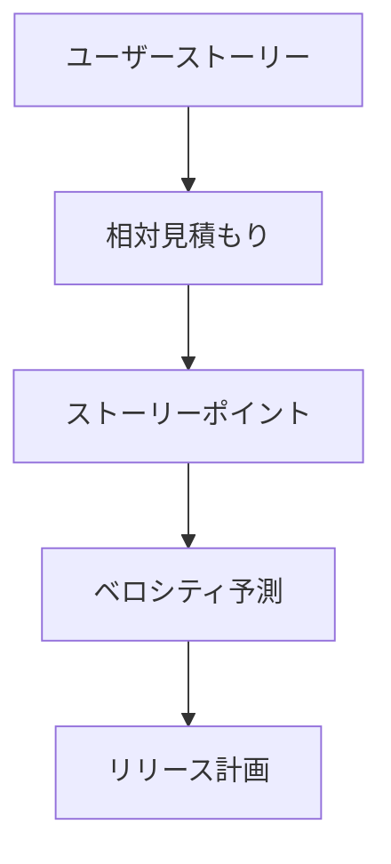
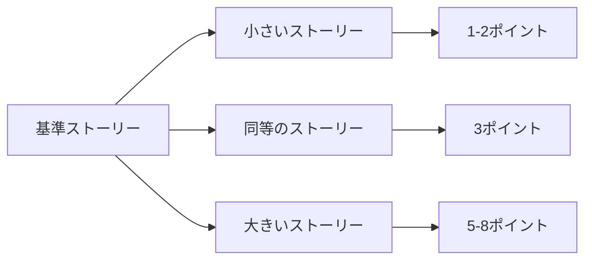
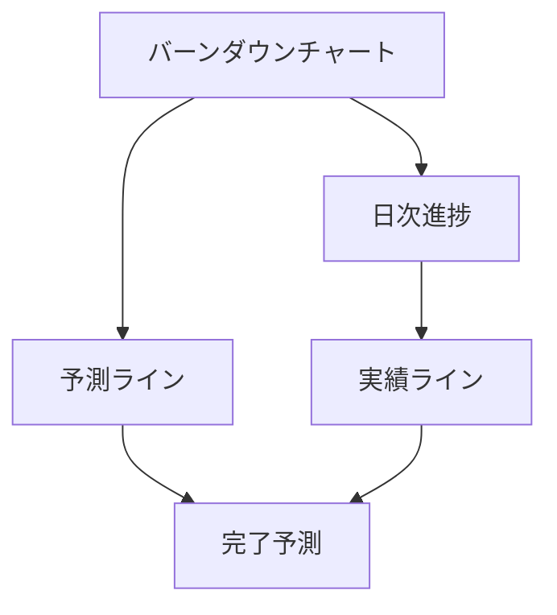

# Agile Estimating and Planning：アジャイルな要求定義と計画立案
著者: Mike Cohn 解説

## はじめに：この書籍が必要とされる理由

このプロジェクトでは、以下の理由からアジャイルな見積もりと計画立案が重要です：

1. Event SourcingやCQRSといった複雑なアーキテクチャの段階的な導入が必要
2. WebアプリケーションとChrome拡張の並行開発における適切な計画立案が必要
3. ブックマーク、記事、ニュースペーパーの各機能の反復的な開発と提供が必要
4. 変化する要求に柔軟に対応できる計画立案手法が必要

## アジャイル見積もりの基本原則

### 1. ストーリーポイントの活用



### 2. 反復的見積もり

```yaml
見積もりプロセス:
  初期見積もり:
    - 大まかな規模感
    - リスク要因
    - 不確実性

  詳細見積もり:
    - 具体的なタスク
    - 技術的な複雑さ
    - チームの経験

  継続的な調整:
    - 実績との比較
    - 見積もりの精度向上
    - ベロシティの調整
```

## 効果的な計画立案

### 1. マルチレベル計画

```typescript
interface PlanningLevel {
  level: 'product' | 'release' | 'iteration' | 'daily';
  timeframe: TimeFrame;
  detail: DetailLevel;
  commitmentLevel: CommitmentLevel;
}

class AgilePlanning {
  async createPlan(level: PlanningLevel): Promise<Plan> {
    const stories = await this.gatherStories(level);
    const estimates = await this.estimateStories(stories);
    const velocity = await this.calculateVelocity();
    
    return this.generatePlan(stories, estimates, velocity);
  }
}
```

### 2. ユーザーストーリーマッピング

```markdown
## ストーリーマップ構造

### バックボーン（主要機能）
1. ブックマーク管理
   - 作成
   - 整理
   - 検索

2. 同期機能
   - デバイス間同期
   - オフライン対応
   - 競合解決

3. 共有機能
   - チーム共有
   - 公開設定
   - アクセス管理

### ウォーキングスケルトン
- MVP機能の特定
- リリース計画
- 反復計画
```

## 見積もり手法

### 1. プランニングポーカー

```typescript
interface PlanningPokerSession {
  story: UserStory;
  participants: TeamMember[];
  rounds: EstimationRound[];
  consensus: number;
}

class PlanningPoker {
  async conductSession(story: UserStory): Promise<EstimationResult> {
    let consensus = false;
    const rounds: EstimationRound[] = [];
    
    while (!consensus) {
      const estimates = await this.collectEstimates();
      const discussion = await this.facilitateDiscussion(estimates);
      consensus = this.checkConsensus(estimates);
      
      rounds.push({ estimates, discussion });
    }
    
    return this.finalizeEstimation(rounds);
  }
}
```

### 2. 相対見積もり



## リリース計画

### 1. ベロシティベースの計画

```typescript
interface VelocityBasedPlan {
  velocity: number;
  backlog: UserStory[];
  iterations: Iteration[];
  risks: Risk[];
}

class ReleasePlanner {
  async createReleasePlan(backlog: UserStory[]): Promise<ReleasePlan> {
    const velocity = await this.calculateVelocity();
    const prioritizedBacklog = this.prioritizeBacklog(backlog);
    const iterations = this.planIterations(prioritizedBacklog, velocity);
    
    return {
      iterations,
      predictedCompletion: this.predictCompletion(iterations),
      confidence: this.calculateConfidence(iterations)
    };
  }
}
```

### 2. バッファ管理

```yaml
バッファタイプ:
  プロジェクトバッファ:
    - 全体の見積もりの30%
    - 主要なリスク対応
    - 不確実性への対応

  機能バッファ:
    - イテレーションごとの10%
    - 技術的な課題対応
    - 小規模な変更対応

  管理バッファ:
    - スプリントごとの15%
    - チーム関連の問題
    - プロセス改善
```

## このプロジェクトでの適用

### 1. 反復計画の例

```typescript
interface IterationPlan {
  sprint: number;
  goals: string[];
  stories: UserStory[];
  capacity: number;
  risks: Risk[];
}

// 初期スプリントの計画例
const sprintOnePlan: IterationPlan = {
  sprint: 1,
  goals: [
    "基本的なブックマーク管理機能の実装",
    "Chrome拡張の基礎構築"
  ],
  stories: [
    {
      id: "US-001",
      title: "ブックマークの作成",
      points: 3,
      priority: "high"
    },
    {
      id: "US-002",
      title: "Chrome拡張の初期設定",
      points: 5,
      priority: "high"
    }
  ],
  capacity: 20,
  risks: [
    {
      type: "technical",
      description: "Chrome API統合の複雑さ",
      mitigation: "スパイク実施"
    }
  ]
};
```

### 2. 進捗トラッキング



## アジャイル要求管理の実践

### 1. バックログリファインメント

```typescript
interface BacklogRefinement {
  story: UserStory;
  refinements: Refinement[];
  acceptance: AcceptanceCriteria[];
  dependencies: Dependency[];
}

class BacklogRefiner {
  async refineStory(story: UserStory): Promise<RefinedStory> {
    const details = await this.gatherDetails(story);
    const criteria = await this.defineAcceptanceCriteria(story);
    const tasks = await this.breakdownIntoTasks(story);
    
    return {
      story,
      details,
      criteria,
      tasks,
      refinementNotes: this.generateNotes(story, details, criteria, tasks)
    };
  }
}
```

### 2. 継続的な優先順位付け

```yaml
優先順位基準:
  ビジネス価値:
    - ROI
    - 顧客満足度
    - 市場優位性

  技術的考慮:
    - 依存関係
    - 技術的リスク
    - 実装の複雑さ

  学習価値:
    - 新技術の検証
    - 仮説の検証
    - フィードバックの獲得
```

## 結論：アジャイル計画立案の重要性

### 1. 成功のための要因

1. **適切な見積もり**
   - 相対見積もりの活用
   - チーム全体の参加
   - 継続的な改善

2. **柔軟な計画立案**
   - 変更への対応
   - リスクの管理
   - バッファの活用

3. **効果的な進捗管理**
   - 可視化
   - 早期警告
   - 適切な調整

### 2. 実践のガイドライン

1. **反復的アプローチ**
   - 小さな実験
   - 頻繁なフィードバック
   - 継続的な適応

2. **チーム協働**
   - 共同見積もり
   - 知識共有
   - スキル向上

3. **継続的改善**
   - 振り返りの実施
   - プロセスの最適化
   - 学習の活用

## 参考文献

1. Cohn, M. "Agile Estimating and Planning"
2. Cohn, M. "User Stories Applied"
3. Cohn, M. "Succeeding with Agile"
4. Project Management Institute "Agile Practice Guide"