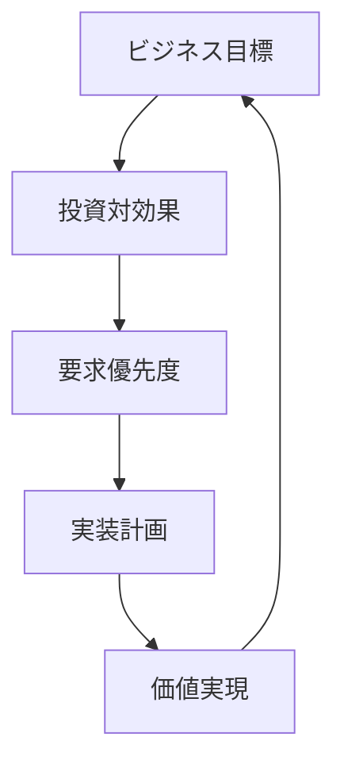
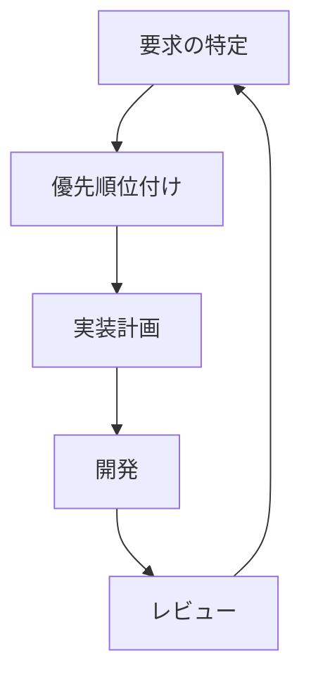

# The Art of Requirements Engineering：実務に即した要求工学の技法
著者: Christof Ebert 解説

## はじめに：この書籍が必要とされる理由

このプロジェクトでは、以下の理由から実践的な要求工学のアプローチが必要です：

1. Event SourcingとCQRSという高度なアーキテクチャの採用判断に実務的な根拠が必要
2. WebアプリケーションとChrome拡張の開発における実践的な要件定義手法が必要
3. ブックマーク、記事、ニュースペーパーの各機能における実用的な要求管理が必要
4. アジャイル開発環境における効果的な要求管理の方法論が必要

## 実践的要求工学の基本

### 1. ビジネス価値主導アプローチ



### 2. 実践的な要求収集

```yaml
収集技法:
  直接的手法:
    - ステークホルダーインタビュー
    - ワークショップ
    - 現場観察

  間接的手法:
    - 競合分析
    - 市場調査
    - ユーザーフィードバック

  実験的手法:
    - プロトタイピング
    - A/Bテスト
    - ユーザビリティテスト
```

## 実務的な要求定義プロセス

### 1. 迅速な要求定義

```typescript
interface RequirementDefinition {
  businessContext: BusinessContext;
  stakeholderNeeds: StakeholderNeed[];
  constraints: Constraint[];
  acceptanceCriteria: AcceptanceCriterion[];
}

class RapidRequirementProcess {
  async defineRequirement(context: Context): Promise<RequirementDefinition> {
    const businessContext = await this.analyzeContext(context);
    const needs = await this.gatherNeeds(context);
    const constraints = await this.identifyConstraints(context);
    const criteria = await this.defineAcceptanceCriteria(needs);

    return {
      businessContext,
      stakeholderNeeds: needs,
      constraints,
      acceptanceCriteria: criteria
    };
  }
}
```

### 2. 実装可能な要求記述

```markdown
## 要求記述テンプレート

### 1. ビジネスコンテキスト
- 目的
- 期待される価値
- 成功指標

### 2. 機能要件
- 前提条件
- 主要機能
- 例外処理

### 3. 非機能要件
- パフォーマンス基準
- セキュリティ要件
- 信頼性要件

### 4. 受け入れ基準
- 検証方法
- 期待される結果
- 品質基準
```

## 実践的な要求管理

### 1. 変更管理の実際

```typescript
interface ChangeRequest {
  id: string;
  type: ChangeType;
  impact: {
    scope: string[];
    effort: number;
    risk: RiskLevel;
    value: number;
  };
  priority: Priority;
  status: Status;
}

class PracticalChangeManager {
  async evaluateChange(request: ChangeRequest): Promise<Decision> {
    const impact = await this.assessImpact(request);
    const value = await this.calculateValue(request);
    const risk = await this.evaluateRisk(request);

    return this.makeDecision({
      impact,
      value,
      risk,
      constraints: this.projectConstraints
    });
  }
}
```

### 2. トレーサビリティの実践


## このプロジェクトでの実践例

### 1. ブックマーク機能の要件定義

```yaml
機能要件:
  基本機能:
    - WebページのURLとメタデータの保存
    - タグ付けとカテゴリ分類
    - 検索と並べ替え

  同期機能:
    - クロスデバイス同期
    - オフラインサポート
    - 変更履歴管理

  共有機能:
    - ブックマークの共有
    - チーム機能
    - アクセス制御

実装優先度:
  Phase 1:
    - 基本的なブックマーク管理
    - シンプルな同期機能
    
  Phase 2:
    - 高度な検索機能
    - 完全な同期機能
    
  Phase 3:
    - 共有機能
    - チーム機能
```

### 2. 実装可能な受け入れ基準

```typescript
interface AcceptanceCriteria {
  scenario: string;
  given: string;
  when: string;
  then: string[];
  metrics: {
    performance: number;
    reliability: number;
    usability: number;
  };
}

// ブックマーク作成の例
const bookmarkCreationCriteria: AcceptanceCriteria = {
  scenario: "新規ブックマークの作成",
  given: "ユーザーが有効なURLを持っている",
  when: "ブックマーク作成ボタンを押す",
  then: [
    "URLとメタデータが保存される",
    "同期キューに追加される",
    "UIが更新される"
  ],
  metrics: {
    performance: 500,  // ms以内
    reliability: 0.99, // 99%の成功率
    usability: 4.5     // 5段階評価
  }
};
```

## 実践的なヒントとコツ

### 1. 要求の優先順位付け

```yaml
優先順位付けの基準:
  ビジネス価値:
    - 収益への直接的影響
    - 顧客満足度への影響
    - マーケットシェアへの影響

  実装の容易さ:
    - 技術的な複雑さ
    - 必要なリソース
    - 依存関係

  リスク:
    - 技術的リスク
    - ビジネスリスク
    - スケジュールリスク
```

### 2. ステークホルダー管理

```typescript
interface StakeholderManagement {
  stakeholders: Map<string, Stakeholder>;
  communications: CommunicationPlan;
  expectations: ExpectationMatrix;
}

class StakeholderManager {
  async manageCommunication(): Promise<void> {
    for (const [id, stakeholder] of this.stakeholders) {
      const plan = this.communications.get(id);
      const expectations = this.expectations.get(id);

      await this.communicateUpdates(stakeholder, plan);
      await this.manageExpectations(stakeholder, expectations);
      await this.gatherFeedback(stakeholder);
    }
  }
}
```

## アジャイル環境での要求管理

### 1. イテレーティブな要求定義



### 2. 継続的なフィードバック

```typescript
interface FeedbackLoop {
  source: FeedbackSource;
  type: FeedbackType;
  priority: Priority;
  impact: Impact;
}

class FeedbackManager {
  async processFeedback(feedback: FeedbackLoop): Promise<Action> {
    const analysis = await this.analyzeFeedback(feedback);
    const priority = await this.prioritizeFeedback(analysis);
    
    return this.determineAction({
      feedback,
      analysis,
      priority,
      currentSprint: this.sprintInfo
    });
  }
}
```

## 結論：実践的アプローチの重要性

### 1. 成功のための要因

1. **実践的な要求管理**
   - 明確な優先順位付け
   - 実装可能な粒度
   - 継続的な見直し

2. **ステークホルダーとの効果的な協働**
   - 期待値の管理
   - 定期的なコミュニケーション
   - フィードバックの活用

3. **価値の実現**
   - 早期の価値提供
   - 継続的な改善
   - 測定可能な成果

### 2. 実践のためのガイドライン

1. **迅速な意思決定**
   - データに基づく判断
   - 明確な基準
   - 効率的なプロセス

2. **柔軟な適応**
   - 変更への対応
   - プロセスの改善
   - 学習の活用

3. **継続的な改善**
   - フィードバックの収集
   - プロセスの最適化
   - ベストプラクティスの共有

## 参考文献

1. Ebert, C. "The Art of Requirements Engineering"
2. Ebert, C. "Global Software and IT"
3. Ebert, C. & De Man, J. "Requirements Engineering"
4. Project Management Institute "Business Analysis for Practitioners"