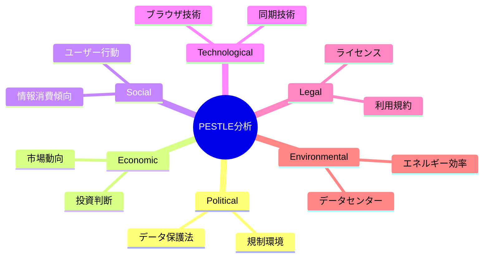
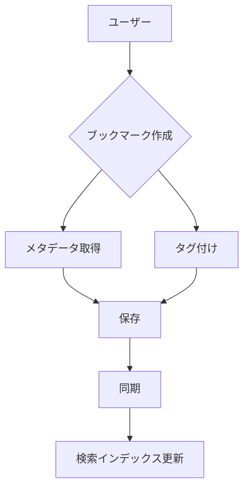
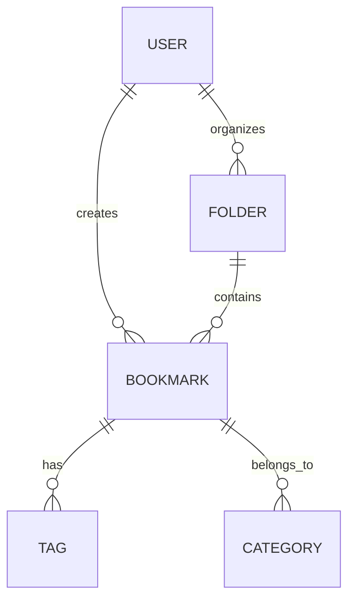
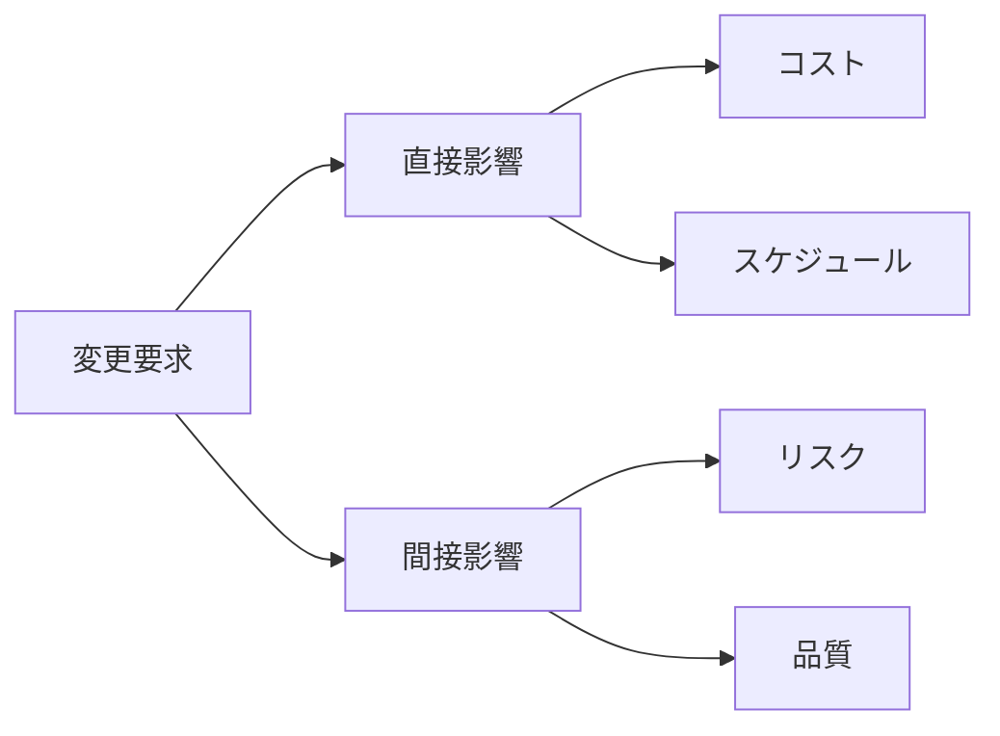

# Business Analysis Techniques：72の実践的要求分析ツール
著者: James Cadle, Debra Paul & Paul Turner 解説

## はじめに：この書籍が必要とされる理由

このプロジェクトでは、以下の理由から体系的な分析ツールの活用が重要です：

1. ブックマーク、記事、ニュースペーパーという異なるドメインの要求を分析する必要がある
2. WebアプリケーションとChrome拡張の利用状況を正確に把握する必要がある
3. Event SourcingとCQRSの採用判断に客観的な分析が必要
4. ステークホルダーの多様なニーズを体系的に整理する必要がある

## 戦略的分析ツール

### 1. PESTLE分析



### 2. SWOT分析

```typescript
interface SWOTAnalysis {
  strengths: {
    technical: string[];
    business: string[];
    organizational: string[];
  };
  weaknesses: {
    technical: string[];
    business: string[];
    organizational: string[];
  };
  opportunities: {
    market: string[];
    technology: string[];
    partnership: string[];
  };
  threats: {
    competition: string[];
    technology: string[];
    regulatory: string[];
  };
}

// プロジェクト固有のSWOT分析例
const projectSWOT: SWOTAnalysis = {
  strengths: {
    technical: [
      "Event Sourcing による堅牢な設計",
      "クロスプラットフォーム対応",
    ],
    business: [
      "ユニークな機能セット",
      "強力なブックマーク管理",
    ],
    organizational: [
      "技術力の高いチーム",
      "アジャイルな開発プロセス",
    ]
  },
  // ... 他の要素
};
```

## ビジネスプロセス分析

### 1. プロセスモデリング



### 2. ギャップ分析

```yaml
現状分析:
  ブックマーク管理:
    - 基本的な保存機能
    - 手動タグ付け
    - ローカル検索

  目標状態:
    - AIによるタグ推奨
    - リアルタイム同期
    - 高度な検索機能

  ギャップ:
    技術的:
      - AI機能の実装
      - 同期インフラの構築
      - 検索エンジンの強化

    組織的:
      - AIの専門知識
      - インフラ運用体制
      - サポート体制
```

## 要求引き出しツール

### 1. ステークホルダー分析

```typescript
interface Stakeholder {
  category: StakeholderCategory;
  influence: number;  // 1-5
  interest: number;   // 1-5
  needs: Need[];
  concerns: Concern[];
}

class StakeholderAnalysis {
  async analyzeStakeholders(): Promise<StakeholderMap> {
    const stakeholders = await this.identifyStakeholders();
    const matrix = this.createPowerInterestMatrix(stakeholders);
    const strategies = this.developEngagementStrategies(matrix);
    
    return {
      stakeholders,
      matrix,
      strategies,
      recommendations: this.generateRecommendations(strategies)
    };
  }
}
```

### 2. インタビュー技法

```markdown
## インタビューガイド

### 準備フェーズ
1. 背景情報の収集
2. 質問リストの作成
3. 時間と場所の設定

### 実施フェーズ
1. アイスブレイク
   - 目的の説明
   - 雰囲気作り

2. 主要な質問
   - オープンエンド形式
   - プロービング
   - 要約と確認

3. クロージング
   - 次のステップ
   - フィードバック
```

## データ分析ツール

### 1. エンティティ関係分析



### 2. データフロー分析

```typescript
interface DataFlow {
  source: DataNode;
  destination: DataNode;
  data: DataType;
  transformation?: Transformation[];
  validation?: Validation[];
}

class DataFlowAnalysis {
  async analyzeFlow(flow: DataFlow): Promise<FlowAnalysis> {
    const security = await this.analyzeSecurityImplications(flow);
    const performance = await this.analyzePerformanceImpact(flow);
    const integrity = await this.analyzeDataIntegrity(flow);
    
    return {
      flow,
      security,
      performance,
      integrity,
      recommendations: this.generateRecommendations({
        security,
        performance,
        integrity
      })
    };
  }
}
```

## 要求モデリングツール

### 1. ユースケース分析

```yaml
ユースケース構造:
  基本情報:
    - タイトル
    - アクター
    - 前提条件
    - 成功条件

  フロー:
    主フロー:
      - ステップ1
      - ステップ2
      - ステップ3

    代替フロー:
      - 代替パスA
      - 代替パスB

    例外フロー:
      - エラー処理1
      - エラー処理2
```

### 2. 非機能要件分析

```typescript
interface NonFunctionalRequirement {
  category: NFRCategory;
  description: string;
  metric: Metric;
  target: Target;
  validation: ValidationMethod;
}

// パフォーマンス要件の例
const performanceNFR: NonFunctionalRequirement = {
  category: "Performance",
  description: "ブックマーク検索の応答時間",
  metric: {
    type: "ResponseTime",
    unit: "milliseconds"
  },
  target: {
    value: 200,
    condition: "95th percentile under normal load"
  },
  validation: {
    method: "LoadTest",
    tool: "JMeter",
    scenario: "SearchBenchmark"
  }
};
```

## 変更管理ツール

### 1. インパクト分析



### 2. トレーサビリティマトリックス

```typescript
interface TraceabilityMatrix {
  requirements: Requirement[];
  designElements: DesignElement[];
  testCases: TestCase[];
  links: TraceabilityLink[];
}

class TraceabilityAnalysis {
  async analyzeTraceability(matrix: TraceabilityMatrix): Promise<Analysis> {
    const coverage = await this.analyzeCoverage(matrix);
    const gaps = await this.identifyGaps(matrix);
    const impacts = await this.analyzeImpacts(matrix);
    
    return {
      coverage,
      gaps,
      impacts,
      recommendations: this.generateRecommendations({
        coverage,
        gaps,
        impacts
      })
    };
  }
}
```

## 結論：分析ツールの効果的な活用

### 1. ツール選択の基準

1. **プロジェクトの特性**
   - 規模と複雑さ
   - 時間的制約
   - リソース制約

2. **期待される成果**
   - 分析の深さ
   - 精度の要求
   - 実用性

3. **チームの能力**
   - 経験レベル
   - 利用可能なツール
   - トレーニング要件

### 2. 実践のガイドライン

1. **段階的なアプローチ**
   - 基本的なツールから開始
   - 徐々に高度なツールを導入
   - 継続的な改善

2. **組み合わせの最適化**
   - 相補的なツールの選択
   - 効率的な適用順序
   - 結果の統合

3. **フィードバックの活用**
   - 効果の測定
   - 適用方法の改善
   - ベストプラクティスの共有

## 参考文献

1. Cadle, J., Paul, D., & Turner, P. "Business Analysis Techniques"
2. Paul, D., et al. "Agile and Business Analysis"
3. Turner, P. "Requirements Management"
4. Cadle, J. "Project Management for Information Systems"