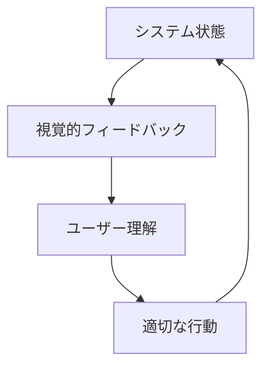
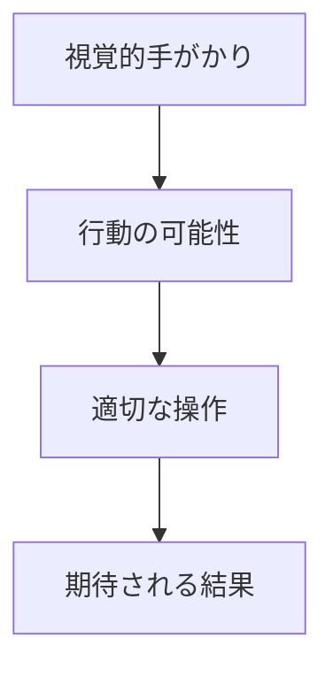
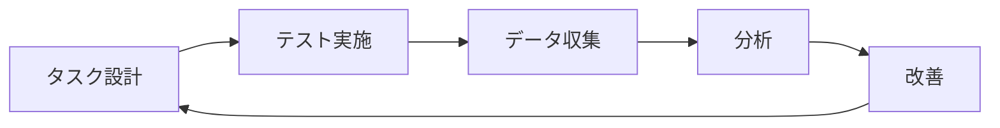

# The Design of Everyday Things：人間中心設計の原則
著者: Don Norman 解説

## はじめに：この書籍が必要とされる理由

このプロジェクトでは、以下の理由から人間中心設計の理解が重要です：

1. WebアプリケーションとChrome拡張という2つの異なるインターフェースを使いやすく設計する必要がある
2. ブックマーク、記事、ニュースペーパーの各機能で直感的な操作性を実現する必要がある
3. Event SourcingとCQRSという複雑な技術を利用者に意識させない設計が必要
4. 多様なユーザーの認知モデルに適合したシステム設計が必要

## 基本原則

### 1. 可視性（Visibility）



### 2. フィードバック（Feedback）

```typescript
interface FeedbackSystem {
  type: FeedbackType;
  timing: 'immediate' | 'delayed';
  modality: 'visual' | 'auditory' | 'haptic';
  message: string;
}

class UserFeedback {
  async provideFeedback(action: UserAction): Promise<void> {
    const feedback = this.determineFeedback(action);
    const timing = this.calculateTiming(action);
    
    await this.displayFeedback({
      ...feedback,
      timing,
      context: this.getCurrentContext()
    });
  }
}
```

## 認知モデルの適用

### 1. メンタルモデル

```yaml
ユーザーの期待モデル:
  ブックマーク操作:
    - クリックで保存
    - ドラッグでの整理
    - タグによる分類

  同期動作:
    - 自動的な同期
    - 競合の自動解決
    - オフライン対応

  検索機能:
    - インクリメンタル検索
    - フィルター機能
    - 関連コンテンツ表示
```

### 2. エラー防止

```typescript
interface ErrorPrevention {
  type: 'slip' | 'mistake';
  context: UserContext;
  prevention: PreventionStrategy[];
  recovery: RecoveryStrategy[];
}

class ErrorPreventionSystem {
  async preventError(action: UserAction): Promise<void> {
    const potentialErrors = await this.analyzeRisks(action);
    const preventions = this.determinePrevention(potentialErrors);
    
    await this.implementPrevention(preventions);
    await this.prepareRecovery(potentialErrors);
  }
}
```

## インターフェース設計原則

### 1. アフォーダンス



### 2. 制約とマッピング

```typescript
interface DesignConstraints {
  physical: PhysicalConstraint[];
  semantic: SemanticConstraint[];
  cultural: CulturalConstraint[];
  logical: LogicalConstraint[];
}

class InterfaceDesigner {
  async designInterface(context: DesignContext): Promise<Interface> {
    const constraints = await this.identifyConstraints(context);
    const mappings = await this.createMappings(constraints);
    
    return {
      elements: this.generateElements(mappings),
      interactions: this.defineInteractions(mappings),
      feedback: this.designFeedback(mappings)
    };
  }
}
```

## 実践的な設計パターン

### 1. ブックマーク機能の設計

```yaml
設計パターン:
  視覚的階層:
    - フォルダ構造の表示
    - タグクラウド
    - 最近の項目

  操作フロー:
    - ワンクリック保存
    - ドラッグ&ドロップ整理
    - コンテキストメニュー

  フィードバック:
    - 保存確認
    - 同期状態表示
    - エラー通知
```

### 2. エラー回復の設計

```typescript
interface ErrorRecovery {
  error: Error;
  context: ErrorContext;
  solutions: Solution[];
  userGuidance: Guidance;
}

class RecoveryDesigner {
  async designRecovery(scenario: ErrorScenario): Promise<RecoveryPlan> {
    const analysis = await this.analyzeError(scenario);
    const solutions = await this.generateSolutions(analysis);
    const guidance = await this.createGuidance(solutions);
    
    return {
      immediateActions: this.getImmediateActions(solutions),
      userSteps: this.getUserSteps(guidance),
      preventionStrategy: this.createPreventionStrategy(analysis)
    };
  }
}
```

## ユーザーテスト

### 1. ユーザビリティテスト



### 2. 行動観察

```typescript
interface UserObservation {
  task: Task;
  behavior: UserBehavior;
  problems: Problem[];
  insights: Insight[];
}

class BehaviorAnalyzer {
  async analyzeSession(session: TestSession): Promise<Analysis> {
    const behaviors = await this.observeBehaviors(session);
    const patterns = await this.identifyPatterns(behaviors);
    const insights = await this.deriveInsights(patterns);
    
    return {
      behaviors,
      patterns,
      insights,
      recommendations: this.generateRecommendations(insights)
    };
  }
}
```

## 認知負荷の最適化

### 1. 情報アーキテクチャ

```yaml
情報構造:
  階層構造:
    - メインカテゴリ
    - サブカテゴリ
    - 個別アイテム

  ナビゲーション:
    - パンくずリスト
    - クイックアクセス
    - 検索機能

  表示制御:
    - フィルタリング
    - ソート
    - グルーピング
```

### 2. 視覚的階層

```typescript
interface VisualHierarchy {
  levels: HierarchyLevel[];
  relationships: Relationship[];
  emphasis: EmphasisRule[];
}

class VisualDesigner {
  async designHierarchy(content: Content): Promise<Design> {
    const structure = await this.analyzeContent(content);
    const hierarchy = await this.createHierarchy(structure);
    const visuals = await this.applyVisualRules(hierarchy);
    
    return {
      layout: this.generateLayout(visuals),
      styles: this.generateStyles(visuals),
      interactions: this.defineInteractions(hierarchy)
    };
  }
}
```

## 結論：人間中心設計の重要性

### 1. 設計の成功要因

1. **ユーザー理解**
   - 認知モデルの把握
   - 行動パターンの分析
   - ニーズの理解

2. **適切なフィードバック**
   - タイミングの最適化
   - 明確な情報提供
   - エラー回復の支援

3. **一貫性の維持**
   - インターフェースの統一
   - 操作の一貫性
   - 期待の充足

### 2. 実践のガイドライン

1. **反復的な設計**
   - プロトタイピング
   - ユーザーテスト
   - 継続的な改善

2. **認知負荷の管理**
   - 情報の適切な分割
   - 視覚的な整理
   - 操作の単純化

3. **エラー管理**
   - 予防的アプローチ
   - 明確な回復パス
   - 学習機会の提供

## 参考文献

1. Norman, D. "The Design of Everyday Things"
2. Norman, D. "Emotional Design"
3. Norman, D. "Living with Complexity"
4. Norman, D. & Nielsen, J. "The Definition of User Experience"