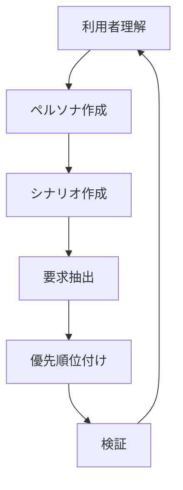
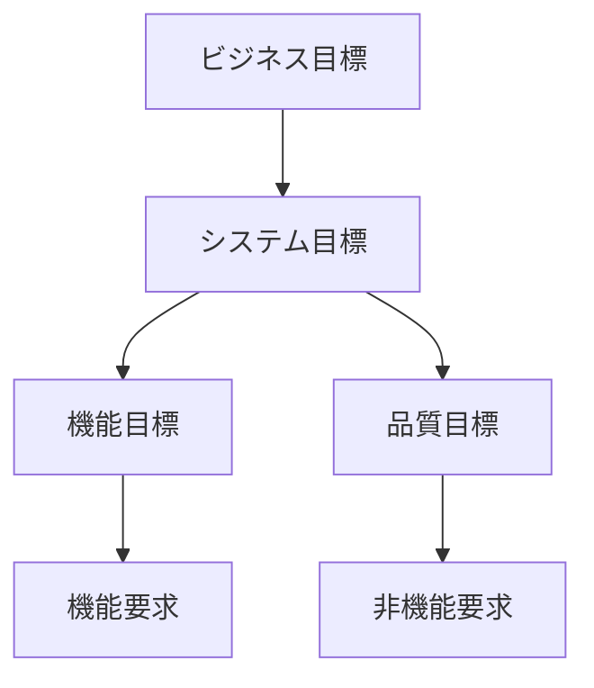
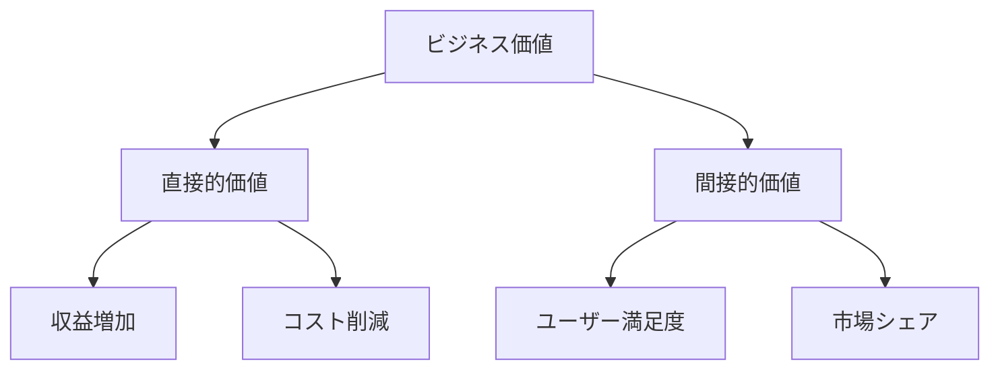
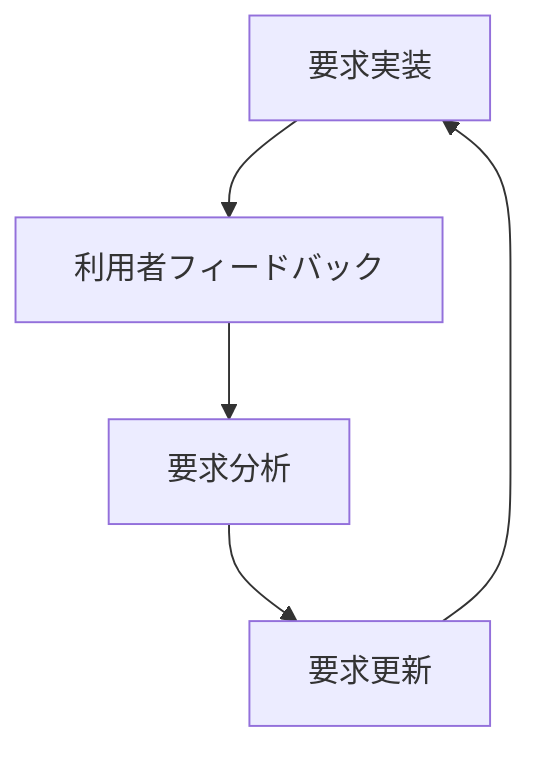

# Discovering Requirements：ビジネス目標と利用者視点からの要求発見
著者: Ian Alexander & Ljerka Beus-Dukic 解説

## はじめに：この書籍が必要とされる理由

このプロジェクトでは、以下の理由から利用者視点とビジネス目標の両面からの要求発見が重要です：

1. Webアプリケーション、Chrome拡張という異なるインターフェースを持つ製品の要件を統合する必要がある
2. ブックマーク、記事、ニュースペーパーという異なるドメインのユーザーニーズを理解する必要がある
3. Event Sourcing、CQRSといった技術選択がユーザー体験に与える影響を評価する必要がある
4. ビジネス目標と利用者のニーズの適切なバランスを取る必要がある

## 要求発見の原則

### 1. 利用者中心アプローチ



### 2. ビジネス目標との整合性

```yaml
ビジネス目標階層:
  戦略的目標:
    - 市場シェアの拡大
    - ユーザー基盤の確立
    - 収益モデルの確立

  戦術的目標:
    - ユーザー満足度の向上
    - 機能の充実
    - パフォーマンスの最適化

  運用目標:
    - システム安定性の確保
    - 保守性の向上
    - コスト効率の改善
```

## 要求発見の技法

### 1. ステークホルダー分析

```typescript
interface Stakeholder {
  role: string;
  interests: string[];
  influence: 'high' | 'medium' | 'low';
  impact: 'high' | 'medium' | 'low';
  expectations: string[];
  concerns: string[];
}

class StakeholderAnalysis {
  stakeholders: Map<string, Stakeholder>;

  identifyKeyStakeholders(): Stakeholder[] {
    return Array.from(this.stakeholders.values())
      .filter(s => s.influence === 'high' && s.impact === 'high');
  }

  analyzeConflicts(): ConflictAnalysis[] {
    // 利害関係の衝突を分析
    return this.findConflictingInterests();
  }
}
```

### 2. 目標指向要求分析



### 3. シナリオベース分析

```markdown
## シナリオテンプレート

### コンテキスト
[シナリオが発生する状況の説明]

### トリガー
[シナリオを開始するイベント]

### アクター
- プライマリアクター
- セカンダリアクター

### フロー
1. [アクション1]
2. [アクション2]
3. [アクション3]

### 期待される結果
[シナリオの成功条件]

### 代替フロー
A. [代替パス1]
B. [代替パス2]

### 例外
E1. [例外状況1]
E2. [例外状況2]
```

## このプロジェクトへの適用

### 1. ユーザーペルソナ例

```yaml
ペルソナ:
  名前: 田中典子
  年齢: 35歳
  職業: Webデザイナー
  
  特徴:
    - 複数のプロジェクトを同時進行
    - 情報収集に熱心
    - 整理整頓が得意
  
  目標:
    - 効率的な情報管理
    - クロスデバイスでのアクセス
    - 素早い情報検索
  
  フラストレーション:
    - ブックマークの同期の手間
    - 情報の重複
    - 検索の非効率性
```

### 2. シナリオ分析例

```typescript
interface UserScenario {
  context: string;
  trigger: string;
  primaryActor: string;
  flow: string[];
  expectedOutcome: string;
  alternatives: string[];
  exceptions: string[];
}

// ブックマーク作成シナリオ
const createBookmarkScenario: UserScenario = {
  context: "ユーザーが興味深いWebページを見つけた場合",
  trigger: "Chrome拡張のブックマークボタンをクリック",
  primaryActor: "Webブラウザユーザー",
  flow: [
    "1. ページのメタデータを自動取得",
    "2. タグ候補を提示",
    "3. 保存先フォルダを選択",
    "4. ブックマークを保存",
  ],
  expectedOutcome: "ブックマークが保存され、すべてのデバイスで利用可能に",
  alternatives: [
    "A1. 手動でメタデータを編集",
    "A2. 新規フォルダを作成",
  ],
  exceptions: [
    "E1. オフライン時の一時保存",
    "E2. 重複ブックマークの処理",
  ],
};
```

### 3. 要求優先順位付け

```mermaid
quadrant-chart
    title 要求優先順位マトリックス
    x-axis 低い実装コスト --> 高い実装コスト
    y-axis 低いビジネス価値 --> 高いビジネス価値
    quadrant-1 即時実装
    quadrant-2 計画的実装
    quadrant-3 保留
    quadrant-4 要検討
```

## 要求の妥当性確認

### 1. 検証技法

```yaml
検証アプローチ:
  プロトタイピング:
    - ペーパープロトタイプ
    - クリッカブルモックアップ
    - MVPリリース

  ユーザーテスト:
    - ユーザビリティテスト
    - A/Bテスト
    - フィードバック収集

  レビュー:
    - エキスパートレビュー
    - ピアレビュー
    - ステークホルダーレビュー
```

### 2. 評価基準

```typescript
interface RequirementValidation {
  requirement: Requirement;
  criteria: ValidationCriteria[];
  methods: ValidationMethod[];
  results: ValidationResult[];
}

interface ValidationCriteria {
  name: string;
  description: string;
  expectedOutcome: string;
  actualOutcome?: string;
  status: 'passed' | 'failed' | 'pending';
}

class RequirementValidator {
  async validateRequirement(req: Requirement): Promise<ValidationResult> {
    const userValidation = await this.performUserValidation(req);
    const businessValidation = await this.performBusinessValidation(req);
    const technicalValidation = await this.performTechnicalValidation(req);

    return this.combineResults(
      userValidation,
      businessValidation,
      technicalValidation
    );
  }
}
```

## ビジネス価値の評価

### 1. 価値評価フレームワーク



### 2. ROI分析

```typescript
interface ROIAnalysis {
  costs: {
    development: number;
    maintenance: number;
    training: number;
    infrastructure: number;
  };
  
  benefits: {
    revenue: number;
    costSavings: number;
    productivity: number;
    marketShare: number;
  };
  
  calculateROI(): number {
    const totalCosts = this.calculateTotalCosts();
    const totalBenefits = this.calculateTotalBenefits();
    return (totalBenefits - totalCosts) / totalCosts;
  }
}
```

## 継続的な要求管理

### 1. 変更管理プロセス

```yaml
変更管理手順:
  1. 変更要求の受付:
    - 変更の記述
    - 影響範囲の特定
    - 優先度の設定

  2. 変更の評価:
    - ビジネス価値の評価
    - 技術的実現可能性
    - リソース要件

  3. 変更の承認:
    - ステークホルダーレビュー
    - 承認プロセス
    - 実装計画

  4. 実装と検証:
    - 変更の実装
    - テスト
    - デプロイ
```

### 2. フィードバックループ



## 結論

### 1. 利用者中心設計の重要性

1. **要求の質の向上**
   - 利用者ニーズの的確な把握
   - 実用的な解決策の設計
   - ユーザー満足度の向上

2. **ビジネス目標達成**
   - 市場ニーズへの適合
   - 競争優位性の確保
   - ROIの最大化

3. **リスク低減**
   - 早期の問題発見
   - 手戻りの防止
   - 投資対効果の最適化

### 2. 実践のためのガイドライン

1. **継続的な利用者関与**
   - 定期的なフィードバック収集
   - プロトタイプの活用
   - イテレーティブな改善

2. **バランスの取れたアプローチ**
   - ビジネス要件とユーザーニーズの調和
   - 短期的目標と長期的視野
   - コストと価値のバランス

3. **柔軟な適応**
   - 市場変化への対応
   - 技術進化の取り込み
   - 組織の成長

## 参考文献

1. Alexander, I. & Beus-Dukic, L. "Discovering Requirements"
2. Alexander, I. "Writing Better Requirements"
3. Beus-Dukic, L. "Non-functional Requirements in Software Engineering"
4. Rogers, Y., Sharp, H., & Preece, J. "Interaction Design"