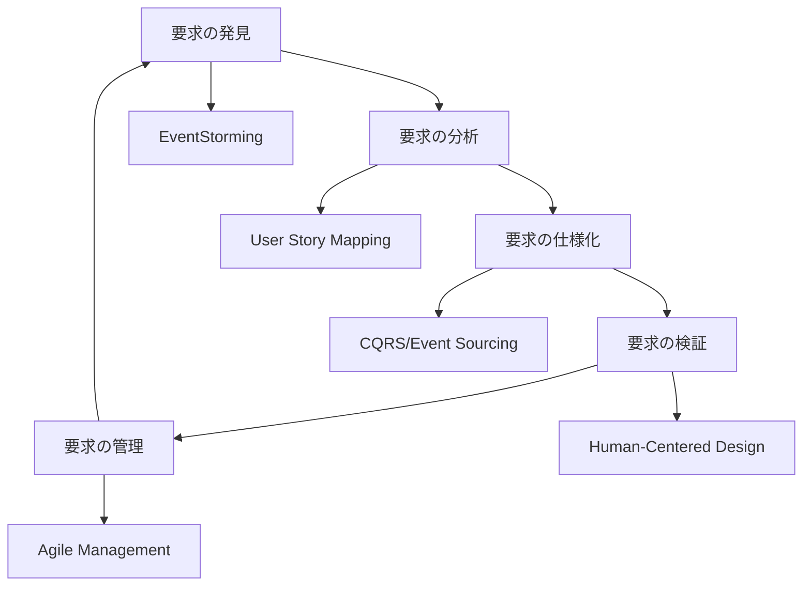
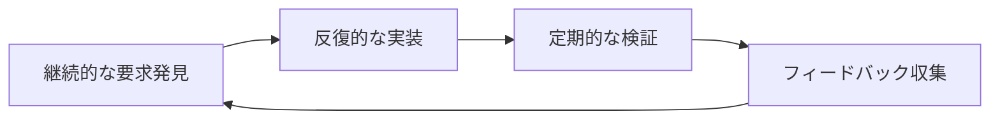

# 要求工学アプローチの統合と推奨事項

## はじめに

10冊の要求工学関連の名著を分析した結果、このプロジェクトに対して以下の統合的なアプローチを推奨します。

## 1. 統合的なアプローチの概要



## 2. 各書籍からの主要な知見

### Software Requirements（Wiegers & Beatty）
- 体系的な要求プロセスの確立
- 要求の分類と優先順位付け
- トレーサビリティの維持

### Mastering the Requirements Process（Robertson）
- Volereテンプレートの活用
- 要求の品質基準の設定
- ステークホルダー分析の重要性

### Discovering Requirements（Alexander & Beus-Dukic）
- ビジネス目標との整合性
- 利用者視点の重要性
- シナリオベースの分析

### Requirements Engineering（Pohl）
- 理論的基盤の重要性
- 形式的手法の活用
- 品質保証フレームワーク

### Art of Requirements Engineering（Ebert）
- 実務的なアプローチ
- ビジネス価値の重視
- 実践的なツールの活用

### Agile Estimating and Planning（Cohn）
- アジャイルな見積もり手法
- イテレーティブな計画立案
- ベロシティベースの管理

### Business Analysis Techniques（Cadle, Paul & Turner）
- 72の分析ツールの活用
- ビジネスプロセス分析
- 変更管理の実践

### User Story Mapping（Patton）
- ユーザーストーリーの構造化
- リリース計画の最適化
- 継続的な改善

### The Design of Everyday Things（Norman）
- 人間中心設計の原則
- 認知モデルの理解
- エラー防止と回復

## 3. このプロジェクトへの具体的な推奨事項

### 3.1 プロセスフレームワーク

```typescript
interface RequirementsProcess {
  discovery: {
    eventStorming: EventStormingSession[];
    userResearch: UserResearch[];
    businessAnalysis: BusinessAnalysis[];
  };
  
  analysis: {
    storyMapping: StoryMap[];
    modelingSession: ModelingSession[];
    technicalSpikes: TechnicalSpike[];
  };
  
  specification: {
    userStories: UserStory[];
    acceptanceCriteria: AcceptanceCriteria[];
    technicalDesign: TechnicalDesign[];
  };
}
```

### 3.2 実装ロードマップ

```yaml
フェーズ1（基盤構築）:
  期間: 2-3ヶ月
  活動:
    - EventStormingワークショップ
    - ドメインモデルの確立
    - アーキテクチャ設計
    - 基本インフラ構築

フェーズ2（コア機能）:
  期間: 3-4ヶ月
  活動:
    - ブックマーク基本機能
    - Chrome拡張連携
    - 基本的な同期機能
    - 初期UI/UX

フェーズ3（拡張機能）:
  期間: 4-6ヶ月
  活動:
    - 高度な検索機能
    - オフライン対応
    - パフォーマンス最適化
    - UI/UX改善
```

## 4. 成功のための重要要素

### 4.1 プロセス面



### 4.2 技術面

```typescript
interface TechnicalFoundation {
  architecture: {
    eventSourcing: EventSourcingConfig;
    cqrs: CQRSConfig;
    sync: SyncStrategy;
  };
  
  quality: {
    performance: PerformanceMetrics;
    reliability: ReliabilityMetrics;
    scalability: ScalabilityMetrics;
  };
  
  security: {
    authentication: AuthConfig;
    authorization: AuthorizationConfig;
    dataProtection: DataProtectionConfig;
  };
}
```

## 5. 実践的な次のステップ

### 5.1 直近の行動計画

1. **要求発見フェーズ（2週間）**
   - EventStormingワークショップの実施
   - ステークホルダーインタビュー
   - 技術検証の開始

2. **分析フェーズ（2週間）**
   - ユーザーストーリーマッピング
   - アーキテクチャ設計
   - プロトタイプ作成

3. **計画フェーズ（1週間）**
   - リリース計画の策定
   - チーム体制の確立
   - 技術スタックの確定

### 5.2 品質保証計画

```yaml
品質指標:
  機能的品質:
    - 要求適合性
    - 機能完全性
    - 正確性

  非機能的品質:
    - パフォーマンス
    - 信頼性
    - 使用性

  プロセス品質:
    - 要求トレーサビリティ
    - 変更管理効率
    - テストカバレッジ
```

## 6. リスク管理

### 6.1 主要リスクと対策

```typescript
interface RiskManagementPlan {
  risks: {
    technical: TechnicalRisk[];
    business: BusinessRisk[];
    process: ProcessRisk[];
  };
  
  mitigations: {
    preventive: PreventiveAction[];
    reactive: ReactiveAction[];
    contingency: ContingencyPlan[];
  };
}

// 具体的なリスク例
const technicalRisks: TechnicalRisk[] = [
  {
    id: "TR-001",
    description: "Event Sourcing実装の複雑性",
    impact: "high",
    probability: "medium",
    mitigation: [
      "技術検証の早期実施",
      "段階的な導入",
      "チーム教育の実施"
    ]
  }
];
```

## 7. 結論

このプロジェクトの成功には、以下の要素が重要です：

1. **方法論の適切な組み合わせ**
   - EventStormingによる知識の共有
   - User Story Mappingによる計画立案
   - 人間中心設計による使いやすさの確保

2. **反復的なアプローチ**
   - 継続的な要求の発見と精緻化
   - フィードバックループの確立
   - 柔軟な計画の調整

3. **品質の確保**
   - 明確な品質基準の設定
   - 継続的な検証と改善
   - トレーサビリティの維持

## 参考文献

上記の10冊に加えて：

1. Evans, Eric. "Domain-Driven Design"
2. Humble, Jez & Farley, David. "Continuous Delivery"
3. Kim, Gene et al. "The DevOps Handbook"
4. Reinertsen, Donald G. "The Principles of Product Development Flow"