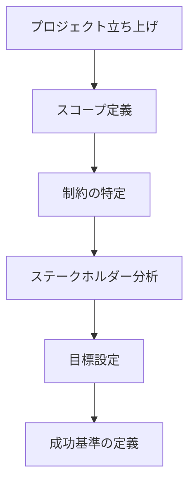
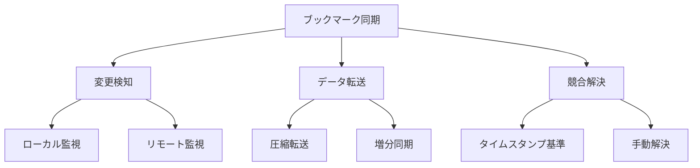
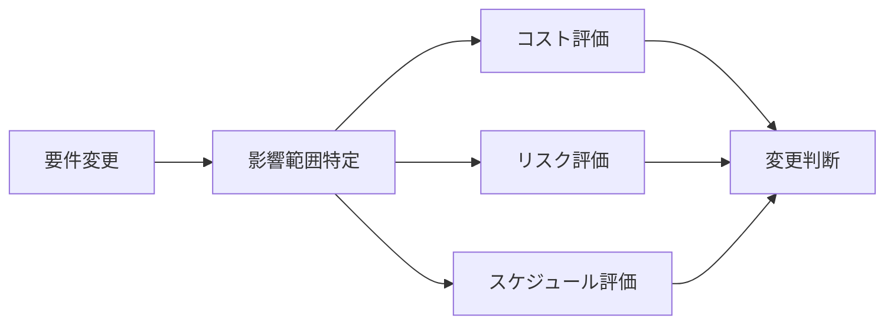

# Mastering the Requirements Process: Volereアプローチによる要求工学
著者: Suzanne Robertson & James Robertson 解説

## はじめに：この書籍が必要とされる理由

このプロジェクトでは、以下の理由から体系的な要求プロセスが必要です：

1. 複数のステークホルダー（Webアプリユーザー、Chrome拡張ユーザー、管理者）の要求を整理する必要がある
2. Event SourcingやCQRSといった技術選択の根拠となる要件を明確にする必要がある
3. 将来の拡張性を考慮した要件定義が必要
4. 異なるドメイン（ブックマーク、記事、ニュースペーパー）間の整合性を確保する必要がある

## Volereプロセスの概要

### 1. プロジェクトの開始



### 2. 要求の収集

```yaml
収集技法:
  1. アプレンティシング:
    - ユーザーの実際の作業を観察
    - コンテキストの理解
    - 暗黙知の発見

  2. ワークショップ:
    - ステークホルダーとの協働
    - 要求の優先順位付け
    - 合意形成

  3. プロトタイピング:
    - 要求の視覚化
    - フィードバックの収集
    - 仮説の検証
```

## Volereテンプレート

### 1. プロジェクト駆動要因

```markdown
1. プロジェクトの目的
   - ビジネス目標
   - 測定可能な利益
   - ステークホルダーの価値

2. システムの境界
   - 含まれるもの
   - 除外されるもの
   - 外部インターフェース

3. ステークホルダー
   - プライマリユーザー
   - セカンダリユーザー
   - 保守担当者
```

### 2. 制約条件

```typescript
interface ProjectConstraints {
  business: {
    budget: number;
    timeline: Date;
    resources: Resource[];
    regulations: Regulation[];
  };
  
  technical: {
    platforms: Platform[];
    integrations: Integration[];
    performance: PerformanceMetrics;
    security: SecurityRequirements;
  };
  
  operational: {
    availability: string;
    reliability: string;
    maintenance: MaintenanceWindow[];
  };
}
```

### 3. 機能要件テンプレート

```markdown
## 要件ID: REQ-[カテゴリ]-[番号]

### 説明
[要件の簡潔な説明]

### 理論的根拠
[なぜこの要件が必要か]

### 起源
[要件の出所]

### 満足度基準
[どのように要件の達成を測定するか]

### 顧客満足度
スケール: 1-5
[要件が満たされた場合の顧客満足度]

### 顧客不満度
スケール: 1-5
[要件が満たされなかった場合の顧客不満度]

### 依存関係
[他の要件との依存関係]

### 競合
[他の要件との競合可能性]

### サポート資料
[関連文書、図表など]
```

## このプロジェクトへの適用例

### 1. ブックマーク機能の要件定義

```yaml
要件ID: REQ-BM-001
タイトル: クロスプラットフォームブックマーク同期

説明:
  Webアプリケーションで作成したブックマークを
  Chrome拡張機能と自動的に同期する機能

理論的根拠:
  ユーザーが異なるプラットフォーム間で
  シームレスにブックマークを利用できるようにするため

満足度基準:
  - 同期の遅延が5秒以内
  - オフライン時の動作保証
  - 競合解決の自動化

顧客満足度: 5
顧客不満度: 4

依存関係:
  - REQ-BM-002: ブックマークストレージ
  - REQ-BM-003: 認証システム

技術的な考慮事項:
  - Event Sourcingによる変更追跡
  - CQRSによる読み書き分離
  - オフラインファーストな設計
```

### 2. アトミック要件の分析



## 要求の品質保証

### 1. 品質ゲート

```yaml
要件品質基準:
  完全性:
    - すべての必要な属性が記載されている
    - 依存関係が明確に定義されている
    - 測定可能な成功基準が設定されている

  明確性:
    - あいまいな表現がない
    - 具体的な数値目標がある
    - 理解しやすい言葉で書かれている

  一貫性:
    - 他の要件と矛盾していない
    - 用語が統一されている
    - 優先順位付けが適切
```

### 2. レビュープロセス

```typescript
interface RequirementReview {
  requirement: Requirement;
  reviewers: Reviewer[];
  criteria: ReviewCriteria;
  findings: Finding[];
  status: 'pending' | 'in-review' | 'approved' | 'rejected';
}

class RequirementReviewProcess {
  async conductReview(review: RequirementReview): Promise<ReviewResult> {
    const completenessCheck = await this.checkCompleteness(review);
    const clarityCheck = await this.checkClarity(review);
    const consistencyCheck = await this.checkConsistency(review);
    
    return this.determineResult(
      completenessCheck,
      clarityCheck,
      consistencyCheck
    );
  }
}
```

## 要求のトレーサビリティ

### 1. トレーサビリティマトリックス

```markdown
| 要件ID | ビジネス目標 | ユースケース | テスト | 実装 |
|--------|------------|-------------|--------|------|
| REQ-BM-001 | BG-1, BG-3 | UC-1, UC-2 | TC-1 | IMP-1 |
| REQ-BM-002 | BG-2 | UC-3 | TC-2 | IMP-2 |
| REQ-BM-003 | BG-1 | UC-4 | TC-3 | IMP-3 |
```

### 2. 影響分析



## プロジェクト管理との統合

### 1. 要求のスケジューリング

```yaml
フェーズ分け:
  フェーズ1:
    - コアブックマーク機能
    - 基本的な同期機能
    - ユーザー認証

  フェーズ2:
    - 高度な同期機能
    - オフライン対応
    - 競合解決

  フェーズ3:
    - パフォーマンス最適化
    - 高度な検索機能
    - アナリティクス
```

### 2. リスク管理

```typescript
interface RequirementRisk {
  id: string;
  requirement: Requirement;
  probability: number;  // 0-1
  impact: number;      // 1-5
  mitigation: string[];
  contingency: string[];
}

class RiskManagementProcess {
  async evaluateRisks(requirements: Requirement[]): Promise<RiskAssessment> {
    const risks = await Promise.all(
      requirements.map(req => this.identifyRisks(req))
    );
    
    return this.prioritizeRisks(risks);
  }
}
```

## 結論：Volereプロセスの価値

### 1. プロジェクトへの具体的な利点

1. **要件の質の向上**
   - 体系的なアプローチによる漏れの防止
   - 明確な品質基準による一貫性の確保
   - トレーサビリティによる変更管理の効率化

2. **ステークホルダーとの効果的なコミュニケーション**
   - 標準化されたテンプレートによる理解促進
   - 明確な優先順位付けによる期待値管理
   - 影響分析に基づく適切な判断

3. **プロジェクト成功率の向上**
   - リスクの早期特定と管理
   - 現実的なスコープ設定
   - 測定可能な成功基準の設定

### 2. 実践のためのガイドライン

1. **段階的な導入**
   - コアプラクティスからの開始
   - チームの習熟度に応じた拡張
   - 継続的な改善

2. **テーラリング**
   - プロジェクト規模に応じた調整
   - アジャイルとの統合
   - 組織文化への適応

3. **ツール活用**
   - 要件管理ツールの選定
   - テンプレートの整備
   - 自動化の推進

## 参考文献

1. Robertson, S. & Robertson, J. "Mastering the Requirements Process"
2. Robertson, S. & Robertson, J. "Requirements-Led Project Management"
3. Robertson, S. "Requirements Patterns and Techniques"
4. The Atlantic Systems Guild "Volere Requirements Specification Template"