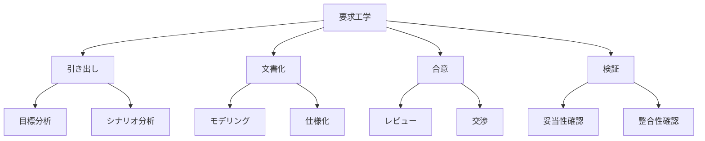
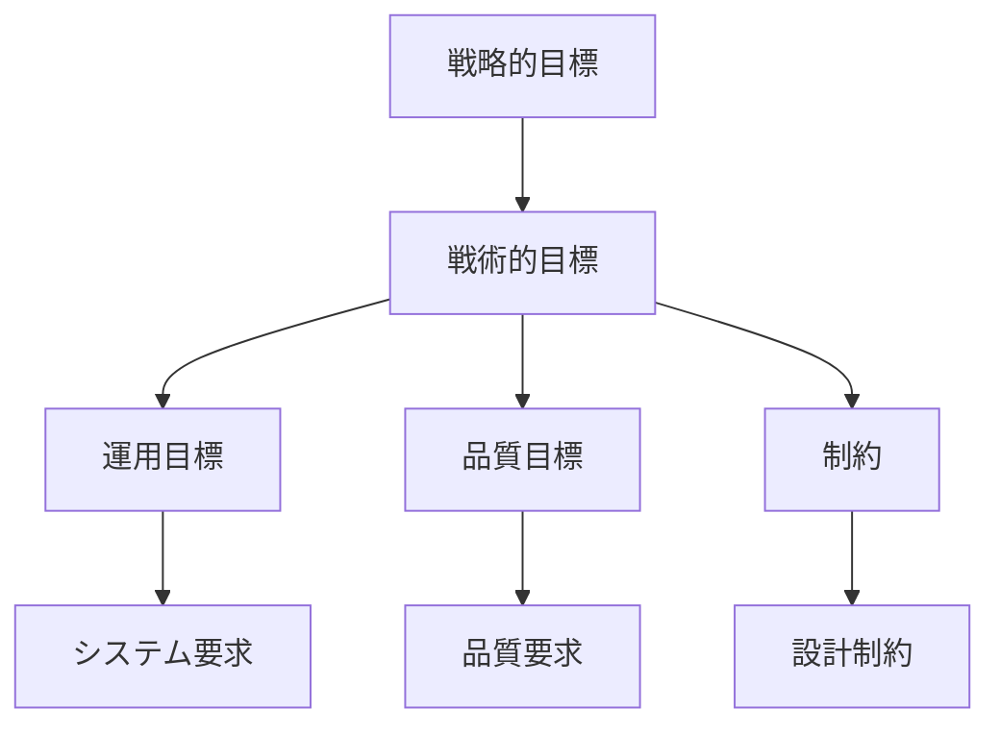
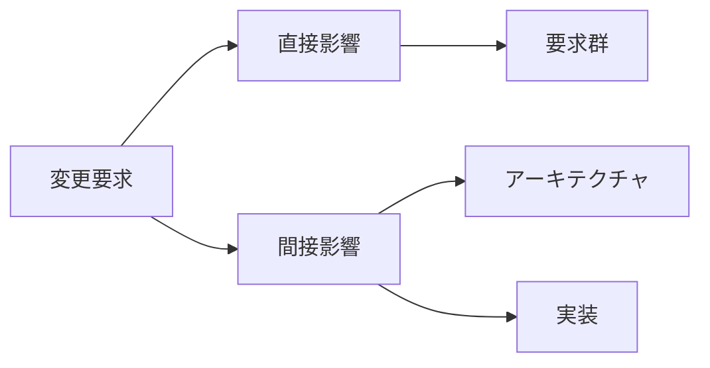
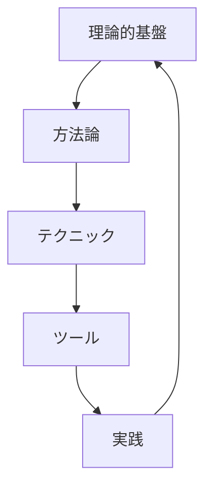

# Requirements Engineering：要求工学の基礎と原則
著者: Klaus Pohl 解説

## はじめに：この書籍が必要とされる理由

このプロジェクトでは、以下の理由から体系的な要求工学の理論的基盤が重要です：

1. Event SourcingとCQRSという高度なアーキテクチャパターンの採用判断に理論的根拠が必要
2. 複数のドメイン（ブックマーク、記事、ニュースペーパー）間の関係性を理論的に整理する必要がある
3. Webアプリケーション、Chrome拡張という異なるインターフェースの要件を体系的に分析する必要がある
4. 将来の拡張性を考慮した理論的に堅固な要求定義が必要

## 要求工学の理論的基盤

### 1. 基本概念



### 2. 要求の分類体系

```typescript
interface Requirement {
  type: RequirementType;
  source: RequirementSource;
  priority: Priority;
  status: Status;
  attributes: RequirementAttributes;
}

enum RequirementType {
  Functional,
  NonFunctional,
  Domain,
  Interface,
  Constraint
}

interface RequirementAttributes {
  stability: number;      // 0-1
  criticality: number;    // 0-1
  feasibility: number;    // 0-1
  verifiability: number;  // 0-1
}
```

## 要求工学プロセス

### 1. コアアクティビティ

```yaml
要求開発:
  文脈分析:
    - システム境界の定義
    - ステークホルダーの特定
    - 制約の識別

  要求引き出し:
    - インタビュー
    - ワークショップ
    - 文書分析
    - プロトタイピング

  要求分析:
    - 整合性チェック
    - 完全性チェック
    - 実現可能性分析

  要求仕様化:
    - 形式的記述
    - モデリング
    - 文書化

  要求検証:
    - レビュー
    - インスペクション
    - 妥当性確認
```

### 2. 品質要件フレームワーク

```typescript
interface QualityRequirement {
  category: QualityCategory;
  metric: Metric;
  threshold: number;
  measurement: MeasurementMethod;
  validation: ValidationMethod;
}

class QualityFramework {
  async evaluateQuality(req: QualityRequirement): Promise<QualityAssessment> {
    const measurement = await this.measure(req);
    const validation = await this.validate(req, measurement);
    
    return {
      requirement: req,
      measurement,
      validation,
      recommendations: this.generateRecommendations(validation)
    };
  }
}
```

## モデリング手法

### 1. 目標指向モデリング



### 2. シナリオベースモデリング

```typescript
interface ScenarioModel {
  context: Context;
  stimulus: Stimulus;
  response: Response;
  alternatives: Alternative[];
  qualities: QualityAttribute[];
}

class ScenarioAnalysis {
  async analyzeScenario(scenario: ScenarioModel): Promise<Analysis> {
    const contextAnalysis = await this.analyzeContext(scenario.context);
    const stimulusAnalysis = await this.analyzeStimulus(scenario.stimulus);
    const responseAnalysis = await this.analyzeResponse(scenario.response);
    
    return this.synthesizeAnalysis(
      contextAnalysis,
      stimulusAnalysis,
      responseAnalysis
    );
  }
}
```

## 要求の形式化

### 1. 形式仕様記述

```yaml
形式化レベル:
  レベル1:
    - 自然言語による記述
    - 構造化テンプレート
    - チェックリスト

  レベル2:
    - 半形式的表記
    - UMLダイアグラム
    - ユースケース記述

  レベル3:
    - 形式的表記
    - 数学的モデル
    - 論理式
```

### 2. 整合性検証

```typescript
interface ConsistencyCheck {
  type: 'syntactic' | 'semantic' | 'pragmatic';
  rules: ValidationRule[];
  scope: RequirementScope;
}

class ConsistencyValidator {
  async validateConsistency(reqs: Requirement[]): Promise<ValidationResult> {
    const syntacticCheck = await this.checkSyntactic(reqs);
    const semanticCheck = await this.checkSemantic(reqs);
    const pragmaticCheck = await this.checkPragmatic(reqs);
    
    return this.aggregateResults([
      syntacticCheck,
      semanticCheck,
      pragmaticCheck
    ]);
  }
}
```

## 要求の進化管理

### 1. 変更影響分析



### 2. トレーサビリティ管理

```typescript
interface TraceabilityLink {
  source: RequirementArtifact;
  target: RequirementArtifact;
  type: LinkType;
  attributes: LinkAttributes;
}

class TraceabilityManager {
  async analyzeImpact(change: Change): Promise<ImpactAnalysis> {
    const directLinks = await this.findDirectLinks(change);
    const indirectLinks = await this.findIndirectLinks(directLinks);
    
    return {
      directImpact: this.analyzeDirectImpact(directLinks),
      indirectImpact: this.analyzeIndirectImpact(indirectLinks),
      recommendations: this.generateRecommendations([
        ...directLinks,
        ...indirectLinks
      ])
    };
  }
}
```

## このプロジェクトでの適用

### 1. 要求モデルの統合

```yaml
統合アプローチ:
  ドメインモデル:
    - ブックマークドメイン
    - 記事ドメイン
    - ニュースペーパードメイン

  インターフェースモデル:
    - Webアプリケーション
    - Chrome拡張

  アーキテクチャモデル:
    - Event Sourcing
    - CQRS
```

### 2. 品質要件の定義

```typescript
interface QualityRequirement {
  id: string;
  name: string;
  description: string;
  metric: Metric;
  target: Target;
  priority: Priority;
  validation: ValidationMethod;
}

// 性能要件の例
const performanceRequirement: QualityRequirement = {
  id: "QR-001",
  name: "ブックマーク検索性能",
  description: "大量のブックマークからの検索応答時間",
  metric: {
    type: "ResponseTime",
    unit: "milliseconds"
  },
  target: {
    value: 200,
    condition: "under normal load (up to 1000 concurrent users)"
  },
  priority: "high",
  validation: {
    method: "PerformanceTest",
    tool: "JMeter",
    scenario: "SearchLoadTest"
  }
};
```

## 理論と実践の統合

### 1. 方法論的フレームワーク



### 2. 品質保証フレームワーク

```typescript
interface QualityAssuranceFramework {
  theoreticalBase: TheoreticalFoundation;
  methodologies: Methodology[];
  techniques: Technique[];
  tools: Tool[];
  practices: Practice[];
}

class QualityAssurance {
  async assureQuality(artifact: RequirementArtifact): Promise<QualityReport> {
    const theoreticalValidation = await this.validateAgainstTheory(artifact);
    const methodologicalValidation = await this.validateAgainstMethodology(artifact);
    const practicalValidation = await this.validateAgainstPractice(artifact);
    
    return this.synthesizeReport([
      theoreticalValidation,
      methodologicalValidation,
      practicalValidation
    ]);
  }
}
```

## 結論：理論的基盤の重要性

### 1. プロジェクトへの価値

1. **要求の質の向上**
   - 理論的裏付けのある分析
   - 体系的なアプローチ
   - 検証可能な成果物

2. **リスクの低減**
   - 方法論的な欠陥の防止
   - 体系的な品質保証
   - 変更影響の予測

3. **長期的な保守性**
   - 理論的整合性の維持
   - トレーサビリティの確保
   - 拡張性の担保

### 2. 実践のガイドライン

1. **理論の適用**
   - プロジェクト特性の考慮
   - 段階的な導入
   - 継続的な評価

2. **方法論の選択**
   - 目的との適合性
   - チームの能力
   - リソースの制約

3. **品質の確保**
   - 理論的妥当性
   - 実践的有効性
   - 継続的改善

## 参考文献

1. Pohl, K. "Requirements Engineering: Fundamentals, Principles, and Techniques"
2. Pohl, K. & Rupp, C. "Requirements Engineering Fundamentals"
3. Pohl, K., et al. "Software Product Line Engineering"
4. IEEE "830-1998 - IEEE Recommended Practice for Software Requirements Specifications"