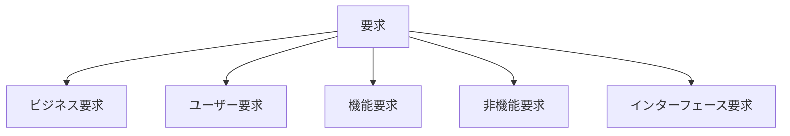
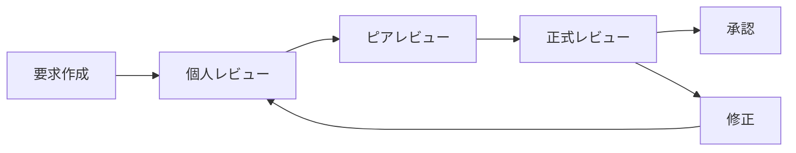
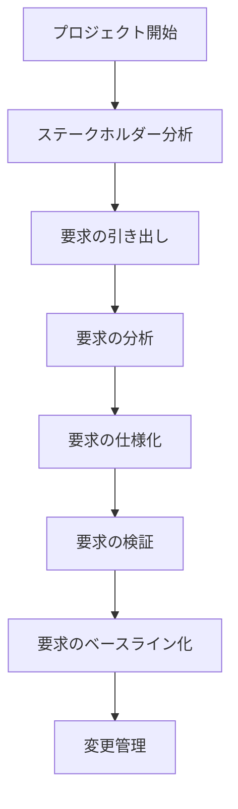

# Software Requirements: 実践的な要求工学の手引き
著者: Karl Wiegers & Joy Beatty 解説

## はじめに：この書籍が必要とされる理由

このプロジェクトでは、以下の理由から体系的な要求工学の理解が不可欠です：

1. 複数のドメイン（ブックマーク、記事、ニュースペーパー）の要件を正確に定義する必要がある
2. WebアプリケーションとChrome拡張という異なるインターフェースの要件を整理する必要がある
3. Event SourcingやCQRSといった高度なアーキテクチャの採用判断の基礎となる要件を明確にする必要がある
4. 将来の拡張性を考慮した要件定義が求められる

## 要求工学の基本原則

### 1. 要求の分類



### 2. 優先順位付けの枠組み

```yaml
優先度レベル:
  必須:
    - 製品のコア機能
    - 法的要件
    - セキュリティ要件

  重要:
    - ビジネス価値の高い機能
    - ユーザー体験の向上
    - パフォーマンス要件

  望ましい:
    - 追加機能
    - 利便性の向上
    - カスタマイズ機能
```

## 要求の引き出し技法

### 1. インタビュー技法

```markdown
#### 効果的なインタビューの構造

1. 準備フェーズ
   - 目的の明確化
   - 質問リストの準備
   - 参加者の選定

2. 実施フェーズ
   - オープンな質問から開始
   - 詳細な掘り下げ
   - 要点の確認

3. フォローアップ
   - 記録の整理
   - 不明点の確認
   - 次のステップの計画
```

### 2. ワークショップの実施

```yaml
ワークショップ構成:
  オープニング:
    - 目的の共有
    - アジェンダの確認
    - グランドルールの設定

  メイン活動:
    - ブレインストーミング
    - 要求の分析
    - 優先順位付け

  クロージング:
    - 成果物の確認
    - アクションアイテムの設定
    - 次回の計画
```

## 要求文書化のベストプラクティス

### 1. ソフトウェア要求仕様書（SRS）テンプレート

```markdown
# ソフトウェア要求仕様書

## 1. はじめに
   1.1 目的
   1.2 スコープ
   1.3 定義と略語
   1.4 参照文書

## 2. 全体的記述
   2.1 製品の展望
   2.2 製品の機能
   2.3 ユーザークラスと特性
   2.4 運用環境
   2.5 設計・実装の制約
   2.6 ユーザードキュメント
   2.7 前提と依存関係

## 3. 機能要件
   3.1 機能A
      3.1.1 記述
      3.1.2 入力
      3.1.3 処理
      3.1.4 出力
   3.2 機能B
      ...

## 4. インターフェース要件
   4.1 ユーザーインターフェース
   4.2 ハードウェアインターフェース
   4.3 ソフトウェアインターフェース
   4.4 通信インターフェース

## 5. 非機能要件
   5.1 性能要件
   5.2 セキュリティ要件
   5.3 ソフトウェア品質属性
   5.4 ビジネスルール
```

### 2. 要求の記述ガイドライン

```yaml
品質基準:
  完全性:
    - すべての必要な情報を含む
    - 欠落がない
    - 依存関係が明確

  一貫性:
    - 矛盾がない
    - 用語の統一
    - 要件間の整合性

  正確性:
    - 曖昧さがない
    - 測定可能
    - 検証可能

  追跡可能性:
    - 源泉が明確
    - 関連要件との関係
    - 実装との対応
```

## 要求の検証と妥当性確認

### 1. レビュープロセス



### 2. 検証チェックリスト

```markdown
## 機能要件チェックリスト

□ 完全性
  - すべての入力が定義されているか
  - すべての出力が定義されているか
  - すべての例外処理が定義されているか

□ 一貫性
  - 要件間の矛盾はないか
  - 用語は統一されているか
  - ビジネスルールと整合しているか

□ 実現可能性
  - 技術的に実現可能か
  - リソース制約内で実現可能か
  - スケジュール内で実現可能か

□ テスト可能性
  - 要件は検証可能か
  - 受け入れ基準は明確か
  - テストシナリオは作成可能か
```

## 要求管理のプロセス

### 1. 変更管理

```typescript
interface RequirementChange {
  id: string;
  type: 'add' | 'modify' | 'delete';
  description: string;
  justification: string;
  impact: {
    scope: string;
    schedule: string;
    resources: string;
    risks: string[];
  };
  status: 'proposed' | 'analyzing' | 'approved' | 'rejected';
  priority: 'high' | 'medium' | 'low';
}

class ChangeManagementProcess {
  async evaluateChange(change: RequirementChange): Promise<void> {
    const impactAnalysis = await this.analyzeImpact(change);
    const stakeholderFeedback = await this.collectFeedback(change);
    
    if (this.isChangeApproved(impactAnalysis, stakeholderFeedback)) {
      await this.implementChange(change);
      await this.updateDocumentation(change);
      await this.notifyStakeholders(change);
    }
  }
}
```

### 2. トレーサビリティ

```yaml
トレーサビリティマトリクス:
  縦軸:
    - ビジネス要求
    - ユーザー要求
    - 機能要求
    - 非機能要求

  横軸:
    - ユースケース
    - 設計仕様
    - テストケース
    - ソースコード
```

## このプロジェクトへの適用

### 1. 要求定義プロセス



### 2. 具体的な要求例

```markdown
## ブックマーク管理機能要件

### 機能要件
1. ブックマークの作成
   - Webページのメタデータの自動取得
   - タグ付け機能
   - フォルダ分類機能

2. ブックマークの同期
   - Chrome拡張との双方向同期
   - オフライン対応
   - 競合解決メカニズム

### 非機能要件
1. パフォーマンス
   - ブックマーク追加の応答時間 < 1秒
   - 同期処理の完了時間 < 5秒

2. スケーラビリティ
   - ユーザーあたり最大10,000ブックマーク
   - 同時接続ユーザー1,000人以上
```

## まとめ：要求工学の重要性

### 1. プロジェクトの成功要因

1. **明確な要求定義**
   - ステークホルダーの期待の明確化
   - スコープの適切な設定
   - 優先順位の合意

2. **効果的なコミュニケーション**
   - 要求の正確な伝達
   - フィードバックの迅速な反映
   - 変更の適切な管理

3. **品質の確保**
   - 要求の検証と妥当性確認
   - トレーサビリティの維持
   - 継続的な改善

### 2. 実践的なアプローチ

1. **段階的な要求定義**
   - ビジネス要求から開始
   - 詳細化の適切なタイミング
   - イテレーティブな改善

2. **ステークホルダー管理**
   - 適切な関与レベル
   - 期待値の管理
   - 合意形成のプロセス

3. **文書化と管理**
   - 適切な粒度の文書化
   - 変更管理の仕組み
   - ナレッジの蓄積

## 参考文献

1. Wiegers, Karl & Beatty, Joy. "Software Requirements, Third Edition"
2. Wiegers, Karl. "More About Software Requirements"
3. Beatty, Joy & Chen, Anthony. "Visual Models for Software Requirements"
4. IEEE. "IEEE 830-1998: Recommended Practice for Software Requirements Specifications"