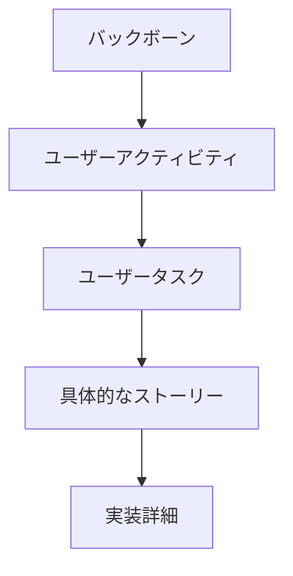
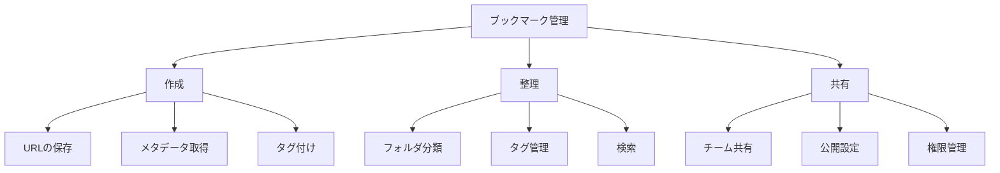
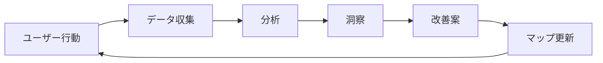

# User Story Mapping：ユーザーストーリーマッピングの実践
著者: Jeff Patton 解説

## はじめに：この書籍が必要とされる理由

このプロジェクトでは、以下の理由からユーザーストーリーマッピングが重要です：

1. ブックマーク、記事、ニュースペーパーの各機能における利用者の行動パターンを理解する必要がある
2. WebアプリケーションとChrome拡張の異なるユーザー体験を整理する必要がある
3. Event SourcingとCQRSの採用がユーザー体験に与える影響を可視化する必要がある
4. 段階的なリリース計画を利用者視点で組み立てる必要がある

## ストーリーマッピングの基本原則

### 1. マップの構造



### 2. ユーザー行動の分析

```yaml
行動パターン:
  情報収集:
    - Webページの閲覧
    - 興味ある情報の発見
    - ブックマークの決定

  整理活動:
    - タグ付け
    - カテゴリ分類
    - 優先度設定

  再訪問:
    - 検索
    - フィルタリング
    - アクセス
```

## ワークショップの実施

### 1. 準備と計画

```typescript
interface WorkshopPlan {
  participants: {
    stakeholders: string[];
    facilitators: string[];
    observers: string[];
  };
  materials: {
    physical: string[];
    digital: string[];
  };
  schedule: {
    duration: number;
    breaks: number[];
    activities: Activity[];
  };
}

class WorkshopFacilitator {
  async conductWorkshop(plan: WorkshopPlan): Promise<WorkshopResult> {
    const setup = await this.prepareEnvironment(plan);
    const activities = await this.facilitateActivities(plan.schedule);
    const results = await this.gatherResults(activities);
    
    return {
      stories: results.stories,
      insights: results.insights,
      nextSteps: this.planNextSteps(results)
    };
  }
}
```

### 2. マッピングの手順

```markdown
## マッピングプロセス

1. バックボーンの作成
   - 主要なユーザーアクティビティの特定
   - 時系列での整理
   - 優先順位付け

2. ユーザータスクの展開
   - 各アクティビティの詳細化
   - 関連タスクのグループ化
   - 依存関係の特定

3. ストーリーの追加
   - 具体的なユーザーストーリーの作成
   - 受け入れ基準の定義
   - 見積もりの実施

4. スライス化
   - リリース計画の作成
   - MVPの特定
   - イテレーションの計画
```

## マッピング技法

### 1. バックボーンの構築

```typescript
interface Backbone {
  activities: UserActivity[];
  sequence: ActivitySequence;
  priorities: Priority[];
}

class BackboneBuilder {
  async buildBackbone(input: WorkshopInput): Promise<Backbone> {
    const activities = await this.identifyActivities(input);
    const sequence = await this.createSequence(activities);
    const priorities = await this.setPriorities(sequence);
    
    return {
      activities,
      sequence,
      priorities,
      visualization: this.createVisualization({
        activities,
        sequence,
        priorities
      })
    };
  }
}
```

### 2. ストーリーの展開



## リリース計画への統合

### 1. MVPの特定

```yaml
MVP定義:
  コア機能:
    - 基本的なブックマーク保存
    - シンプルなタグ付け
    - 基本検索

  初期リリース:
    スコープ:
      - Chrome拡張の基本機能
      - Webアプリの閲覧機能
      - 基本的な同期機能

    除外項目:
      - 高度な検索機能
      - 共有機能
      - オフライン機能
```

### 2. イテレーション計画

```typescript
interface IterationPlan {
  iteration: number;
  stories: UserStory[];
  goals: string[];
  metrics: Metric[];
}

class ReleasePlanner {
  async createReleasePlan(map: StoryMap): Promise<ReleasePlan> {
    const mvp = await this.identifyMVP(map);
    const iterations = await this.planIterations(map, mvp);
    const metrics = await this.defineMetrics(iterations);
    
    return {
      mvp,
      iterations,
      metrics,
      risks: this.identifyRisks(iterations)
    };
  }
}
```

## ユーザーストーリーの洗練

### 1. ストーリーの構造化

```typescript
interface UserStory {
  title: string;
  narrative: {
    role: string;
    goal: string;
    benefit: string;
  };
  acceptanceCriteria: string[];
  details: {
    constraints: string[];
    notes: string[];
    mockups: string[];
  };
}

// ブックマーク作成ストーリーの例
const bookmarkCreationStory: UserStory = {
  title: "Webページのブックマーク作成",
  narrative: {
    role: "頻繁にWeb記事を読むユーザー",
    goal: "興味深いWebページを素早く保存したい",
    benefit: "後で簡単に見つけられるようにするため"
  },
  acceptanceCriteria: [
    "URLとタイトルが自動取得される",
    "カスタムタグを追加できる",
    "保存完了の確認が表示される"
  ],
  details: {
    constraints: [
      "オフライン時も動作すること",
      "重複URLのチェック"
    ],
    notes: [
      "Chrome拡張との連携が必要",
      "Event Sourcingの考慮"
    ],
    mockups: [
      "bookmark-creation-ui.png",
      "tag-selection-modal.png"
    ]
  }
};
```

### 2. 受け入れ基準の定義

```yaml
受け入れ基準フレームワーク:
  機能的基準:
    - 入力の検証
    - 処理の正確性
    - 出力の確認

  非機能的基準:
    - パフォーマンス要件
    - セキュリティ要件
    - 使用性要件

  ビジネス基準:
    - 価値の実現
    - コスト制約
    - 時間制約
```

## 継続的な改善

### 1. フィードバックの収集



### 2. マップの更新

```typescript
interface MapUpdate {
  type: 'add' | 'modify' | 'remove';
  target: MapElement;
  reason: string;
  impact: Impact;
}

class MapMaintainer {
  async updateMap(updates: MapUpdate[]): Promise<UpdatedMap> {
    const validatedUpdates = await this.validateUpdates(updates);
    const impacts = await this.assessImpacts(validatedUpdates);
    const newMap = await this.applyUpdates(validatedUpdates);
    
    return {
      map: newMap,
      impacts,
      recommendations: this.generateRecommendations(impacts)
    };
  }
}
```

## 結論：ストーリーマッピングの価値

### 1. プロジェクトへの効果

1. **共通理解の促進**
   - ユーザー行動の可視化
   - 優先順位の明確化
   - チーム全体の方向性統一

2. **計画の最適化**
   - MVPの適切な定義
   - 段階的なリリース計画
   - リスクの早期特定

3. **価値の最大化**
   - ユーザー中心の開発
   - 早期価値提供
   - 継続的な改善

### 2. 実践のガイドライン

1. **効果的なファシリテーション**
   - 適切な参加者の選定
   - 明確なゴール設定
   - 活発な議論の促進

2. **継続的なメンテナンス**
   - 定期的な見直し
   - フィードバックの反映
   - 新しい知見の統合

3. **チーム協働の促進**
   - 共同作業の重視
   - 知識の共有
   - スキルの向上

## 参考文献

1. Patton, J. "User Story Mapping"
2. Patton, J. & Economy, P. "User Story Mapping: Discover the Whole Story"
3. Patton, J. "The New User Story Backlog is a Map"
4. Cohn, M. "User Stories Applied"