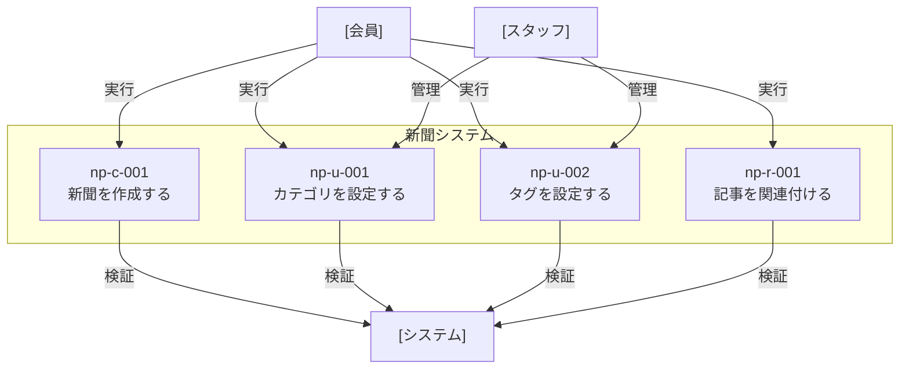
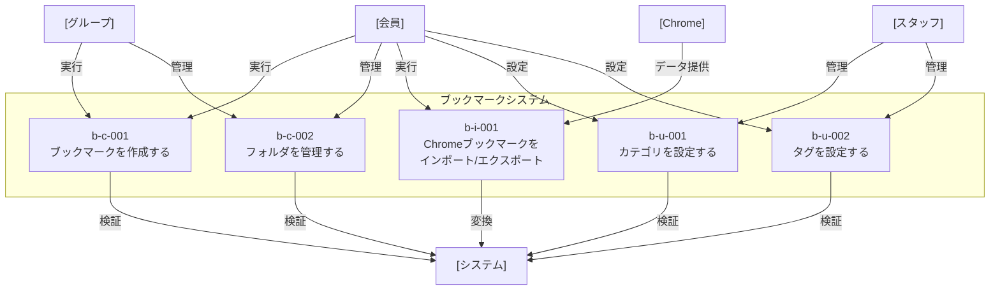

# ユースケース一覧

## 新聞システム

新聞の作成・管理に関するユースケース図

### 実装済みユースケース

- [np-c-001 新聞作成](newspaper/newspaper-create.md) - 新聞の基本情報を設定し作成する

### 未実装ユースケース

- np-u-001 カテゴリ設定 - 新聞にカテゴリを設定する
- np-u-002 タグ設定 - 新聞にタグを設定する
- np-r-001 記事関連付け - 新聞に記事を関連付ける

## ブックマークシステム

ブックマークの作成・管理に関するユースケース図

### 実装済みユースケース

- [b-c-001 ブックマーク作成](bookmark/bookmark-create.md) - ブックマークの基本情報を設定し作成する

### 未実装ユースケース

- b-c-002 フォルダ管理 - ブックマークを整理するフォルダを作成・編集する
- b-i-001 Chromeブックマーク連携 - Chromeのブックマークをインポート/エクスポートする
- b-u-001 カテゴリ設定 - ブックマークにカテゴリを設定する
- b-u-002 タグ設定 - ブックマークにタグを設定する