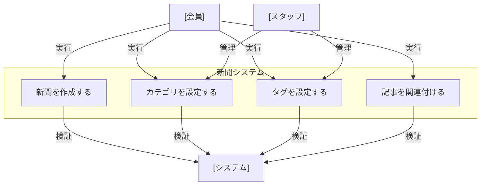

# ユースケース一覧

## 新聞システム

新聞の作成・管理に関するユースケース図

### 実装済みユースケース

- [新聞作成](newspaper/newspaper-create.md) - 新聞の基本情報を設定し作成する

### 未実装ユースケース

- カテゴリ設定 - 新聞にカテゴリを設定する
- タグ設定 - 新聞にタグを設定する
- 記事関連付け - 新聞に記事を関連付ける