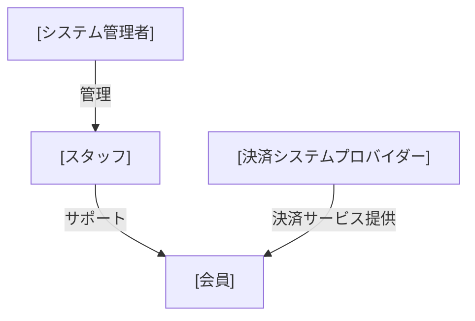

# WeEdit ユースケース図

## アクター関係図

## 統合ユースケース図

```mermaid
graph TB
    subgraph member["会員管理"]
        M1["グループ所属管理"]
        M2["会員情報管理"]
    end

    subgraph bookmark["ブックマーク管理"]
        B1["ブックマーク作成/保存"]
        B2["フォルダ整理"]
        B3["Chrome連携"]
        B4["カテゴリ/タグ管理"]
    end

    subgraph article["記事管理"]
        A1["記事保存"]
        A2["新聞管理"]
        A3["カテゴリ/タグ管理"]
    end

    subgraph notification["通知"]
        N1["通知送信"]
        N2["受信確認"]
        N3["再通知"]
        N4["拡散状況確認"]
    end

    subgraph point["ポイント"]
        P1["ポイント確認"]
        P2["ポイント購入"]
        P3["ポイント譲渡"]
        P4["ボーナスポイント"]
    end

    subgraph payment["決済"]
        Pay1["ポイント購入決済"]
        Pay2["支払い履歴確認"]
        Pay3["月次集計確認"]
    end

    subgraph support["サポート"]
        S1["問い合わせ"]
        S2["サポート対応"]
    end

    subgraph system["システム管理"]
        Sys1["会員一覧確認"]
        Sys2["イベント履歴確認"]
        Sys3["公式タグ管理"]
        Sys4["カテゴリ管理"]
    end

    Member-->M1
    Member-->M2
    Member-->B1
    Member-->B2
    Member-->B3
    Member-->B4
    Member-->A1
    Member-->A2
    Member-->A3
    Member-->N1
    Member-->N2
    Member-->N3
    Member-->N4
    Member-->P1
    Member-->P2
    Member-->P3
    Member-->S1

    Staff-->S2
    Staff-->Sys3
    Staff-->Sys4

    SysAdmin-->Sys1
    SysAdmin-->Sys2
    SysAdmin-->Pay3

    PaymentProvider-->Pay1
```

詳細なユースケースシナリオは各境界付けられたコンテキストのディレクトリ内に記載されています：

- [会員管理ユースケース](./member/)
- [ブックマーク管理ユースケース](./bookmark/)
- [記事管理ユースケース](./article/)
- [新聞管理ユースケース](./newspaper/)
- [通知ユースケース](./notification/)
- [ポイントユースケース](./point/)
- [決済ユースケース](./payment/)
- [サポートユースケース](./support/)
- [システム管理ユースケース](./system/)