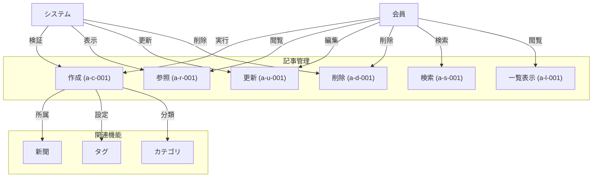

# 記事機能ユースケース

## 概要

記事機能は、Webページの内容を構造化された形式で保存し、新聞との関連付けや分類を可能にする中核機能です。ハイライトやメモ機能により、重要なポイントの強調や知見の追加が可能で、チーム内での技術情報の共有と活用を促進します。

## ユースケース図

## 実装済みユースケース

- [記事作成](./article-create.md) - Webページの記事化と保存
- [記事参照](./article-read.md) - 保存された記事の閲覧
- [記事更新](./article-update.md) - 既存記事の編集
- [記事削除](./article-delete.md) - 記事の安全な削除
- [記事検索](./article-search.md) - 高度な検索機能
- [記事一覧](./article-list.md) - 効率的な一覧表示

## 主要機能

1. 基本操作
- 記事の作成、参照、更新、削除（CRUD）
- 新聞との関連付け
- カテゴリとタグによる分類
- ハイライトとメモの追加

2. コンテンツ管理
- Webページコンテンツの自動抽出
- 本文のフォーマット保持
- 画像の参照保存
- リンクの有効性管理

3. 検索・表示
- 全文検索
- タグ・カテゴリ検索
- カスタマイズ可能な一覧表示
- リアルタイムプレビュー

4. 共有・連携
- 新聞を通じた共有
- メンバー間の共同編集
- 外部システムとの連携
- 変更通知機能

## バリデーションルール

1. テキスト制限
- タイトル：1-200文字
- 説明：最大500文字
- タグ：30文字まで、最大10個
- メモ：最大1000文字

2. コンテンツ制限
- 本文：最大100万文字
- 画像参照：最大100枚
- 外部リンク：最大1000個

3. 分類制限
- カテゴリ：単一選択必須
- タグ：任意、最大10個
- 新聞：必須、単一所属

## 技術要件

1. パフォーマンス
- ページ抽出：5秒以内
- 検索応答：1秒以内
- 一覧表示：仮想スクロール対応
- 更新反映：リアルタイム

2. スケーラビリティ
- 記事数：最大100万件/新聞
- 同時編集：最大10ユーザー
- 添付ファイル：記事あたり最大100MB
- 履歴保持：最大100バージョン

3. 可用性
- 24時間365日稼働
- バックアップ：日次
- 復旧時間：1時間以内
- オフライン対応

## アクターと権限

1. 会員
- 記事の作成
- 自身の記事の編集
- 共有記事の閲覧
- コメント・メモの追加

2. グループ管理者
- グループ内の記事管理
- メンバーの投稿承認
- カテゴリの設定
- 一括操作の実行

3. システム管理者
- 全記事の管理
- バッチ処理の実行
- ログの監査
- システム設定の変更