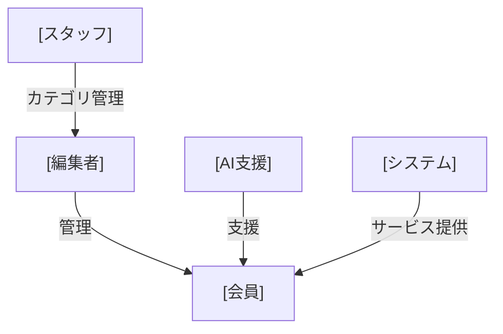
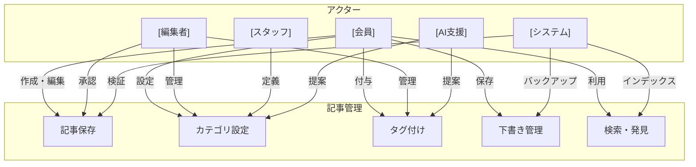
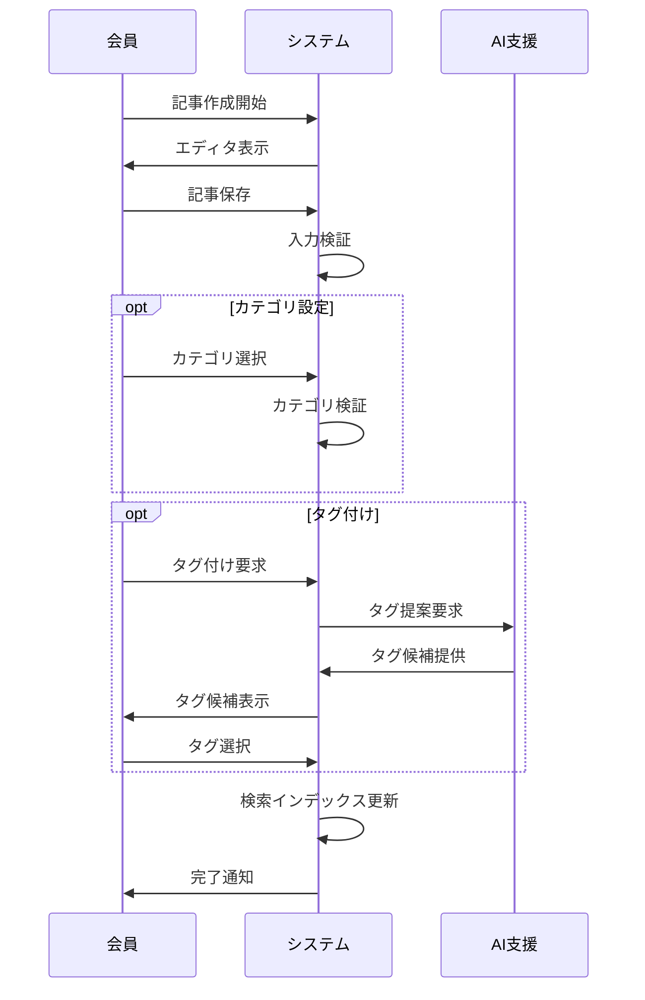

# 記事管理ユースケース図

## 概要

記事の作成、カテゴリ設定、タグ付けに関する一連のユースケースを定義します。

## アクター関係図

## ユースケース図

## ユースケース一覧

1. [記事保存](./article-save.md)
   - 記事の作成
   - 下書き保存
   - 記事の更新

2. [カテゴリ設定](./article-category.md)
   - カテゴリの選択
   - 新規カテゴリのリクエスト
   - カテゴリの変更

3. [タグ付け](./article-tag.md)
   - タグの追加
   - AI支援によるタグ提案
   - タグの管理

## 主要なフロー

## 注意事項

1. データの整合性
   - カテゴリとタグの一貫性維持
   - 検索インデックスの即時更新
   - 下書きの定期バックアップ

2. パフォーマンス
   - 大量の記事の効率的な管理
   - 検索の応答性確保
   - AI提案の最適化

3. セキュリティ
   - 適切な権限管理
   - 変更履歴の追跡
   - データの保護