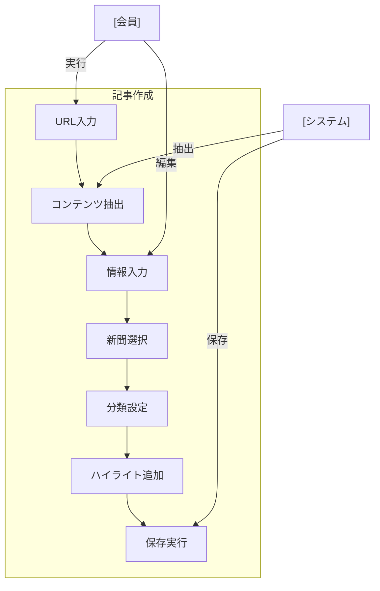

# 記事作成

## ユースケース概要

Webページの内容を記事として保存し、新聞への関連付けや分類を行う機能を提供します。

## アクター

- [会員] - 記事を作成する一般ユーザー
- [システム] - 記事情報を処理・保存するシステム

## 事前条件

- 会員としてログインしていること
- 記事化する対象のWebページが有効であること
- 所属する新聞が存在すること（必須）

## 想定シナリオ

[技術情報のキュレーション]

吉田さん（34歳、技術ブロガー）は、最新のフロントエンド開発トレンドについて、チーム内で共有するための技術情報をキュレーションすることにしました。

Web上で見つけた興味深い記事を、システムの記事作成機能を使って保存。自動で本文を抽出し、重要な部分にハイライトやメモを追加しました。また、「Frontend Weekly」という週刊の技術新聞に関連付けて、カテゴリとタグを設定しました。

この作業により、単なるURLの保存以上に、コンテキストを持った技術情報としてチーム内で共有できるようになりました。記事の要約や重要ポイントの強調により、チームメンバーの情報消化時間が記事あたり平均15分短縮されました。

## 基本フロー

1. [会員]は記事作成機能を選択
2. [システム]は記事作成フォームを表示
3. [会員]はURLを入力
4. [システム]は記事コンテンツを自動抽出
5. [会員]は以下の情報を入力：
   - タイトル（自動抽出された内容を編集可能）
   - 説明
   - 所属新聞の選択
   - カテゴリの選択
   - タグの設定
   - ハイライト・メモの追加
6. [システム]は入力内容を検証
7. [会員]は記事を保存
8. [システム]は記事を作成
9. [システム]は新聞との関連付けを更新

## 代替フロー

### コンテンツ抽出に失敗した場合

4a. [システム]は手動入力モードを提供
4b. [会員]は記事内容を手動で入力

### 既に同じURLが登録されている場合

3a. [システム]は重複を警告
3b. [会員]は以下から選択：
    - 新規作成
    - 既存記事の参照

## 例外フロー

### URLが無効な場合

3a. [システム]はエラーを表示
3b. [会員]は有効なURLを入力

## 事後条件

- 記事が作成され、新聞に関連付けられている
- カテゴリとタグが設定されている
- ハイライトとメモが保存されている

## 関連オブジェクト

- 記事
  - URL（必須）
  - タイトル（必須、1-200文字）
  - 本文（必須）
  - 説明（任意、最大500文字）
  - カテゴリ（必須、1つ）
  - タグ（任意、最大10個）
  - ハイライト（任意）
  - メモ（任意）
  - 所属新聞（必須）
  - 作成日時
  - 更新日時

## 補足情報

### コンテンツ抽出機能

1. 自動抽出
   - 本文抽出
   - タイトル抽出
   - メタデータ抽出

2. 手動編集
   - テキストエディタ
   - 整形ツール
   - プレビュー機能