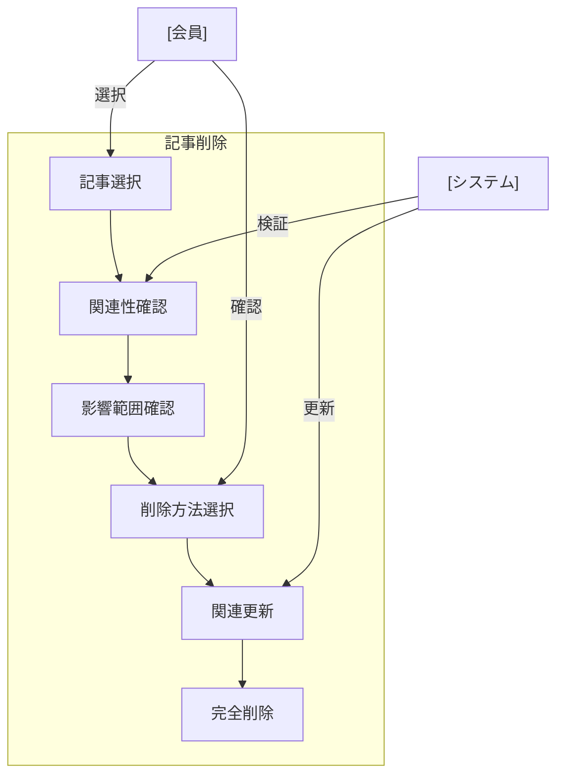

# 記事削除

## ユースケース概要

保存された記事を安全に削除する機能を提供します。新聞との関連性や、他の記事からの参照を考慮し、システムの整合性を維持します。

## アクター

- [会員] - 記事を削除する一般ユーザー
- [システム] - 記事情報を処理するシステム

## 事前条件

- 会員としてログインしていること
- 削除対象の記事が存在すること
- 記事の削除権限があること（作成者または管理者）

## 想定シナリオ

[技術記事の整理]

鈴木さん（32歳、テックリード）は、チームの技術情報を整理するため、古くなった記事や重複した内容の記事を整理することにしました。

まず、各記事の最終更新日とアクセス履歴を確認し、1年以上更新されておらず、最近3ヶ月間アクセスのない記事を特定しました。また、同じ内容を扱う新しい記事が存在する場合は、それらの関係性も確認しました。

削除前に、関連する新聞の管理者に通知を送り、承認を得てから削除を実行。必要に応じて、重要な記事は新しい記事に内容を統合しました。

この作業により、チームの技術情報がより整理され、必要な情報へのアクセス時間が30%短縮されました。また、新規メンバーの情報検索の効率も向上しました。

## 基本フロー

1. [会員]は削除対象の記事を選択
2. [システム]は記事の関連性を確認：
   - 所属新聞
   - 他の記事からの参照
   - コメント・メモの存在
3. [システム]は影響範囲を表示
4. [会員]は削除方法を選択：
   - 完全削除
   - アーカイブ
   - 別記事との統合
5. [会員]は削除を確認
6. [システム]は関連するリソースを更新
7. [システム]は記事を削除
8. [システム]は完了メッセージを表示

## 代替フロー

### 他の記事から参照されている場合

3a. [システム]は参照元の一覧を表示
3b. [会員]は以下から選択：
    - 参照の更新
    - 別記事への統合
    - 削除のキャンセル

### 複数記事の一括削除

1a. [会員]は複数の記事を選択
1b. [システム]は一括削除の確認を要求
1c. [会員]は確認後に進める

## 例外フロー

### 削除権限がない場合

1a. [システム]は権限エラーを表示
1b. [会員]は権限リクエストを送信可能

## 事後条件

- 記事が削除またはアーカイブされている
- 関連する新聞が更新されている
- 参照が適切に更新されている
- 削除ログが記録されている

## 関連オブジェクト

- 記事
  - ID
  - タイトル
  - 所属新聞
  - 参照関係
  - 作成者
  - 最終更新日時
  - アクセス履歴

## 補足情報

### 削除時の考慮事項

1. データの整合性
   - 新聞との関連性
   - 記事間の参照
   - インデックスの更新

2. 通知と承認
   - 関係者への通知
   - 必要な承認の取得
   - 削除完了の通知

3. データ保護
   - アーカイブ期間（30日）
   - バックアップ保持
   - 復元手順

4. 監査とログ
   - 削除理由の記録
   - 実行者の記録
   - 影響範囲の記録