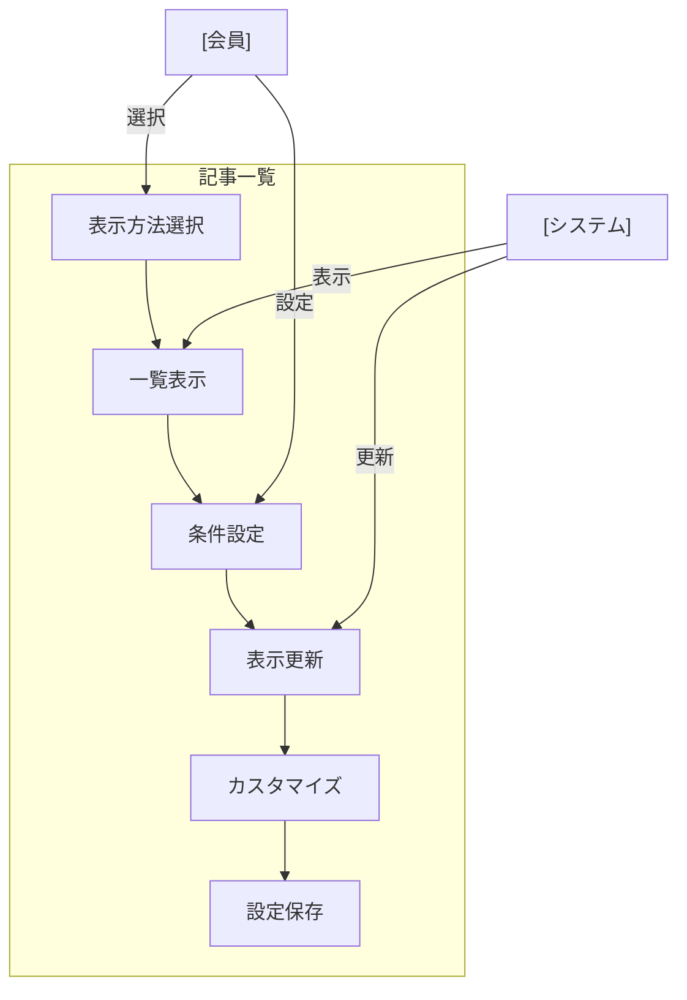

# 記事一覧表示

## ユースケース概要

保存された記事を新聞やカテゴリごとに一覧表示し、効率的な閲覧と管理を可能にする機能を提供します。様々な表示形式とソート・フィルター機能を含みます。

## アクター

- [会員] - 記事一覧を閲覧する一般ユーザー
- [システム] - 一覧表示機能を提供するシステム

## 事前条件

- 会員としてログインしていること
- 表示対象の記事へのアクセス権限があること

## 想定シナリオ

[技術情報の整理と活用]

佐藤さん（31歳、プロジェクトリード）は、チームで共有している技術記事のコレクションを効率的に管理するため、一覧表示機能を活用することにしました。

まず、新聞ごとの記事一覧を表示し、各記事の更新状況や閲覧状況を確認。その後、カテゴリやタグでフィルタリングしながら、未分類の記事や更新が必要な記事を特定していきました。

カスタムビュー機能を使用して、「最近の更新」「未読記事」「重要記事」などの表示パターンを保存。チームメンバーとも共有し、情報管理の効率化を図りました。

この作業により、チーム全体の技術情報の整理が進み、必要な記事へのアクセス時間が50%短縮されました。また、定期的なメンテナンス作業の効率も大幅に向上しました。

## 基本フロー

1. [会員]は記事一覧表示を選択
2. [システム]は表示オプションを提供：
   - 新聞ごとの表示
   - カテゴリごとの表示
   - タグごとの表示
   - カスタムビュー
3. [会員]は表示方法を選択
4. [システム]は選択に応じて一覧を表示
5. [会員]はソート・フィルター条件を設定：
   - 更新日時順
   - アクセス数順
   - 重要度順
   - タグフィルター
6. [システム]は条件に応じて表示を更新
7. [会員]は必要に応じて表示をカスタマイズ

## 代替フロー

### カスタムビューの作成

5a. [会員]は現在の表示設定を保存
5b. [システム]はビュー名の入力を要求
5c. [会員]は表示設定を共有可能

### 一括操作の実行

7a. [会員]は複数記事を選択
7b. [システム]は一括操作メニューを表示：
    - カテゴリ変更
    - タグ追加
    - 新聞間移動
    - 削除

## 例外フロー

### アクセス権限の変更時

4a. [システム]は権限のない記事を非表示
4b. [システム]は権限変更を通知

## 事後条件

- 選択された表示方法で記事が表示されている
- ソート・フィルター条件が適用されている
- カスタムビューが保存されている（該当する場合）

## 関連オブジェクト

- 表示設定
  - 表示方法
  - ソート条件
  - フィルター条件
  - カスタムビュー

- リストアイテム
  - タイトル
  - 更新日時
  - カテゴリ
  - タグ
  - アクセス数
  - 所属新聞
  - 未読/既読状態

## 補足情報

### 表示機能の特徴

1. パフォーマンス最適化
   - 仮想スクロール
   - 遅延読み込み
   - プログレッシブレンダリング

2. 表示オプション
   - グリッドビュー
   - リストビュー
   - カード表示
   - ツリー表示

3. インタラクション
   - ドラッグ＆ドロップ
   - インライン編集
   - クイックプレビュー
   - コンテキストメニュー

4. 共有機能
   - ビュー共有
   - フィルター共有
   - カスタム設定共有
   - 一括操作履歴