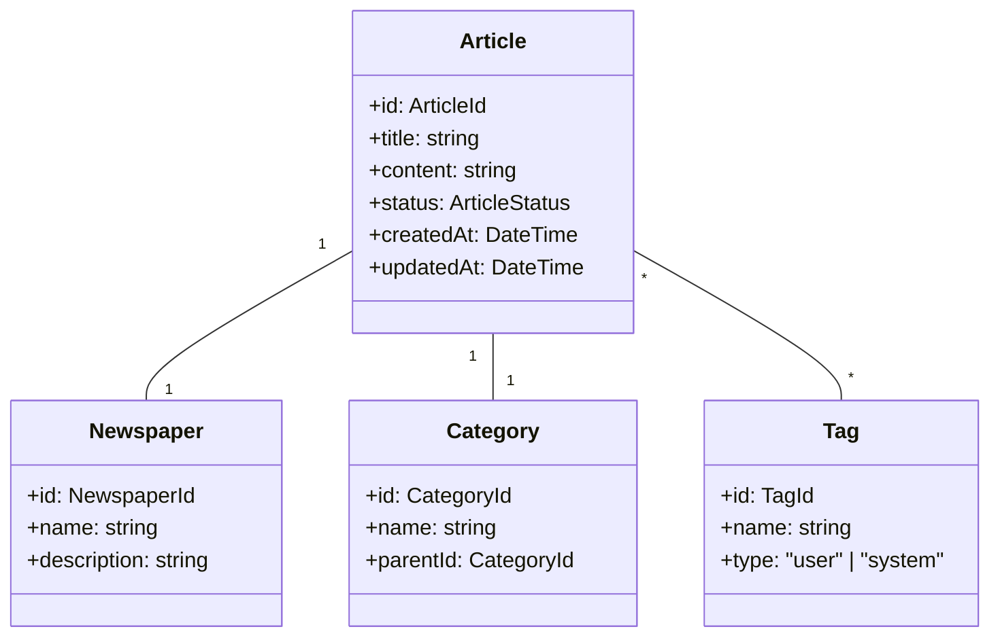

# 記事管理ユースケース

## ユースケース概要

会員が新聞記事を保存し、整理・管理するためのユースケース。

## アクター

- [会員]
- [システム]

## 事前条件

- アカウントが有効であること
- ログイン済みであること

## 基本フロー

### シナリオ：取材記事の整理

ジャーナリストの田中美咲は、最新の取材記事を保存し、テーマごとに整理しようとしています。

1. [会員]は(ArticleForm)から記事を作成
2. [システム]は入力フォームを表示
3. [会員]は記事情報を入力
   - タイトル
   - 本文
   - 所属新聞の選択
   - カテゴリの選択
   - タグの設定
4. [システム]は(ValidationService)で入力を検証
5. [システム]は(ArticleManager)で保存を実行
6. [システム]は(SearchIndexer)で検索インデックスを更新
7. [システム]は完了を通知

## 代替フロー

### A1. 新聞の作成

3a. [会員]は新しい新聞を作成
4a. [システム]は(NewspaperManager)で新聞を作成
5a. 基本フローの3に戻る

### A2. 下書き保存

3b. [会員]は下書きとして保存
4b. [システム]は(DraftManager)で保存
5b. 基本フローを終了

## 例外フロー

### E1. バリデーションエラー

4e. [システム]は入力エラーを検出
5e. [システム]はエラーメッセージを表示
6e. 基本フローの3に戻る

### E2. カテゴリ制限

3e. [会員]が無効なカテゴリを選択
4e. [システム]は(CategoryValidator)でエラーを検出
5e. 基本フローの3に戻る

## 事後条件

- 記事が保存されていること
- 新聞との関連付けが完了していること
- 検索インデックスが更新されていること

## 関連オブジェクト

- (Article): 記事情報
- (Newspaper): 新聞情報
- (Category): カテゴリ情報
- (Tag): タグ情報
- (ArticleManager): 記事管理
- (SearchIndexer): 検索エンジン
- (ValidationService): 入力検証

## 補足資料

### データモデル



### バリデーションルール

1. 記事
   - タイトル：1-200文字
   - 本文：1-50000文字
   - タグ：最大20個

2. 新聞
   - 名前：1-100文字
   - 説明：0-1000文字

### イベント定義

```typescript
type ArticleEvent = {
    type: "CREATE" | "UPDATE" | "DELETE" | "ARCHIVE";
    articleId: ArticleId;
    timestamp: DateTime;
    data: {
        title?: string;
        content?: string;
        newspaperId?: NewspaperId;
        categoryId?: CategoryId;
        tags?: TagId[];
    };
    metadata: {
        status: ArticleStatus;
        author: MemberId;
    };
};
```

### 検索インデックス

```typescript
type ArticleIndex = {
    id: ArticleId;
    title: string;
    content: string;
    newspaper: {
        id: NewspaperId;
        name: string;
    };
    category: {
        id: CategoryId;
        name: string;
    };
    tags: Array<{
        id: TagId;
        name: string;
    }>;
    metadata: {
        createdAt: DateTime;
        updatedAt: DateTime;
        status: ArticleStatus;
    };
};
```

### UI レイアウト

```mermaid
graph TD
    Main["メインエリア"]
    Sidebar["サイドバー"]
    Editor["エディター"]
    
    Main --> List["記事一覧"]
    Main --> Editor
    
    Sidebar --> Papers["新聞一覧"]
    Sidebar --> Cats["カテゴリ"]
    Sidebar --> Tags["タグクラウド"]
    
    Editor --> Title["タイトル"]
    Editor --> Content["本文"]
    Editor --> Meta["メタデータ"]
    Meta --> Paper["所属新聞"]
    Meta --> Category["カテゴリ"]
    Meta --> TagInput["タグ入力"]