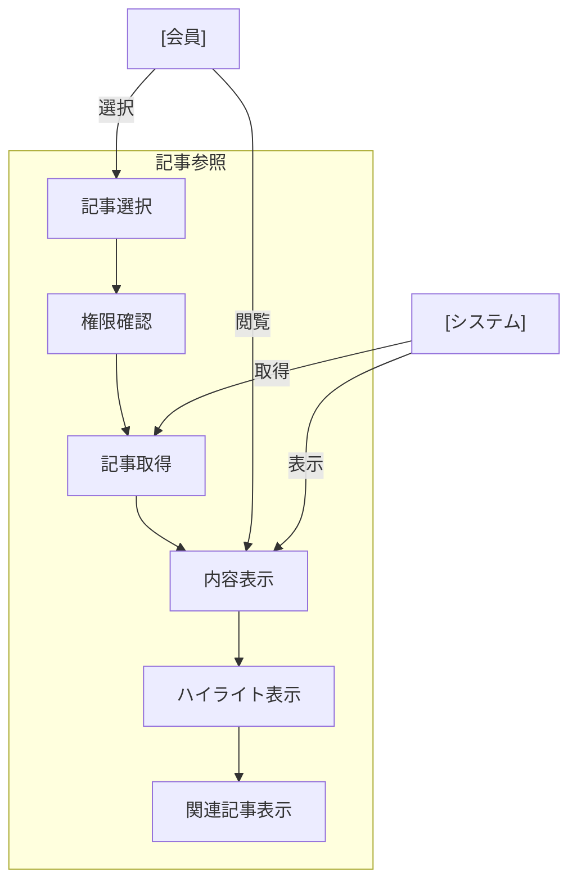

# 記事参照

## ユースケース概要

保存された記事の内容を閲覧し、ハイライトやメモを確認する機能を提供します。また、所属する新聞や関連記事との連携も含みます。

## アクター

- [会員] - 記事を閲覧する一般ユーザー
- [システム] - 記事情報を提供するシステム

## 事前条件

- 会員としてログインしていること
- 参照対象の記事が存在すること
- 記事へのアクセス権限があること

## 想定シナリオ

[チーム内技術共有]

山本さん（26歳、新人エンジニア）は、先輩が「Frontend Weekly」に保存していた、Reactのパフォーマンスチューニングに関する記事を読むことにしました。

記事を開くと、原文に加えて先輩が付けたハイライトとメモが表示され、重要なポイントを素早く理解することができました。また、同じ新聞に含まれる関連記事や、同じタグが付けられた他の記事へのリンクも表示されていたため、関連知識も効率的に学習できました。

従来は記事を読んで内容を理解するのに30分ほどかかっていましたが、ハイライトとメモのガイドにより15分程度で核心を掴むことができるようになりました。

## 基本フロー

1. [会員]は記事一覧から記事を選択
2. [システム]は記事の詳細情報を取得
3. [システム]は以下の情報を表示：
   - 記事タイトル
   - 本文
   - ハイライト
   - メモ
   - カテゴリ
   - タグ
   - 所属新聞
   - メタ情報（作成日時など）
4. [会員]は記事内容を閲覧
5. [会員]はハイライトやメモを確認
6. [システム]は関連記事を表示
7. [会員]は必要に応じて原文URLにアクセス

## 代替フロー

### オフライン表示の場合

2a. [システム]はキャッシュされた内容を表示
2b. [システム]はオフライン表示である旨を通知

### 関連記事の詳細表示

6a. [会員]は関連記事の概要を確認
6b. [システム]は選択された関連記事の詳細を表示

## 例外フロー

### 記事が削除されている場合

2a. [システム]は削除された旨を表示
2b. [会員]は記事一覧に戻る

## 事後条件

- 記事の内容が表示されている
- 閲覧履歴が更新されている
- 関連記事が表示されている

## 関連オブジェクト

- 記事
  - URL
  - タイトル
  - 本文
  - ハイライト
  - メモ
  - カテゴリ
  - タグ
  - 所属新聞
  - メタ情報

- 関連情報
  - 関連記事リスト
  - 同一新聞の記事
  - 同一タグの記事

## 補足情報

### 表示機能の特徴

1. コンテンツ表示
   - レスポンシブデザイン
   - ダークモード対応
   - フォントサイズ調整

2. ナビゲーション
   - 目次生成
   - アンカーリンク
   - スムーススクロール

3. インタラクション
   - ハイライトのホバー表示
   - メモの展開/折りたたみ
   - 関連記事のプレビュー