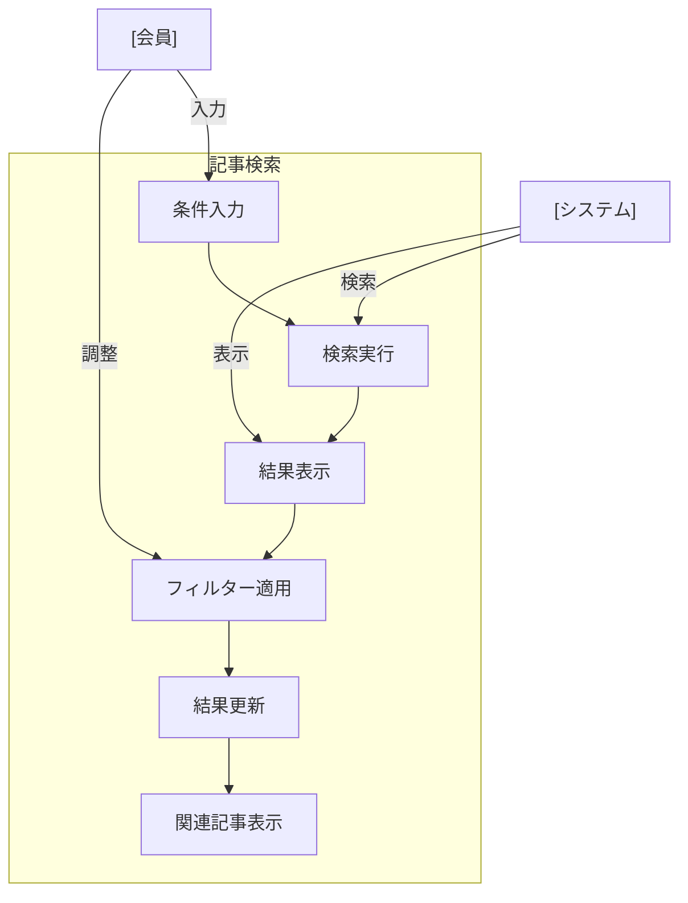

# 記事検索

## ユースケース概要

保存された記事を、タグ、カテゴリ、所属新聞、キーワードなど、様々な条件で検索する機能を提供します。全文検索や高度な検索オプションも含みます。

## アクター

- [会員] - 記事を検索する一般ユーザー
- [システム] - 検索機能を提供するシステム

## 事前条件

- 会員としてログインしていること
- 検索対象の記事が存在すること
- 検索対象へのアクセス権限があること

## 想定シナリオ

[技術ナレッジの活用]

橋本さん（29歳、アプリケーションエンジニア）は、新規プロジェクトでGraphQLとTypeScriptを組み合わせた実装を検討していました。

検索機能を使用して、まず「GraphQL」タグと「TypeScript」タグの両方が付いている記事を検索。さらに、「実装例」カテゴリで絞り込み、最近3ヶ月以内に更新された記事に範囲を限定しました。

検索結果には、記事本文の関連箇所のプレビューと、付けられているハイライトやメモも表示されるため、内容の確認が素早くできました。また、関連記事の推薦機能により、有用な追加情報も見つけることができました。

この効率的な検索により、技術調査に必要な時間が従来の半日から1時間に短縮され、実装の方針を素早く決定することができました。

## 基本フロー

1. [会員]は記事検索機能を起動
2. [システム]は検索フォームを表示
3. [会員]は以下の検索条件を設定：
   - キーワード（全文検索）
   - タグ（複数選択可）
   - カテゴリ
   - 所属新聞
   - 日付範囲
   - 更新者
4. [システム]は検索を実行
5. [システム]は検索結果を表示：
   - 記事一覧
   - 本文プレビュー
   - ハイライト・メモ
   - 関連記事
6. [会員]は結果を確認
7. [会員]は必要に応じて条件を調整

## 代替フロー

### 高度な検索オプションの使用

3a. [会員]は高度な検索を選択
3b. [システム]は追加のオプションを表示：
    - 正規表現検索
    - メモ内容検索
    - AND/OR条件指定
    - 除外条件設定

### 検索条件の保存

7a. [会員]は検索条件を保存
7b. [システム]は名前を付けて保存
7c. [会員]は次回から保存条件を使用可能

## 例外フロー

### 検索結果が0件の場合

4a. [システム]は「結果なし」を表示
4b. [システム]は類似の検索条件を提案
4c. [会員]は条件を調整して再検索

## 事後条件

- 検索結果が表示されている
- 検索履歴が更新されている
- 関連記事が表示されている

## 関連オブジェクト

- 検索条件
  - キーワード
  - タグリスト
  - カテゴリ
  - 新聞
  - 日付範囲
  - 更新者
  - 高度な条件

- 検索結果
  - 記事リスト
  - プレビュー情報
  - ハイライト・メモ
  - 関連記事

## 補足情報

### 検索機能の特徴

1. インデックス
   - 全文検索インデックス
   - タグインデックス
   - カテゴリインデックス
   - 新聞インデックス

2. パフォーマンス最適化
   - クエリキャッシュ
   - 部分一致インデックス
   - 結果のページング

3. UX機能
   - オートコンプリート
   - サジェスト機能
   - プレビュー表示
   - インクリメンタルサーチ

4. 検索履歴
   - 履歴保存
   - 条件保存
   - よく使う検索
   - トレンド検索