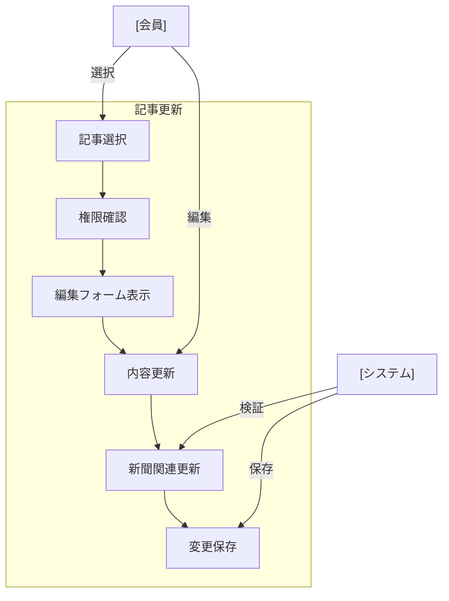

# 記事更新

## ユースケース概要

保存された記事の内容を編集し、ハイライトやメモの追加・更新、所属新聞の変更などを行う機能を提供します。

## アクター

- [会員] - 記事を更新する一般ユーザー
- [システム] - 記事情報を処理するシステム

## 事前条件

- 会員としてログインしていること
- 更新対象の記事が存在すること
- 記事の編集権限があること（作成者または共同編集者）

## 想定シナリオ

[技術記事の改善]

田中さん（35歳、シニアエンジニア）は、半年前に保存したマイクロサービスのベストプラクティスに関する記事を見直していました。

新しいプロジェクトでの経験を踏まえ、以前付けたハイライトやメモを更新する必要性を感じました。また、記事の分類も、より適切なカテゴリとタグに変更することにしました。

記事の更新機能を使用して、重要なポイントの再ハイライト、実践から得た知見のメモ追加、タグの追加を行いました。さらに、複数の新聞で共有されるよう、所属新聞の設定も更新しました。

この作業により、チームの知識ベースがより充実し、新規参加者が技術スタックを理解する時間が2日から1日に短縮されました。

## 基本フロー

1. [会員]は更新対象の記事を選択
2. [システム]は編集フォームを表示
3. [会員]は以下の項目を必要に応じて更新：
   - タイトル
   - 説明
   - 本文
   - ハイライト
   - メモ
   - カテゴリ
   - タグ
   - 所属新聞
4. [システム]は入力内容を検証
5. [会員]は更新を確定
6. [システム]は変更を保存
7. [システム]は関連する新聞の更新を実行
8. [システム]は完了メッセージを表示

## 代替フロー

### 所属新聞の変更時

7a. [システム]は新聞の変更による影響を確認
7b. [システム]は関連記事の更新を実行
7c. [システム]は新聞のインデックスを更新

### 複数人による同時編集

3a. [システム]は編集のロックを確認
3b. [システム]は競合を検出した場合は警告
3c. [会員]は変更をマージまたは破棄

## 例外フロー

### 編集権限がない場合

1a. [システム]は権限エラーを表示
1b. [会員]は権限リクエストを送信可能

## 事後条件

- 記事の内容が更新されている
- 関連する新聞が更新されている
- 更新履歴が記録されている
- インデックスが更新されている

## 関連オブジェクト

- 記事
  - タイトル（必須、1-200文字）
  - 本文（必須）
  - 説明（任意、最大500文字）
  - ハイライト（任意）
  - メモ（任意）
  - カテゴリ（必須、1つ）
  - タグ（任意、最大10個）
  - 所属新聞（必須）
  - 更新履歴

## 補足情報

### 更新機能の特徴

1. エディタ機能
   - リッチテキストエディタ
   - マークダウン対応
   - プレビュー表示

2. バージョン管理
   - 更新履歴の保持
   - 変更の差分表示
   - ロールバック機能

3. 共同編集
   - ロック機能
   - 競合検出
   - 変更マージ