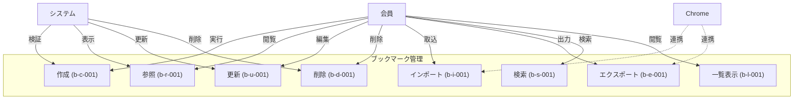

# ブックマーク機能ユースケース

## 概要

ブックマーク機能は、Webページの保存、整理、共有を可能にする中核機能です。ユーザーは階層的なフォルダ構造でブックマークを管理し、カテゴリやタグを用いて分類できます。また、Chromeブックマークとの互換性も確保されています。

## ユースケース図

## 実装済みユースケース

- [ブックマーク作成](./bookmark-create.md) - Webページの新規ブックマーク作成
- [ブックマーク参照](./bookmark-read.md) - 保存されたブックマークの閲覧
- [ブックマーク更新](./bookmark-update.md) - 既存ブックマークの編集
- [ブックマーク削除](./bookmark-delete.md) - ブックマークの安全な削除
- [ブックマークインポート](./bookmark-import.md) - Chromeブックマークの取り込み
- [ブックマークエクスポート](./bookmark-export.md) - Chrome互換形式での出力
- [ブックマーク検索](./bookmark-search.md) - 高度な検索機能
- [ブックマーク一覧](./bookmark-list.md) - 効率的な一覧表示

## 主要機能

1. 基本操作
- ブックマークの作成、参照、更新、削除（CRUD）
- フォルダによる階層管理（最大5階層）
- カテゴリ（単一）とタグ（複数）による分類

2. データ連携
- Chrome互換形式でのインポート
- Chrome互換形式でのエクスポート
- 他ユーザーとの共有

3. 検索・表示
- 高度な検索機能
- カスタマイズ可能な一覧表示
- リアルタイムプレビュー

## バリデーションルール

1. テキスト制限
- タイトル：1-200文字
- 説明：最大500文字
- タグ：30文字まで、最大10個

2. 構造制限
- フォルダ階層：最大5階層
- URL長：最大2048文字
- ファイルサイズ：最大10MB（インポート/エクスポート時）

## 技術要件

1. パフォーマンス
- 検索応答：1秒以内
- 一覧表示：仮想スクロール対応
- バルク操作：非同期処理

2. スケーラビリティ
- ユーザーあたり最大10,000ブックマーク
- 1フォルダあたり最大1,000アイテム
- 全文検索インデックス対応